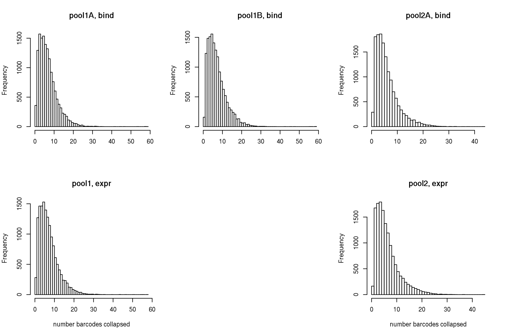
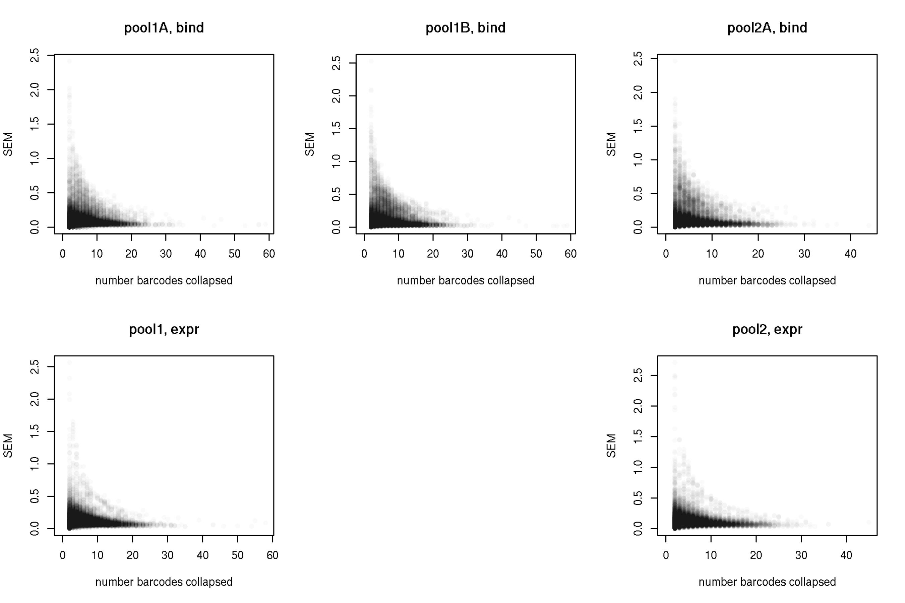
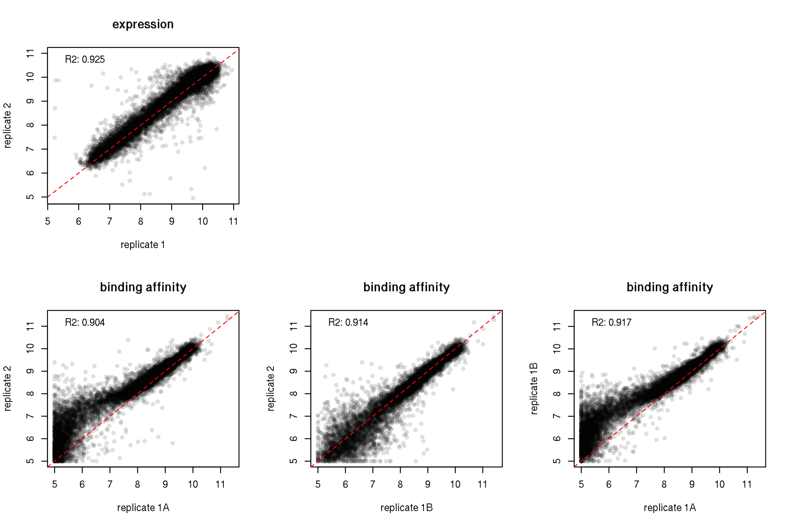
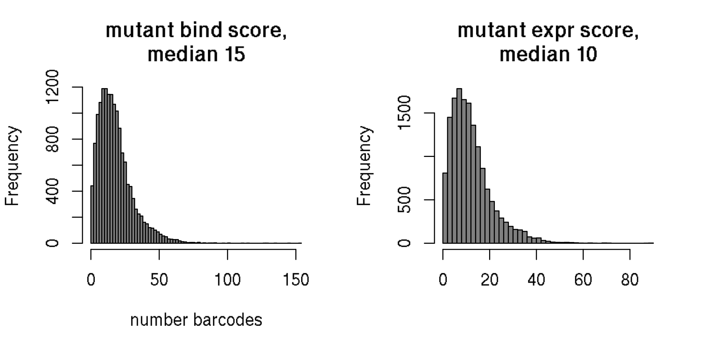

Collapse barcodes to final per-RBD/mutant phenotype scores
================
Tyler Starr
07/28/2021

-   [Setup](#setup)
-   [Calculate per-variant mean scores within
    replicates](#calculate-per-variant-mean-scores-within-replicates)
-   [Calculate per-mutant score across
    libraries](#calculate-per-mutant-score-across-libraries)
-   [Heatmaps!](#heatmaps)

This notebook reads in the per-barcode titration Kds and expression
measurements from the `compute_binding_Kd` and
`compute_expression_meanF` scripts. It synthesizes these two sets of
results and calculates the final ‘mean’ phenotypes for each variant, and
generates some coverage and QC analyses.

``` r
require("knitr")
knitr::opts_chunk$set(echo = T)
knitr::opts_chunk$set(dev.args = list(png = list(type = "cairo")))

#list of packages to install/load
packages = c("yaml","data.table","tidyverse","gridExtra","egg")
#install any packages not already installed
installed_packages <- packages %in% rownames(installed.packages())
if(any(installed_packages == F)){
  install.packages(packages[!installed_packages])
}
#load packages
invisible(lapply(packages, library, character.only=T))

#read in config file
config <- read_yaml("config.yaml")

#make output directory
if(!file.exists(config$final_variant_scores_dir)){
  dir.create(file.path(config$final_variant_scores_dir))
}
```

Session info for reproducing environment:

``` r
sessionInfo()
```

    ## R version 3.6.2 (2019-12-12)
    ## Platform: x86_64-pc-linux-gnu (64-bit)
    ## Running under: Ubuntu 18.04.5 LTS
    ## 
    ## Matrix products: default
    ## BLAS/LAPACK: /app/software/OpenBLAS/0.3.7-GCC-8.3.0/lib/libopenblas_haswellp-r0.3.7.so
    ## 
    ## locale:
    ##  [1] LC_CTYPE=en_US.UTF-8       LC_NUMERIC=C              
    ##  [3] LC_TIME=en_US.UTF-8        LC_COLLATE=en_US.UTF-8    
    ##  [5] LC_MONETARY=en_US.UTF-8    LC_MESSAGES=en_US.UTF-8   
    ##  [7] LC_PAPER=en_US.UTF-8       LC_NAME=C                 
    ##  [9] LC_ADDRESS=C               LC_TELEPHONE=C            
    ## [11] LC_MEASUREMENT=en_US.UTF-8 LC_IDENTIFICATION=C       
    ## 
    ## attached base packages:
    ## [1] stats     graphics  grDevices utils     datasets  methods   base     
    ## 
    ## other attached packages:
    ##  [1] egg_0.4.5         gridExtra_2.3     forcats_0.4.0     stringr_1.4.0    
    ##  [5] dplyr_0.8.3       purrr_0.3.3       readr_1.3.1       tidyr_1.0.0      
    ##  [9] tibble_3.0.2      ggplot2_3.3.0     tidyverse_1.3.0   data.table_1.12.8
    ## [13] yaml_2.2.0        knitr_1.26       
    ## 
    ## loaded via a namespace (and not attached):
    ##  [1] tidyselect_1.1.0 xfun_0.11        haven_2.2.0      colorspace_1.4-1
    ##  [5] vctrs_0.3.1      generics_0.0.2   htmltools_0.4.0  rlang_0.4.7     
    ##  [9] pillar_1.4.5     glue_1.3.1       withr_2.1.2      DBI_1.1.0       
    ## [13] dbplyr_1.4.2     modelr_0.1.5     readxl_1.3.1     lifecycle_0.2.0 
    ## [17] munsell_0.5.0    gtable_0.3.0     cellranger_1.1.0 rvest_0.3.5     
    ## [21] evaluate_0.14    fansi_0.4.0      broom_0.7.0      Rcpp_1.0.3      
    ## [25] scales_1.1.0     backports_1.1.5  jsonlite_1.6     fs_1.3.1        
    ## [29] hms_0.5.2        digest_0.6.23    stringi_1.4.3    grid_3.6.2      
    ## [33] cli_2.0.0        tools_3.6.2      magrittr_1.5     crayon_1.3.4    
    ## [37] pkgconfig_2.0.3  ellipsis_0.3.0   xml2_1.2.2       reprex_0.3.0    
    ## [41] lubridate_1.7.4  assertthat_0.2.1 rmarkdown_2.0    httr_1.4.1      
    ## [45] rstudioapi_0.10  R6_2.4.1         compiler_3.6.2

## Setup

Read in tables of per-barcode expression and binding Kd measurements and
combine.

``` r
dt_bind <- data.table(read.csv(config$Titeseq_Kds_file),stringsAsFactors=F)
dt_expr <- data.table(read.csv(config$expression_sortseq_file),stringsAsFactors=F)

dt <- merge(dt_bind,dt_expr)
```

## Calculate per-variant mean scores within replicates

Calculate the mean binding and expression score collapsed by genotype.
Also output the number of barcodes across which a variant score was
determined in each library.

``` r
dt[is.na(log10Ka),TiteSeq_avgcount:=NA]
dt[is.na(expression),expr_count:=NA]

dt[,mean_bind:=mean(log10Ka,na.rm=T),by=c("library","target","variant_class","aa_substitutions")]
dt[,sd_bind:=sd(log10Ka,na.rm=T),by=c("library","target","variant_class","aa_substitutions")]
dt[,n_bc_bind:=sum(!is.na(log10Ka)),by=c("library","target","variant_class","aa_substitutions")]
dt[,avg_count_bind:=mean(TiteSeq_avgcount,na.rm=T),by=c("library","target","variant_class","aa_substitutions")]

dt[,mean_expr:=mean(expression,na.rm=T),by=c("library","target","variant_class","aa_substitutions")]
dt[,sd_expr:=sd(expression,na.rm=T),by=c("library","target","variant_class","aa_substitutions")]
dt[,n_bc_expr:=sum(!is.na(expression)),by=c("library","target","variant_class","aa_substitutions")]
dt[,avg_count_expr:=mean(expr_count,na.rm=T),by=c("library","target","variant_class","aa_substitutions")]

dt <- unique(dt[,.(library,target,variant_class,aa_substitutions,n_aa_substitutions,mean_bind,sd_bind,n_bc_bind,avg_count_bind,mean_expr,sd_expr,n_bc_expr,avg_count_expr)])
```

Some QC plots. First, look at distribution of number barcodes for
binding and expression measurements for single mutant detemrinations.
These are ‘left-justified’ histograms, so the leftmost bar represents
the number of genotypes for which no barcodes were collapsed to final
measurement in a pool.

``` r
par(mfrow=c(2,2))
hist(dt[library=="pool1" & variant_class=="1 nonsynonymous",n_bc_bind],main="pool1, bind",right=F,breaks=max(dt[library=="pool1" & variant_class=="1 nonsynonymous",n_bc_bind],na.rm=T),xlab="")
hist(dt[library=="pool2" & variant_class=="1 nonsynonymous",n_bc_bind],main="pool2, bind",right=F,breaks=max(dt[library=="pool2" & variant_class=="1 nonsynonymous",n_bc_bind],na.rm=T),xlab="")
hist(dt[library=="pool1" & variant_class=="1 nonsynonymous",n_bc_expr],main="pool1, expr",right=F,breaks=max(dt[library=="pool1" & variant_class=="1 nonsynonymous",n_bc_expr],na.rm=T),xlab="number barcodes collapsed")
hist(dt[library=="pool2" & variant_class=="1 nonsynonymous",n_bc_expr],main="pool2, expr",right=F,breaks=max(dt[library=="pool2" & variant_class=="1 nonsynonymous",n_bc_expr],na.rm=T),xlab="number barcodes collapsed")
```



``` r
invisible(dev.print(pdf, paste(config$final_variant_scores_dir,"/histogram_n_bc_per_geno_sep-libs.pdf",sep=""),useDingbats=F))
```

What about how SEM tracks with number of barcodes collapsed? This could
help for choosing a minimum number of barcodes to use.

``` r
par(mfrow=c(2,2))
plot(dt[library=="pool1" & variant_class=="1 nonsynonymous",n_bc_bind],
     dt[library=="pool1" & variant_class=="1 nonsynonymous",sd_bind/sqrt(n_bc_bind)],
     pch=19,col="#00000005",main="pool1, bind",ylab="SEM",xlab="number barcodes collapsed")
plot(dt[library=="pool2" & variant_class=="1 nonsynonymous",n_bc_bind],
     dt[library=="pool2" & variant_class=="1 nonsynonymous",sd_bind/sqrt(n_bc_bind)],
     pch=19,col="#00000005",main="pool2, bind",ylab="SEM",xlab="number barcodes collapsed")
plot(dt[library=="pool1" & variant_class=="1 nonsynonymous",n_bc_expr],
     dt[library=="pool1" & variant_class=="1 nonsynonymous",sd_expr/sqrt(n_bc_expr)],
     pch=19,col="#00000005",main="pool1, expr",ylab="SEM",xlab="number barcodes collapsed")
plot(dt[library=="pool2" & variant_class=="1 nonsynonymous",n_bc_expr],
     dt[library=="pool2" & variant_class=="1 nonsynonymous",sd_expr/sqrt(n_bc_expr)],
     pch=19,col="#00000005",main="pool2, expr",ylab="SEM",xlab="number barcodes collapsed")
```



``` r
invisible(dev.print(pdf, paste(config$final_variant_scores_dir,"/sem_v_n-bc.pdf",sep=""),useDingbats=F))
```

Format into a ‘mutation lookup table’, where we focus just on the single
mutants (and wildtype), breakup the string of mutations, and fill in the
table to also include any missing mutants.

``` r
dt_mutant <- dt[variant_class %in% "1 nonsynonymous",]

#split mutation string
#define function to apply
split_mut <- function(x){
  split <- strsplit(x,split="")[[1]]
  return(list(split[1],as.numeric(paste(split[2:(length(split)-1)],collapse="")),split[length(split)]))
}
dt_mutant[,c("wildtype","position","mutant"):=split_mut(as.character(aa_substitutions)),by=aa_substitutions]

dt_mutant <- dt_mutant[,.(library,target,wildtype,position,mutant,mean_bind,sd_bind,n_bc_bind,avg_count_bind,mean_expr,sd_expr,n_bc_expr,avg_count_expr)]

aas <- c("A","C","D","E","F","G","H","I","K","L","M","N","P","Q","R","S","T","V","W","Y")
#fill out missing values in table with a hideous loop, so the table is complete for all mutaitons (including those that are missing). If you are somebody who is reading this code, I apologize.
for(lib in c("pool1","pool2")){
  for(bg in as.character(unique(dt_mutant$target))){
    for(pos in 1:max(dt_mutant$position)){
      for(aa in aas){
        if(!(aa %in% as.character(dt_mutant[library==lib & target==bg & position==pos,mutant]))){
          dt_mutant <- rbind(dt_mutant,list(lib, bg, dt_mutant[library==lib & target==bg & position==pos,wildtype][1],pos,aa),fill=T)
        }
      }
    }
  }
}
setkey(dt_mutant,library,target,position,mutant)

#fill in wildtype values -- should vectorize in data table but being so stupid so just going to write for loop
for(bg in c("Wuhan_Hu_1","E484K","N501Y","B1351")){
  for(lib in c("pool1","pool2")){
    dt_mutant[library==lib & target==bg & wildtype==mutant, c("mean_bind","sd_bind","n_bc_bind","avg_count_bind","mean_expr","sd_expr","n_bc_expr","avg_count_expr"):=dt[library==lib & target==bg & variant_class=="wildtype",.(mean_bind,sd_bind,n_bc_bind,avg_count_bind,mean_expr,sd_expr,n_bc_expr,avg_count_expr)]]
  }
}

#add delta bind and expr measures
for(bg in c("Wuhan_Hu_1","E484K","N501Y","B1351")){
  for(lib in c("pool1","pool2")){
    ref_bind <- dt[library==lib & target==bg & variant_class=="wildtype",mean_bind]
    ref_expr <- dt[library==lib & target==bg & variant_class=="wildtype",mean_expr]
    dt_mutant[library==lib & target==bg,delta_bind := mean_bind - ref_bind]
    dt_mutant[library==lib & target==bg,delta_expr := mean_expr - ref_expr]
  }
}
```

We have duplicates for each measurement. Let’s look at correlations!
Later on, can look at how correlation degrades when subsetting on lower
and lower n_bcs, and use that to determine if I need to filter for a
minimum number of collapsed bcs

``` r
par(mfrow=c(1,2))
x <- dt_mutant[library=="pool1" & wildtype!=mutant,mean_expr]; y <- dt_mutant[library=="pool2" & wildtype!=mutant,mean_expr]; plot(x,y,pch=19,col="#00000020",xlab="replicate 1",ylab="replicate 2",main="expression");model <- lm(y~x);abline(model,lty=2,col="red");legend("topleft",legend=paste("R2: ",round(summary(model)$r.squared,3),sep=""),bty="n")

x <- dt_mutant[library=="pool1" & wildtype!=mutant,mean_bind]; y <- dt_mutant[library=="pool2" & wildtype!=mutant,mean_bind]; plot(x,y,pch=19,col="#00000020",xlab="replicate 1",ylab="replicate 2",main="binding affinity");model <- lm(y~x);abline(model,lty=2,col="red");legend("topleft",legend=paste("R2: ",round(summary(model)$r.squared,3),sep=""),bty="n")
```



``` r
invisible(dev.print(pdf, paste(config$final_variant_scores_dir,"/replicate_correlations.pdf",sep=""),useDingbats=F))
```

## Calculate per-mutant score across libraries

Collapse down to mean from both replicates, and total n barcodes between
the two replicates. Also record the number of the replicates the variant
was quantified within. Note, we are currently keeping a value even if
it’s determined from a single bc fit in a single pool. Later on, we’ll
want to require some combination of minimum number of bcs within or
between libraries for retention.

``` r
dt_final <- copy(dt_mutant)

dt_final[ ,bind_tot:=mean(mean_bind,na.rm=T),by=c("target","position","mutant")]
dt_final[ ,delta_bind_tot:=mean(delta_bind,na.rm=T),by=c("target","position","mutant")]
dt_final[ ,n_bc_bind_tot:=sum(n_bc_bind,na.rm=T),by=c("target","position","mutant")]
dt_final[ ,n_libs_bind_tot:=sum(!is.na(mean_bind)),by=c("target","position","mutant")]

dt_final[ ,expr_tot:=mean(mean_expr,na.rm=T),by=c("target","position","mutant")]
dt_final[ ,delta_expr_tot:=mean(delta_expr,na.rm=T),by=c("target","position","mutant")]
dt_final[ ,n_bc_expr_tot:=sum(n_bc_expr,na.rm=T),by=c("target","position","mutant")]
dt_final[ ,n_libs_expr_tot:=sum(!is.na(mean_expr)),by=c("target","position","mutant")]

#switch to spike indexing of postitions
dt_final$position <- dt_final$position + config$site_number_offset

#add single mutation string
dt_final[,mutation:=paste(wildtype,position,mutant,sep=""),by=c("wildtype","position","mutant")]

dt_final <- unique(dt_final[,.(target,wildtype,position,mutant,mutation,bind_tot,delta_bind_tot,n_bc_bind_tot,n_libs_bind_tot,expr_tot,delta_expr_tot,n_bc_expr_tot,n_libs_expr_tot)])

#add the rep1 and rep2 bind and expr averages
dt_final[,bind_rep1 := dt_mutant[library=="pool1", mean_bind]]
dt_final[,bind_rep2 := dt_mutant[library=="pool2", mean_bind]]
dt_final[,expr_rep1 := dt_mutant[library=="pool1", mean_expr]]
dt_final[,expr_rep2 := dt_mutant[library=="pool2", mean_expr]]


#add delta bind and expr measures
for(bg in c("Wuhan_Hu_1","E484K","N501Y","B1351")){
  for(lib in c("pool1","pool2")){
    ref_bind <- dt[library==lib & target==bg & variant_class=="wildtype",mean_bind]
    ref_expr <- dt[library==lib & target==bg & variant_class=="wildtype",mean_expr]
    dt_mutant[library==lib & target==bg,delta_bind := mean_bind - ref_bind]
    dt_mutant[library==lib & target==bg,delta_expr := mean_expr - ref_expr]
  }
}

#rename some of the columns
setnames(dt_final,"bind_tot","bind")
setnames(dt_final,"delta_bind_tot","delta_bind")
setnames(dt_final,"n_bc_bind_tot","n_bc_bind")
setnames(dt_final,"n_libs_bind_tot","n_libs_bind")
setnames(dt_final,"expr_tot","expr")
setnames(dt_final,"delta_expr_tot","delta_expr")
setnames(dt_final,"n_bc_expr_tot","n_bc_expr")
setnames(dt_final,"n_libs_expr_tot","n_libs_expr")
```

Censor any measurements that are from \<3 bc or only sampled in a single
replicate? Don’t do this for now.

``` r
# min_bc <- 2
# min_lib <- 2
# 
# dt_final[n_bc_bind < min_bc & n_libs_bind < min_lib, c("bind","delta_bind","n_bc_bind","n_libs_bind") := list(NA,NA,NA,NA)]
# dt_final[n_bc_expr < min_bc & n_libs_expr < min_lib, c("expr","delta_expr","n_bc_expr","n_libs_expr") := list(NA,NA,NA,NA)]
```

Coverage stats on n_barcodes for different measurements in the final
pooled measurements.

``` r
par(mfrow=c(1,2))
hist(dt_final[wildtype!=mutant, n_bc_bind],col="gray50",main=paste("mutant bind score,\nmedian ",median(dt_final[wildtype!=mutant, n_bc_bind],na.rm=T),sep=""),right=F,breaks=max(dt_final[wildtype!=mutant, n_bc_bind]),xlab="")
hist(dt_final[wildtype!=mutant, n_bc_expr],col="gray50",main=paste("mutant expr score,\nmedian ",median(dt_final[wildtype!=mutant, n_bc_expr],na.rm=T),sep=""),right=F,breaks=max(dt_final[wildtype!=mutant, n_bc_expr]),xlab="")
```



``` r
invisible(dev.print(pdf, paste(config$final_variant_scores_dir,"/histogram_n_bc_per_geno_pooled-libs.pdf",sep="")))
```

## Heatmaps!

Order factor variables for plotting

``` r
#order target by order given in config
dt_final$target <- factor(dt_final$target,levels=c("Wuhan_Hu_1","E484K","N501Y","B1351"))
#order mutant as a factor for grouping by rough biochemical grouping
dt_final$mutant <- factor(dt_final$mutant, levels=c("C","P","G","V","M","L","I","A","F","W","Y","T","S","N","Q","E","D","H","K","R"))
#add character vector indicating wildtype to use as plotting symbols for wt
dt_final[,wildtype_indicator := ""]
dt_final[as.character(mutant)==as.character(wildtype),wildtype_indicator := "x"]

#make temp long-form data frame
temp <- data.table::melt(dt_final[, .(target,position,mutant,bind,delta_bind,expr,delta_expr,wildtype_indicator)],id.vars=c("target","position","mutant","wildtype_indicator"),measure.vars=c("bind","delta_bind","expr","delta_expr"),variable.name="measurement",value.name="value")

#for method to duplicate aa labels on right side of plot https://github.com/tidyverse/ggplot2/issues/3171
guide_axis_label_trans <- function(label_trans = identity, ...) {
  axis_guide <- guide_axis(...)
  axis_guide$label_trans <- rlang::as_function(label_trans)
  class(axis_guide) <- c("guide_axis_trans", class(axis_guide))
  axis_guide
}

guide_train.guide_axis_trans <- function(x, ...) {
  trained <- NextMethod()
  trained$key$.label <- x$label_trans(trained$key$.label)
  trained
}
```

Make heatmaps faceted by target, showing raw affinity and delta-affinity
of muts relative to respective

``` r
p1 <- ggplot(temp[measurement=="bind",],aes(position,mutant))+geom_tile(aes(fill=value),color="black",lwd=0.1)+
  scale_fill_gradientn(colours=c("#FFFFFF","#003366"),limits=c(5,11),na.value="yellow")+
  #scale_fill_gradientn(colours=c("#FFFFFF","#FFFFFF","#003366"),limits=c(5,12),values=c(0,1/7,7/7),na.value="yellow")+ #three notches in case I want to 'censor' closer to the 5 boundary condition
  scale_x_continuous(expand=c(0,0),breaks=c(331,seq(335,530,by=5)))+
  labs(x="",y="")+theme_classic(base_size=9)+
  coord_equal()+theme(axis.text.x=element_text(angle=90,hjust=1,vjust=0.6,face="bold",size=10),axis.text.y=element_text(face="bold",size=10))+
  facet_wrap(~target,nrow=4)+
  guides(y.sec=guide_axis_label_trans())+
  geom_text(aes(label=wildtype_indicator),size=2,color="gray10")

p1
```


``` r
invisible(dev.print(pdf, paste(config$final_variant_scores_dir,"/heatmap_SSM_log10Ka-by-target.pdf",sep="")))
```

Second, illustrating delta_log10Ka grouped by SSM position.

``` r
p1 <- ggplot(temp[measurement=="delta_bind",],aes(position,mutant))+geom_tile(aes(fill=value),color="black",lwd=0.1)+
  scale_fill_gradientn(colours=c("#A94E35","#A94E35","#F48365","#FFFFFF","#7378B9","#383C6C"),limits=c(-5,2),values=c(0/7,1/7,3/7,5/7,6/7,7/7),na.value="yellow")+
  scale_x_continuous(expand=c(0,0),breaks=c(331,seq(335,530,by=5)))+
  labs(x="",y="")+theme_classic(base_size=9)+
  coord_equal()+theme(axis.text.x=element_text(angle=90,hjust=1,vjust=0.6,face="bold",size=10),axis.text.y=element_text(face="bold",size=10))+
  facet_wrap(~target,nrow=4)+
  guides(y.sec=guide_axis_label_trans())+
  geom_text(aes(label=wildtype_indicator),size=2,color="gray10")

p1
```


``` r
invisible(dev.print(pdf, paste(config$final_variant_scores_dir,"/heatmap_SSM_delta-log10Ka-by-target.pdf",sep="")))
```

Make heatmaps faceted by target, showing raw expression and
delta-expression of muts relative to respective wildtype

``` r
p1 <- ggplot(temp[measurement=="expr",],aes(position,mutant))+geom_tile(aes(fill=value),color="black",lwd=0.1)+
  scale_fill_gradientn(colours=c("#FFFFFF","#003366"),limits=c(5,11),na.value="yellow")+
  #scale_fill_gradientn(colours=c("#FFFFFF","#FFFFFF","#003366"),limits=c(5,11.2),values=c(0,1/7,7/7),na.value="yellow")+ #three notches in case I want to 'censor' closer to the 5 boundary condition
  scale_x_continuous(expand=c(0,0),breaks=c(331,seq(335,530,by=5)))+
  labs(x="",y="")+theme_classic(base_size=9)+
  coord_equal()+theme(axis.text.x=element_text(angle=90,hjust=1,vjust=0.6,face="bold",size=10),axis.text.y=element_text(face="bold",size=10))+
  facet_wrap(~target,nrow=4)+
  guides(y.sec=guide_axis_label_trans())+
  geom_text(aes(label=wildtype_indicator),size=2,color="gray10")

p1
```


``` r
invisible(dev.print(pdf, paste(config$final_variant_scores_dir,"/heatmap_SSM_expression-by-target.pdf",sep="")))
```

Second, illustrating delta_expression grouped by SSM position.

``` r
p1 <- ggplot(temp[measurement=="delta_expr",],aes(position,mutant))+geom_tile(aes(fill=value),color="black",lwd=0.1)+
  scale_fill_gradientn(colours=c("#A94E35","#A94E35","#F48365","#FFFFFF","#7378B9","#383C6C"),limits=c(-5.5,1),values=c(0/6.5,1.5/6.5,3.5/6.5,5.5/6.5,6/6.5,6.5/6.5),na.value="yellow")+
  scale_x_continuous(expand=c(0,0),breaks=c(331,seq(335,530,by=5)))+
  labs(x="",y="")+theme_classic(base_size=9)+
  coord_equal()+theme(axis.text.x=element_text(angle=90,hjust=1,vjust=0.6,face="bold",size=10),axis.text.y=element_text(face="bold",size=10))+
  facet_wrap(~target,nrow=4)+
  guides(y.sec=guide_axis_label_trans())+
  geom_text(aes(label=wildtype_indicator),size=2,color="gray10")

p1
```


``` r
invisible(dev.print(pdf, paste(config$final_variant_scores_dir,"/heatmap_SSM_delta-expression-by-target.pdf",sep="")))
```

That’s the data! Other analyses in additional notebooks

``` r
#playing around to look at interactions...
#dt_Wuhan_Hu_1 <- dt_final[target=="Wuhan_Hu_1",]
#dt_E484K <- dt_final[target=="E484K",]
#dt_N501Y <- dt_final[target=="N501Y",]
#dt_B1351 <- dt_final[target=="B1351",]

#plot(dt_Wuhan_Hu_1[,delta_bind],dt_N501Y[,delta_bind],pch=19,col="#00000030",xlab="mutant effect, Wuhan_Hu_1",ylab="mutant effect, N501Y")
#dt_Wuhan_Hu_1[which(dt_Wuhan_Hu_1$delta_bind > -0.5 & dt_N501Y$delta_bind < -1),]


#plot(dt_Wuhan_Hu_1[,delta_bind],dt_B1351[,delta_bind],pch=19,col="#00000030",xlab="mutant effect, Wuhan_Hu_1",ylab="mutant effect, B1351")
```

Save output files.

``` r
dt_final[,.(target,wildtype,position,mutant,mutation,bind,delta_bind,n_bc_bind,n_libs_bind,bind_rep1,bind_rep2,expr,delta_expr,n_bc_expr,n_libs_expr,expr_rep1,expr_rep2)] %>%
  mutate_if(is.numeric, round, digits=5) %>%
  write.csv(file=config$final_variant_scores_mut_file, row.names=F,quote=F)
```
