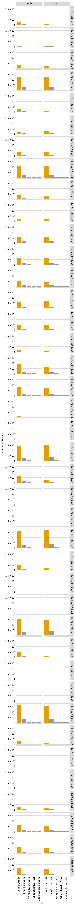

# Count variants in each sample
This Python Jupyter notebook counts occurrences of each barcode in each sample from Illumina barcode sequencing, and adds these counts to the codon variant table.

## Set up analysis
### Import Python modules.
Use [plotnine](https://plotnine.readthedocs.io/en/stable/) for ggplot2-like plotting.

The analysis relies heavily on the Bloom lab's [dms_variants](https://jbloomlab.github.io/dms_variants) package:


```python
import glob
import itertools
import multiprocessing
import multiprocessing.pool
import os
import warnings

import alignparse
import alignparse.targets

import dms_variants.codonvarianttable
from dms_variants.constants import CBPALETTE
import dms_variants.illuminabarcodeparser
import dms_variants.utils
import dms_variants.plotnine_themes

from IPython.display import display, HTML

import pandas as pd

from plotnine import *

import yaml
```

Set [plotnine](https://plotnine.readthedocs.io/en/stable/) theme to the gray-grid one defined in `dms_variants`:


```python
theme_set(dms_variants.plotnine_themes.theme_graygrid())
```

Versions of key software:


```python
print(f"Using alignparse version {alignparse.__version__}")
print(f"Using dms_variants version {dms_variants.__version__}")
```

    Using alignparse version 0.2.4
    Using dms_variants version 0.8.9


Ignore warnings that clutter output:


```python
warnings.simplefilter('ignore')
```

### Parameters for notebook
Read the configuration file:


```python
with open('config.yaml') as f:
    config = yaml.safe_load(f)
```

Make output directory if needed:


```python
os.makedirs(config['counts_dir'], exist_ok=True)
os.makedirs(config['figs_dir'], exist_ok=True)
```

## Input variant tables
Initialize the table of barcode-variant pairs from the respective `process_ccs` notebooks for each background.


```python
variants = pd.read_csv(config['codon_variant_table_file_Wuhan_Hu_1'], na_filter=None)
variants = variants.append(pd.read_csv(config['codon_variant_table_file_E484K'], na_filter=None))
variants = variants.append(pd.read_csv(config['codon_variant_table_file_N501Y'], na_filter=None))
variants = variants.append(pd.read_csv(config['codon_variant_table_file_B1351'], na_filter=None))

variants = variants.reset_index(drop=True)

display(HTML(variants.head().to_html(index=False)))
```


<table border="1" class="dataframe">
  <thead>
    <tr style="text-align: right;">
      <th>target</th>
      <th>library</th>
      <th>barcode</th>
      <th>variant_call_support</th>
      <th>codon_substitutions</th>
      <th>aa_substitutions</th>
      <th>n_codon_substitutions</th>
      <th>n_aa_substitutions</th>
    </tr>
  </thead>
  <tbody>
    <tr>
      <td>Wuhan_Hu_1</td>
      <td>pool1</td>
      <td>AAAAAAAAAAATTTAA</td>
      <td>4</td>
      <td></td>
      <td></td>
      <td>0</td>
      <td>0</td>
    </tr>
    <tr>
      <td>Wuhan_Hu_1</td>
      <td>pool1</td>
      <td>AAAAAAAAAACGCGTA</td>
      <td>3</td>
      <td>GAA154ACT</td>
      <td>E154T</td>
      <td>1</td>
      <td>1</td>
    </tr>
    <tr>
      <td>Wuhan_Hu_1</td>
      <td>pool1</td>
      <td>AAAAAAAAAACTCCAA</td>
      <td>2</td>
      <td>TTT156ATG</td>
      <td>F156M</td>
      <td>1</td>
      <td>1</td>
    </tr>
    <tr>
      <td>Wuhan_Hu_1</td>
      <td>pool1</td>
      <td>AAAAAAAAACCGATTA</td>
      <td>2</td>
      <td>CAG84GAA</td>
      <td>Q84E</td>
      <td>1</td>
      <td>1</td>
    </tr>
    <tr>
      <td>Wuhan_Hu_1</td>
      <td>pool1</td>
      <td>AAAAAAAAACGGATGA</td>
      <td>1</td>
      <td>GCT14GGT</td>
      <td>A14G</td>
      <td>1</td>
      <td>1</td>
    </tr>
  </tbody>
</table>


Are there any barcodes in the same library that are shared across targets?
If so, we need to get rid of those as they will be confounded in barcode parsing:


```python
dup_barcodes = (
    variants
    .groupby(['library', 'barcode'])
    .size()
    .rename('duplicate_count')
    .reset_index()
    .query('duplicate_count > 1')
    )

print('Here are duplicated barcodes:')
display(HTML(dup_barcodes.head().to_html(index=False)))

print(f"\nRemoving the {len(dup_barcodes)} duplicated barcodes."
      f"Started with {len(variants)} barcodes:")
variants = (
    variants
    .merge(dup_barcodes, on=['library', 'barcode'], how='outer')
    .query('duplicate_count.isnull()', engine='python')
    )
print(f"After removing duplicates, there are {len(variants)} barcodes.")
```

    Here are duplicated barcodes:


<table border="1" class="dataframe">
  <thead>
    <tr style="text-align: right;">
      <th>library</th>
      <th>barcode</th>
      <th>duplicate_count</th>
    </tr>
  </thead>
  <tbody>
    <tr>
      <td>pool1</td>
      <td>AAAGAGACAATTCGTT</td>
      <td>2</td>
    </tr>
    <tr>
      <td>pool1</td>
      <td>AAAGCCGGATTCGTAC</td>
      <td>2</td>
    </tr>
    <tr>
      <td>pool1</td>
      <td>AAATATGAAAGATACA</td>
      <td>2</td>
    </tr>
    <tr>
      <td>pool1</td>
      <td>AACAGCCGATTTACAA</td>
      <td>2</td>
    </tr>
    <tr>
      <td>pool1</td>
      <td>AAGAGCATAAGCCCCA</td>
      <td>2</td>
    </tr>
  </tbody>
</table>


    
    Removing the 347 duplicated barcodes.Started with 330417 barcodes:
    After removing duplicates, there are 329723 barcodes.


Pull out a target sequence for matching to the barcode and flanking sequence regions. Note, in this pipeline this is ok because our different backgrounds don't have differing flanks or other features within the actual N16 region covered in Illumina sequencing. If ever placing in-line barcodes here in the future, we would need to modify this.


```python
# get wildtype gene sequence for primary target
targets = alignparse.targets.Targets(seqsfile=config['amplicons_Wuhan_Hu_1'],
                                     feature_parse_specs=config['feature_parse_specs_Wuhan_Hu_1'])
```

## Setup to parse barcodes
Read data frame with list of all barcode runs.


```python
# barcode runs with R1 files expanded by glob
barcode_runs = (
    pd.read_csv(config['barcode_runs'])
    .assign(R1=lambda x: x['R1'].str.split('; ').map(
                    lambda y: list(itertools.chain(*map(glob.glob, y)))),
            n_R1=lambda x: x['R1'].map(len),
            )
    )

display(HTML(barcode_runs.to_html(index=False)))
```


<table border="1" class="dataframe">
  <thead>
    <tr style="text-align: right;">
      <th>library</th>
      <th>sample</th>
      <th>sample_type</th>
      <th>sort_bin</th>
      <th>concentration</th>
      <th>date</th>
      <th>number_cells</th>
      <th>R1_prefix</th>
      <th>R1_samplename</th>
      <th>R1_postfix</th>
      <th>R1</th>
      <th>n_R1</th>
    </tr>
  </thead>
  <tbody>
    <tr>
      <td>pool1</td>
      <td>SortSeq_bin1</td>
      <td>SortSeq</td>
      <td>1</td>
      <td>NaN</td>
      <td>210603</td>
      <td>500500</td>
      <td>/shared/ngs/illumina/tstarr/210614_D00300_1254_AHLLWLBCX3/Unaligned/Project_tstarr/</td>
      <td>210603_lib1_bin1</td>
      <td>*R1*.fastq.gz</td>
      <td>[/shared/ngs/illumina/tstarr/210614_D00300_1254_AHLLWLBCX3/Unaligned/Project_tstarr/210603_lib1_bin1_4_S40_R1_001.fastq.gz, /shared/ngs/illumina/tstarr/210614_D00300_1254_AHLLWLBCX3/Unaligned/Project_tstarr/210603_lib1_bin1_3_S39_R1_001.fastq.gz, /shared/ngs/illumina/tstarr/210614_D00300_1254_AHLLWLBCX3/Unaligned/Project_tstarr/210603_lib1_bin1_2_S38_R1_001.fastq.gz, /shared/ngs/illumina/tstarr/210614_D00300_1254_AHLLWLBCX3/Unaligned/Project_tstarr/210603_lib1_bin1_1_S37_R1_001.fastq.gz]</td>
      <td>4</td>
    </tr>
    <tr>
      <td>pool1</td>
      <td>SortSeq_bin2</td>
      <td>SortSeq</td>
      <td>2</td>
      <td>NaN</td>
      <td>210603</td>
      <td>309000</td>
      <td>/shared/ngs/illumina/tstarr/210614_D00300_1254_AHLLWLBCX3/Unaligned/Project_tstarr/</td>
      <td>210603_lib1_bin2</td>
      <td>*R1*.fastq.gz</td>
      <td>[/shared/ngs/illumina/tstarr/210614_D00300_1254_AHLLWLBCX3/Unaligned/Project_tstarr/210603_lib1_bin2_1_S41_R1_001.fastq.gz, /shared/ngs/illumina/tstarr/210614_D00300_1254_AHLLWLBCX3/Unaligned/Project_tstarr/210603_lib1_bin2_2_S42_R1_001.fastq.gz]</td>
      <td>2</td>
    </tr>
    <tr>
      <td>pool1</td>
      <td>SortSeq_bin3</td>
      <td>SortSeq</td>
      <td>3</td>
      <td>NaN</td>
      <td>210603</td>
      <td>710000</td>
      <td>/shared/ngs/illumina/tstarr/210614_D00300_1254_AHLLWLBCX3/Unaligned/Project_tstarr/</td>
      <td>210603_lib1_bin3</td>
      <td>*R1*.fastq.gz</td>
      <td>[/shared/ngs/illumina/tstarr/210614_D00300_1254_AHLLWLBCX3/Unaligned/Project_tstarr/210603_lib1_bin3_1_S43_R1_001.fastq.gz, /shared/ngs/illumina/tstarr/210614_D00300_1254_AHLLWLBCX3/Unaligned/Project_tstarr/210603_lib1_bin3_2_S44_R1_001.fastq.gz]</td>
      <td>2</td>
    </tr>
    <tr>
      <td>pool1</td>
      <td>SortSeq_bin4</td>
      <td>SortSeq</td>
      <td>4</td>
      <td>NaN</td>
      <td>210603</td>
      <td>2080000</td>
      <td>/shared/ngs/illumina/tstarr/210614_D00300_1254_AHLLWLBCX3/Unaligned/Project_tstarr/</td>
      <td>210603_lib1_bin4</td>
      <td>*R1*.fastq.gz</td>
      <td>[/shared/ngs/illumina/tstarr/210614_D00300_1254_AHLLWLBCX3/Unaligned/Project_tstarr/210603_lib1_bin4_1_S45_R1_001.fastq.gz, /shared/ngs/illumina/tstarr/210614_D00300_1254_AHLLWLBCX3/Unaligned/Project_tstarr/210603_lib1_bin4_2_S46_R1_001.fastq.gz]</td>
      <td>2</td>
    </tr>
    <tr>
      <td>pool1</td>
      <td>TiteSeq_01_bin1</td>
      <td>TiteSeq</td>
      <td>1</td>
      <td>1.0</td>
      <td>210610</td>
      <td>858664</td>
      <td>/shared/ngs/illumina/tstarr/210614_D00300_1254_AHLLWLBCX3/Unaligned/Project_tstarr/</td>
      <td>210610_s01-b1</td>
      <td>*R1*.fastq.gz</td>
      <td>[/shared/ngs/illumina/tstarr/210614_D00300_1254_AHLLWLBCX3/Unaligned/Project_tstarr/210610_s01-b1_S1_R1_001.fastq.gz]</td>
      <td>1</td>
    </tr>
    <tr>
      <td>pool1</td>
      <td>TiteSeq_01_bin2</td>
      <td>TiteSeq</td>
      <td>2</td>
      <td>1.0</td>
      <td>210610</td>
      <td>460882</td>
      <td>/shared/ngs/illumina/tstarr/210614_D00300_1254_AHLLWLBCX3/Unaligned/Project_tstarr/</td>
      <td>210610_s01-b2</td>
      <td>*R1*.fastq.gz</td>
      <td>[/shared/ngs/illumina/tstarr/210614_D00300_1254_AHLLWLBCX3/Unaligned/Project_tstarr/210610_s01-b2_S2_R1_001.fastq.gz]</td>
      <td>1</td>
    </tr>
    <tr>
      <td>pool1</td>
      <td>TiteSeq_01_bin3</td>
      <td>TiteSeq</td>
      <td>3</td>
      <td>1.0</td>
      <td>210610</td>
      <td>1250537</td>
      <td>/shared/ngs/illumina/tstarr/210614_D00300_1254_AHLLWLBCX3/Unaligned/Project_tstarr/</td>
      <td>210610_s01-b3</td>
      <td>*R1*.fastq.gz</td>
      <td>[/shared/ngs/illumina/tstarr/210614_D00300_1254_AHLLWLBCX3/Unaligned/Project_tstarr/210610_s01-b3_S3_R1_001.fastq.gz]</td>
      <td>1</td>
    </tr>
    <tr>
      <td>pool1</td>
      <td>TiteSeq_01_bin4</td>
      <td>TiteSeq</td>
      <td>4</td>
      <td>1.0</td>
      <td>210610</td>
      <td>7549363</td>
      <td>/shared/ngs/illumina/tstarr/210614_D00300_1254_AHLLWLBCX3/Unaligned/Project_tstarr/</td>
      <td>210610_s01-b4</td>
      <td>*R1*.fastq.gz</td>
      <td>[/shared/ngs/illumina/tstarr/210614_D00300_1254_AHLLWLBCX3/Unaligned/Project_tstarr/210610_s01-b4_S4_R1_001.fastq.gz]</td>
      <td>1</td>
    </tr>
    <tr>
      <td>pool1</td>
      <td>TiteSeq_02_bin1</td>
      <td>TiteSeq</td>
      <td>1</td>
      <td>2.0</td>
      <td>210610</td>
      <td>1324428</td>
      <td>/shared/ngs/illumina/tstarr/210614_D00300_1254_AHLLWLBCX3/Unaligned/Project_tstarr/</td>
      <td>210610_s02-b1</td>
      <td>*R1*.fastq.gz</td>
      <td>[/shared/ngs/illumina/tstarr/210614_D00300_1254_AHLLWLBCX3/Unaligned/Project_tstarr/210610_s02-b1_S5_R1_001.fastq.gz]</td>
      <td>1</td>
    </tr>
    <tr>
      <td>pool1</td>
      <td>TiteSeq_02_bin2</td>
      <td>TiteSeq</td>
      <td>2</td>
      <td>2.0</td>
      <td>210610</td>
      <td>926365</td>
      <td>/shared/ngs/illumina/tstarr/210614_D00300_1254_AHLLWLBCX3/Unaligned/Project_tstarr/</td>
      <td>210610_s02-b2</td>
      <td>*R1*.fastq.gz</td>
      <td>[/shared/ngs/illumina/tstarr/210614_D00300_1254_AHLLWLBCX3/Unaligned/Project_tstarr/210610_s02-b2_S6_R1_001.fastq.gz]</td>
      <td>1</td>
    </tr>
    <tr>
      <td>pool1</td>
      <td>TiteSeq_02_bin3</td>
      <td>TiteSeq</td>
      <td>3</td>
      <td>2.0</td>
      <td>210610</td>
      <td>1663441</td>
      <td>/shared/ngs/illumina/tstarr/210614_D00300_1254_AHLLWLBCX3/Unaligned/Project_tstarr/</td>
      <td>210610_s02-b3</td>
      <td>*R1*.fastq.gz</td>
      <td>[/shared/ngs/illumina/tstarr/210614_D00300_1254_AHLLWLBCX3/Unaligned/Project_tstarr/210610_s02-b3_S7_R1_001.fastq.gz]</td>
      <td>1</td>
    </tr>
    <tr>
      <td>pool1</td>
      <td>TiteSeq_02_bin4</td>
      <td>TiteSeq</td>
      <td>4</td>
      <td>2.0</td>
      <td>210610</td>
      <td>6226953</td>
      <td>/shared/ngs/illumina/tstarr/210614_D00300_1254_AHLLWLBCX3/Unaligned/Project_tstarr/</td>
      <td>210610_s02-b4</td>
      <td>*R1*.fastq.gz</td>
      <td>[/shared/ngs/illumina/tstarr/210614_D00300_1254_AHLLWLBCX3/Unaligned/Project_tstarr/210610_s02-b4_S8_R1_001.fastq.gz]</td>
      <td>1</td>
    </tr>
    <tr>
      <td>pool1</td>
      <td>TiteSeq_03_bin1</td>
      <td>TiteSeq</td>
      <td>1</td>
      <td>3.0</td>
      <td>210610</td>
      <td>2278383</td>
      <td>/shared/ngs/illumina/tstarr/210614_D00300_1254_AHLLWLBCX3/Unaligned/Project_tstarr/</td>
      <td>210610_s03-b1</td>
      <td>*R1*.fastq.gz</td>
      <td>[/shared/ngs/illumina/tstarr/210614_D00300_1254_AHLLWLBCX3/Unaligned/Project_tstarr/210610_s03-b1_S9_R1_001.fastq.gz]</td>
      <td>1</td>
    </tr>
    <tr>
      <td>pool1</td>
      <td>TiteSeq_03_bin2</td>
      <td>TiteSeq</td>
      <td>2</td>
      <td>3.0</td>
      <td>210610</td>
      <td>1230724</td>
      <td>/shared/ngs/illumina/tstarr/210614_D00300_1254_AHLLWLBCX3/Unaligned/Project_tstarr/</td>
      <td>210610_s03-b2</td>
      <td>*R1*.fastq.gz</td>
      <td>[/shared/ngs/illumina/tstarr/210614_D00300_1254_AHLLWLBCX3/Unaligned/Project_tstarr/210610_s03-b2_S10_R1_001.fastq.gz]</td>
      <td>1</td>
    </tr>
    <tr>
      <td>pool1</td>
      <td>TiteSeq_03_bin3</td>
      <td>TiteSeq</td>
      <td>3</td>
      <td>3.0</td>
      <td>210610</td>
      <td>1959289</td>
      <td>/shared/ngs/illumina/tstarr/210614_D00300_1254_AHLLWLBCX3/Unaligned/Project_tstarr/</td>
      <td>210610_s03-b3</td>
      <td>*R1*.fastq.gz</td>
      <td>[/shared/ngs/illumina/tstarr/210614_D00300_1254_AHLLWLBCX3/Unaligned/Project_tstarr/210610_s03-b3_S11_R1_001.fastq.gz]</td>
      <td>1</td>
    </tr>
    <tr>
      <td>pool1</td>
      <td>TiteSeq_03_bin4</td>
      <td>TiteSeq</td>
      <td>4</td>
      <td>3.0</td>
      <td>210610</td>
      <td>4428498</td>
      <td>/shared/ngs/illumina/tstarr/210614_D00300_1254_AHLLWLBCX3/Unaligned/Project_tstarr/</td>
      <td>210610_s03-b4</td>
      <td>*R1*.fastq.gz</td>
      <td>[/shared/ngs/illumina/tstarr/210614_D00300_1254_AHLLWLBCX3/Unaligned/Project_tstarr/210610_s03-b4_S12_R1_001.fastq.gz]</td>
      <td>1</td>
    </tr>
    <tr>
      <td>pool1</td>
      <td>TiteSeq_04_bin1</td>
      <td>TiteSeq</td>
      <td>1</td>
      <td>4.0</td>
      <td>210610</td>
      <td>4939429</td>
      <td>/shared/ngs/illumina/tstarr/210614_D00300_1254_AHLLWLBCX3/Unaligned/Project_tstarr/</td>
      <td>210610_s04-b1</td>
      <td>*R1*.fastq.gz</td>
      <td>[/shared/ngs/illumina/tstarr/210614_D00300_1254_AHLLWLBCX3/Unaligned/Project_tstarr/210610_s04-b1_S13_R1_001.fastq.gz]</td>
      <td>1</td>
    </tr>
    <tr>
      <td>pool1</td>
      <td>TiteSeq_04_bin2</td>
      <td>TiteSeq</td>
      <td>2</td>
      <td>4.0</td>
      <td>210610</td>
      <td>2213476</td>
      <td>/shared/ngs/illumina/tstarr/210614_D00300_1254_AHLLWLBCX3/Unaligned/Project_tstarr/</td>
      <td>210610_s04-b2</td>
      <td>*R1*.fastq.gz</td>
      <td>[/shared/ngs/illumina/tstarr/210614_D00300_1254_AHLLWLBCX3/Unaligned/Project_tstarr/210610_s04-b2_S14_R1_001.fastq.gz]</td>
      <td>1</td>
    </tr>
    <tr>
      <td>pool1</td>
      <td>TiteSeq_04_bin3</td>
      <td>TiteSeq</td>
      <td>3</td>
      <td>4.0</td>
      <td>210610</td>
      <td>2032674</td>
      <td>/shared/ngs/illumina/tstarr/210614_D00300_1254_AHLLWLBCX3/Unaligned/Project_tstarr/</td>
      <td>210610_s04-b3</td>
      <td>*R1*.fastq.gz</td>
      <td>[/shared/ngs/illumina/tstarr/210614_D00300_1254_AHLLWLBCX3/Unaligned/Project_tstarr/210610_s04-b3_S15_R1_001.fastq.gz]</td>
      <td>1</td>
    </tr>
    <tr>
      <td>pool1</td>
      <td>TiteSeq_04_bin4</td>
      <td>TiteSeq</td>
      <td>4</td>
      <td>4.0</td>
      <td>210610</td>
      <td>1063886</td>
      <td>/shared/ngs/illumina/tstarr/210614_D00300_1254_AHLLWLBCX3/Unaligned/Project_tstarr/</td>
      <td>210610_s04-b4</td>
      <td>*R1*.fastq.gz</td>
      <td>[/shared/ngs/illumina/tstarr/210614_D00300_1254_AHLLWLBCX3/Unaligned/Project_tstarr/210610_s04-b4_S16_R1_001.fastq.gz]</td>
      <td>1</td>
    </tr>
    <tr>
      <td>pool1</td>
      <td>TiteSeq_05_bin1</td>
      <td>TiteSeq</td>
      <td>1</td>
      <td>5.0</td>
      <td>210610</td>
      <td>8563762</td>
      <td>/shared/ngs/illumina/tstarr/210614_D00300_1254_AHLLWLBCX3/Unaligned/Project_tstarr/</td>
      <td>210610_s05-b1</td>
      <td>*R1*.fastq.gz</td>
      <td>[/shared/ngs/illumina/tstarr/210614_D00300_1254_AHLLWLBCX3/Unaligned/Project_tstarr/210610_s05-b1_S17_R1_001.fastq.gz]</td>
      <td>1</td>
    </tr>
    <tr>
      <td>pool1</td>
      <td>TiteSeq_05_bin2</td>
      <td>TiteSeq</td>
      <td>2</td>
      <td>5.0</td>
      <td>210610</td>
      <td>1854929</td>
      <td>/shared/ngs/illumina/tstarr/210614_D00300_1254_AHLLWLBCX3/Unaligned/Project_tstarr/</td>
      <td>210610_s05-b2</td>
      <td>*R1*.fastq.gz</td>
      <td>[/shared/ngs/illumina/tstarr/210614_D00300_1254_AHLLWLBCX3/Unaligned/Project_tstarr/210610_s05-b2_S18_R1_001.fastq.gz]</td>
      <td>1</td>
    </tr>
    <tr>
      <td>pool1</td>
      <td>TiteSeq_05_bin3</td>
      <td>TiteSeq</td>
      <td>3</td>
      <td>5.0</td>
      <td>210610</td>
      <td>199348</td>
      <td>/shared/ngs/illumina/tstarr/210614_D00300_1254_AHLLWLBCX3/Unaligned/Project_tstarr/</td>
      <td>210610_s05-b3</td>
      <td>*R1*.fastq.gz</td>
      <td>[/shared/ngs/illumina/tstarr/210614_D00300_1254_AHLLWLBCX3/Unaligned/Project_tstarr/210610_s05-b3_S19_R1_001.fastq.gz]</td>
      <td>1</td>
    </tr>
    <tr>
      <td>pool1</td>
      <td>TiteSeq_05_bin4</td>
      <td>TiteSeq</td>
      <td>4</td>
      <td>5.0</td>
      <td>210610</td>
      <td>5275</td>
      <td>/shared/ngs/illumina/tstarr/210614_D00300_1254_AHLLWLBCX3/Unaligned/Project_tstarr/</td>
      <td>210610_s05-b4</td>
      <td>*R1*.fastq.gz</td>
      <td>[/shared/ngs/illumina/tstarr/210614_D00300_1254_AHLLWLBCX3/Unaligned/Project_tstarr/210610_s05-b4_S20_R1_001.fastq.gz]</td>
      <td>1</td>
    </tr>
    <tr>
      <td>pool1</td>
      <td>TiteSeq_06_bin1</td>
      <td>TiteSeq</td>
      <td>1</td>
      <td>6.0</td>
      <td>210610</td>
      <td>10038244</td>
      <td>/shared/ngs/illumina/tstarr/210614_D00300_1254_AHLLWLBCX3/Unaligned/Project_tstarr/</td>
      <td>210610_s06-b1</td>
      <td>*R1*.fastq.gz</td>
      <td>[/shared/ngs/illumina/tstarr/210614_D00300_1254_AHLLWLBCX3/Unaligned/Project_tstarr/210610_s06-b1_S21_R1_001.fastq.gz]</td>
      <td>1</td>
    </tr>
    <tr>
      <td>pool1</td>
      <td>TiteSeq_06_bin2</td>
      <td>TiteSeq</td>
      <td>2</td>
      <td>6.0</td>
      <td>210610</td>
      <td>358173</td>
      <td>/shared/ngs/illumina/tstarr/210614_D00300_1254_AHLLWLBCX3/Unaligned/Project_tstarr/</td>
      <td>210610_s06-b2</td>
      <td>*R1*.fastq.gz</td>
      <td>[/shared/ngs/illumina/tstarr/210614_D00300_1254_AHLLWLBCX3/Unaligned/Project_tstarr/210610_s06-b2_S22_R1_001.fastq.gz]</td>
      <td>1</td>
    </tr>
    <tr>
      <td>pool1</td>
      <td>TiteSeq_06_bin3</td>
      <td>TiteSeq</td>
      <td>3</td>
      <td>6.0</td>
      <td>210610</td>
      <td>1708</td>
      <td>/shared/ngs/illumina/tstarr/210614_D00300_1254_AHLLWLBCX3/Unaligned/Project_tstarr/</td>
      <td>210610_s06-b3</td>
      <td>*R1*.fastq.gz</td>
      <td>[/shared/ngs/illumina/tstarr/210614_D00300_1254_AHLLWLBCX3/Unaligned/Project_tstarr/210610_s06-b3_S23_R1_001.fastq.gz]</td>
      <td>1</td>
    </tr>
    <tr>
      <td>pool1</td>
      <td>TiteSeq_06_bin4</td>
      <td>TiteSeq</td>
      <td>4</td>
      <td>6.0</td>
      <td>210610</td>
      <td>730</td>
      <td>/shared/ngs/illumina/tstarr/210614_D00300_1254_AHLLWLBCX3/Unaligned/Project_tstarr/</td>
      <td>210610_s06-b4</td>
      <td>*R1*.fastq.gz</td>
      <td>[/shared/ngs/illumina/tstarr/210614_D00300_1254_AHLLWLBCX3/Unaligned/Project_tstarr/210610_s06-b4_S24_R1_001.fastq.gz]</td>
      <td>1</td>
    </tr>
    <tr>
      <td>pool1</td>
      <td>TiteSeq_07_bin1</td>
      <td>TiteSeq</td>
      <td>1</td>
      <td>7.0</td>
      <td>210610</td>
      <td>10039342</td>
      <td>/shared/ngs/illumina/tstarr/210614_D00300_1254_AHLLWLBCX3/Unaligned/Project_tstarr/</td>
      <td>210610_s07-b1</td>
      <td>*R1*.fastq.gz</td>
      <td>[/shared/ngs/illumina/tstarr/210614_D00300_1254_AHLLWLBCX3/Unaligned/Project_tstarr/210610_s07-b1_S25_R1_001.fastq.gz]</td>
      <td>1</td>
    </tr>
    <tr>
      <td>pool1</td>
      <td>TiteSeq_07_bin2</td>
      <td>TiteSeq</td>
      <td>2</td>
      <td>7.0</td>
      <td>210610</td>
      <td>293635</td>
      <td>/shared/ngs/illumina/tstarr/210614_D00300_1254_AHLLWLBCX3/Unaligned/Project_tstarr/</td>
      <td>210610_s07-b2</td>
      <td>*R1*.fastq.gz</td>
      <td>[/shared/ngs/illumina/tstarr/210614_D00300_1254_AHLLWLBCX3/Unaligned/Project_tstarr/210610_s07-b2_S26_R1_001.fastq.gz]</td>
      <td>1</td>
    </tr>
    <tr>
      <td>pool1</td>
      <td>TiteSeq_07_bin3</td>
      <td>TiteSeq</td>
      <td>3</td>
      <td>7.0</td>
      <td>210610</td>
      <td>1088</td>
      <td>/shared/ngs/illumina/tstarr/210614_D00300_1254_AHLLWLBCX3/Unaligned/Project_tstarr/</td>
      <td>210610_s07-b3</td>
      <td>*R1*.fastq.gz</td>
      <td>[/shared/ngs/illumina/tstarr/210614_D00300_1254_AHLLWLBCX3/Unaligned/Project_tstarr/210610_s07-b3_S27_R1_001.fastq.gz]</td>
      <td>1</td>
    </tr>
    <tr>
      <td>pool1</td>
      <td>TiteSeq_07_bin4</td>
      <td>TiteSeq</td>
      <td>4</td>
      <td>7.0</td>
      <td>210610</td>
      <td>631</td>
      <td>/shared/ngs/illumina/tstarr/210614_D00300_1254_AHLLWLBCX3/Unaligned/Project_tstarr/</td>
      <td>210610_s07-b4</td>
      <td>*R1*.fastq.gz</td>
      <td>[/shared/ngs/illumina/tstarr/210614_D00300_1254_AHLLWLBCX3/Unaligned/Project_tstarr/210610_s07-b4_S28_R1_001.fastq.gz]</td>
      <td>1</td>
    </tr>
    <tr>
      <td>pool1</td>
      <td>TiteSeq_08_bin1</td>
      <td>TiteSeq</td>
      <td>1</td>
      <td>8.0</td>
      <td>210610</td>
      <td>10026201</td>
      <td>/shared/ngs/illumina/tstarr/210614_D00300_1254_AHLLWLBCX3/Unaligned/Project_tstarr/</td>
      <td>210610_s08-b1</td>
      <td>*R1*.fastq.gz</td>
      <td>[/shared/ngs/illumina/tstarr/210614_D00300_1254_AHLLWLBCX3/Unaligned/Project_tstarr/210610_s08-b1_S29_R1_001.fastq.gz]</td>
      <td>1</td>
    </tr>
    <tr>
      <td>pool1</td>
      <td>TiteSeq_08_bin2</td>
      <td>TiteSeq</td>
      <td>2</td>
      <td>8.0</td>
      <td>210610</td>
      <td>267959</td>
      <td>/shared/ngs/illumina/tstarr/210614_D00300_1254_AHLLWLBCX3/Unaligned/Project_tstarr/</td>
      <td>210610_s08-b2</td>
      <td>*R1*.fastq.gz</td>
      <td>[/shared/ngs/illumina/tstarr/210614_D00300_1254_AHLLWLBCX3/Unaligned/Project_tstarr/210610_s08-b2_S30_R1_001.fastq.gz]</td>
      <td>1</td>
    </tr>
    <tr>
      <td>pool1</td>
      <td>TiteSeq_08_bin3</td>
      <td>TiteSeq</td>
      <td>3</td>
      <td>8.0</td>
      <td>210610</td>
      <td>1113</td>
      <td>/shared/ngs/illumina/tstarr/210614_D00300_1254_AHLLWLBCX3/Unaligned/Project_tstarr/</td>
      <td>210610_s08-b3</td>
      <td>*R1*.fastq.gz</td>
      <td>[/shared/ngs/illumina/tstarr/210614_D00300_1254_AHLLWLBCX3/Unaligned/Project_tstarr/210610_s08-b3_S31_R1_001.fastq.gz]</td>
      <td>1</td>
    </tr>
    <tr>
      <td>pool1</td>
      <td>TiteSeq_08_bin4</td>
      <td>TiteSeq</td>
      <td>4</td>
      <td>8.0</td>
      <td>210610</td>
      <td>661</td>
      <td>/shared/ngs/illumina/tstarr/210614_D00300_1254_AHLLWLBCX3/Unaligned/Project_tstarr/</td>
      <td>210610_s08-b4</td>
      <td>*R1*.fastq.gz</td>
      <td>[/shared/ngs/illumina/tstarr/210614_D00300_1254_AHLLWLBCX3/Unaligned/Project_tstarr/210610_s08-b4_S32_R1_001.fastq.gz]</td>
      <td>1</td>
    </tr>
    <tr>
      <td>pool1</td>
      <td>TiteSeq_09_bin1</td>
      <td>TiteSeq</td>
      <td>1</td>
      <td>9.0</td>
      <td>210610</td>
      <td>9930895</td>
      <td>/shared/ngs/illumina/tstarr/210614_D00300_1254_AHLLWLBCX3/Unaligned/Project_tstarr/</td>
      <td>210610_s09-b1</td>
      <td>*R1*.fastq.gz</td>
      <td>[/shared/ngs/illumina/tstarr/210614_D00300_1254_AHLLWLBCX3/Unaligned/Project_tstarr/210610_s09-b1_S33_R1_001.fastq.gz]</td>
      <td>1</td>
    </tr>
    <tr>
      <td>pool1</td>
      <td>TiteSeq_09_bin2</td>
      <td>TiteSeq</td>
      <td>2</td>
      <td>9.0</td>
      <td>210610</td>
      <td>280327</td>
      <td>/shared/ngs/illumina/tstarr/210614_D00300_1254_AHLLWLBCX3/Unaligned/Project_tstarr/</td>
      <td>210610_s09-b2</td>
      <td>*R1*.fastq.gz</td>
      <td>[/shared/ngs/illumina/tstarr/210614_D00300_1254_AHLLWLBCX3/Unaligned/Project_tstarr/210610_s09-b2_S34_R1_001.fastq.gz]</td>
      <td>1</td>
    </tr>
    <tr>
      <td>pool1</td>
      <td>TiteSeq_09_bin3</td>
      <td>TiteSeq</td>
      <td>3</td>
      <td>9.0</td>
      <td>210610</td>
      <td>1273</td>
      <td>/shared/ngs/illumina/tstarr/210614_D00300_1254_AHLLWLBCX3/Unaligned/Project_tstarr/</td>
      <td>210610_s09-b3</td>
      <td>*R1*.fastq.gz</td>
      <td>[/shared/ngs/illumina/tstarr/210614_D00300_1254_AHLLWLBCX3/Unaligned/Project_tstarr/210610_s09-b3_S35_R1_001.fastq.gz]</td>
      <td>1</td>
    </tr>
    <tr>
      <td>pool1</td>
      <td>TiteSeq_09_bin4</td>
      <td>TiteSeq</td>
      <td>4</td>
      <td>9.0</td>
      <td>210610</td>
      <td>865</td>
      <td>/shared/ngs/illumina/tstarr/210614_D00300_1254_AHLLWLBCX3/Unaligned/Project_tstarr/</td>
      <td>210610_s09-b4</td>
      <td>*R1*.fastq.gz</td>
      <td>[/shared/ngs/illumina/tstarr/210614_D00300_1254_AHLLWLBCX3/Unaligned/Project_tstarr/210610_s09-b4_S36_R1_001.fastq.gz]</td>
      <td>1</td>
    </tr>
    <tr>
      <td>pool2</td>
      <td>SortSeq_bin1</td>
      <td>SortSeq</td>
      <td>1</td>
      <td>NaN</td>
      <td>210603</td>
      <td>624000</td>
      <td>/shared/ngs/illumina/tstarr/210614_D00300_1254_AHLLWLBCX3/Unaligned/Project_tstarr/</td>
      <td>210603_lib2_bin1</td>
      <td>*R1*.fastq.gz</td>
      <td>[/shared/ngs/illumina/tstarr/210614_D00300_1254_AHLLWLBCX3/Unaligned/Project_tstarr/210603_lib2_bin1_1_S87_R1_001.fastq.gz, /shared/ngs/illumina/tstarr/210614_D00300_1254_AHLLWLBCX3/Unaligned/Project_tstarr/210603_lib2_bin1_3_S89_R1_001.fastq.gz, /shared/ngs/illumina/tstarr/210614_D00300_1254_AHLLWLBCX3/Unaligned/Project_tstarr/210603_lib2_bin1_4_S90_R1_001.fastq.gz, /shared/ngs/illumina/tstarr/210614_D00300_1254_AHLLWLBCX3/Unaligned/Project_tstarr/210603_lib2_bin1_2_S88_R1_001.fastq.gz]</td>
      <td>4</td>
    </tr>
    <tr>
      <td>pool2</td>
      <td>SortSeq_bin2</td>
      <td>SortSeq</td>
      <td>2</td>
      <td>NaN</td>
      <td>210603</td>
      <td>2010000</td>
      <td>/shared/ngs/illumina/tstarr/210614_D00300_1254_AHLLWLBCX3/Unaligned/Project_tstarr/</td>
      <td>210603_lib2_bin2</td>
      <td>*R1*.fastq.gz</td>
      <td>[/shared/ngs/illumina/tstarr/210614_D00300_1254_AHLLWLBCX3/Unaligned/Project_tstarr/210603_lib2_bin2_1_S91_R1_001.fastq.gz, /shared/ngs/illumina/tstarr/210614_D00300_1254_AHLLWLBCX3/Unaligned/Project_tstarr/210603_lib2_bin2_2_S92_R1_001.fastq.gz]</td>
      <td>2</td>
    </tr>
    <tr>
      <td>pool2</td>
      <td>SortSeq_bin3</td>
      <td>SortSeq</td>
      <td>3</td>
      <td>NaN</td>
      <td>210603</td>
      <td>840000</td>
      <td>/shared/ngs/illumina/tstarr/210614_D00300_1254_AHLLWLBCX3/Unaligned/Project_tstarr/</td>
      <td>210603_lib2_bin3</td>
      <td>*R1*.fastq.gz</td>
      <td>[/shared/ngs/illumina/tstarr/210614_D00300_1254_AHLLWLBCX3/Unaligned/Project_tstarr/210603_lib2_bin3_2_S94_R1_001.fastq.gz, /shared/ngs/illumina/tstarr/210614_D00300_1254_AHLLWLBCX3/Unaligned/Project_tstarr/210603_lib2_bin3_1_S93_R1_001.fastq.gz]</td>
      <td>2</td>
    </tr>
    <tr>
      <td>pool2</td>
      <td>SortSeq_bin4</td>
      <td>SortSeq</td>
      <td>4</td>
      <td>NaN</td>
      <td>210603</td>
      <td>1560000</td>
      <td>/shared/ngs/illumina/tstarr/210614_D00300_1254_AHLLWLBCX3/Unaligned/Project_tstarr/</td>
      <td>210603_lib2_bin4</td>
      <td>*R1*.fastq.gz</td>
      <td>[/shared/ngs/illumina/tstarr/210614_D00300_1254_AHLLWLBCX3/Unaligned/Project_tstarr/210603_lib2_bin4_2_S96_R1_001.fastq.gz, /shared/ngs/illumina/tstarr/210614_D00300_1254_AHLLWLBCX3/Unaligned/Project_tstarr/210603_lib2_bin4_1_S95_R1_001.fastq.gz]</td>
      <td>2</td>
    </tr>
    <tr>
      <td>pool2</td>
      <td>TiteSeq_01_bin1</td>
      <td>TiteSeq</td>
      <td>1</td>
      <td>1.0</td>
      <td>210610</td>
      <td>1102235</td>
      <td>/shared/ngs/illumina/tstarr/210614_D00300_1254_AHLLWLBCX3/Unaligned/Project_tstarr/</td>
      <td>210610_s10-b1</td>
      <td>*R1*.fastq.gz</td>
      <td>[/shared/ngs/illumina/tstarr/210614_D00300_1254_AHLLWLBCX3/Unaligned/Project_tstarr/210610_s10-b1_S51_R1_001.fastq.gz]</td>
      <td>1</td>
    </tr>
    <tr>
      <td>pool2</td>
      <td>TiteSeq_01_bin2</td>
      <td>TiteSeq</td>
      <td>2</td>
      <td>1.0</td>
      <td>210610</td>
      <td>412625</td>
      <td>/shared/ngs/illumina/tstarr/210614_D00300_1254_AHLLWLBCX3/Unaligned/Project_tstarr/</td>
      <td>210610_s10-b2</td>
      <td>*R1*.fastq.gz</td>
      <td>[/shared/ngs/illumina/tstarr/210614_D00300_1254_AHLLWLBCX3/Unaligned/Project_tstarr/210610_s10-b2_S52_R1_001.fastq.gz]</td>
      <td>1</td>
    </tr>
    <tr>
      <td>pool2</td>
      <td>TiteSeq_01_bin3</td>
      <td>TiteSeq</td>
      <td>3</td>
      <td>1.0</td>
      <td>210610</td>
      <td>833282</td>
      <td>/shared/ngs/illumina/tstarr/210614_D00300_1254_AHLLWLBCX3/Unaligned/Project_tstarr/</td>
      <td>210610_s10-b3</td>
      <td>*R1*.fastq.gz</td>
      <td>[/shared/ngs/illumina/tstarr/210614_D00300_1254_AHLLWLBCX3/Unaligned/Project_tstarr/210610_s10-b3_S53_R1_001.fastq.gz]</td>
      <td>1</td>
    </tr>
    <tr>
      <td>pool2</td>
      <td>TiteSeq_01_bin4</td>
      <td>TiteSeq</td>
      <td>4</td>
      <td>1.0</td>
      <td>210610</td>
      <td>7770201</td>
      <td>/shared/ngs/illumina/tstarr/210614_D00300_1254_AHLLWLBCX3/Unaligned/Project_tstarr/</td>
      <td>210610_s10-b4</td>
      <td>*R1*.fastq.gz</td>
      <td>[/shared/ngs/illumina/tstarr/210614_D00300_1254_AHLLWLBCX3/Unaligned/Project_tstarr/210610_s10-b4_S54_R1_001.fastq.gz]</td>
      <td>1</td>
    </tr>
    <tr>
      <td>pool2</td>
      <td>TiteSeq_02_bin1</td>
      <td>TiteSeq</td>
      <td>1</td>
      <td>2.0</td>
      <td>210610</td>
      <td>1429448</td>
      <td>/shared/ngs/illumina/tstarr/210614_D00300_1254_AHLLWLBCX3/Unaligned/Project_tstarr/</td>
      <td>210610_s11-b1</td>
      <td>*R1*.fastq.gz</td>
      <td>[/shared/ngs/illumina/tstarr/210614_D00300_1254_AHLLWLBCX3/Unaligned/Project_tstarr/210610_s11-b1_S55_R1_001.fastq.gz]</td>
      <td>1</td>
    </tr>
    <tr>
      <td>pool2</td>
      <td>TiteSeq_02_bin2</td>
      <td>TiteSeq</td>
      <td>2</td>
      <td>2.0</td>
      <td>210610</td>
      <td>621648</td>
      <td>/shared/ngs/illumina/tstarr/210614_D00300_1254_AHLLWLBCX3/Unaligned/Project_tstarr/</td>
      <td>210610_s11-b2</td>
      <td>*R1*.fastq.gz</td>
      <td>[/shared/ngs/illumina/tstarr/210614_D00300_1254_AHLLWLBCX3/Unaligned/Project_tstarr/210610_s11-b2_S56_R1_001.fastq.gz]</td>
      <td>1</td>
    </tr>
    <tr>
      <td>pool2</td>
      <td>TiteSeq_02_bin3</td>
      <td>TiteSeq</td>
      <td>3</td>
      <td>2.0</td>
      <td>210610</td>
      <td>1209232</td>
      <td>/shared/ngs/illumina/tstarr/210614_D00300_1254_AHLLWLBCX3/Unaligned/Project_tstarr/</td>
      <td>210610_s11-b3</td>
      <td>*R1*.fastq.gz</td>
      <td>[/shared/ngs/illumina/tstarr/210614_D00300_1254_AHLLWLBCX3/Unaligned/Project_tstarr/210610_s11-b3_S57_R1_001.fastq.gz]</td>
      <td>1</td>
    </tr>
    <tr>
      <td>pool2</td>
      <td>TiteSeq_02_bin4</td>
      <td>TiteSeq</td>
      <td>4</td>
      <td>2.0</td>
      <td>210610</td>
      <td>6782535</td>
      <td>/shared/ngs/illumina/tstarr/210614_D00300_1254_AHLLWLBCX3/Unaligned/Project_tstarr/</td>
      <td>210610_s11-b4</td>
      <td>*R1*.fastq.gz</td>
      <td>[/shared/ngs/illumina/tstarr/210614_D00300_1254_AHLLWLBCX3/Unaligned/Project_tstarr/210610_s11-b4_S58_R1_001.fastq.gz]</td>
      <td>1</td>
    </tr>
    <tr>
      <td>pool2</td>
      <td>TiteSeq_03_bin1</td>
      <td>TiteSeq</td>
      <td>1</td>
      <td>3.0</td>
      <td>210610</td>
      <td>2161487</td>
      <td>/shared/ngs/illumina/tstarr/210614_D00300_1254_AHLLWLBCX3/Unaligned/Project_tstarr/</td>
      <td>210610_s12-b1</td>
      <td>*R1*.fastq.gz</td>
      <td>[/shared/ngs/illumina/tstarr/210614_D00300_1254_AHLLWLBCX3/Unaligned/Project_tstarr/210610_s12-b1_S59_R1_001.fastq.gz]</td>
      <td>1</td>
    </tr>
    <tr>
      <td>pool2</td>
      <td>TiteSeq_03_bin2</td>
      <td>TiteSeq</td>
      <td>2</td>
      <td>3.0</td>
      <td>210610</td>
      <td>890528</td>
      <td>/shared/ngs/illumina/tstarr/210614_D00300_1254_AHLLWLBCX3/Unaligned/Project_tstarr/</td>
      <td>210610_s12-b2</td>
      <td>*R1*.fastq.gz</td>
      <td>[/shared/ngs/illumina/tstarr/210614_D00300_1254_AHLLWLBCX3/Unaligned/Project_tstarr/210610_s12-b2_S60_R1_001.fastq.gz]</td>
      <td>1</td>
    </tr>
    <tr>
      <td>pool2</td>
      <td>TiteSeq_03_bin3</td>
      <td>TiteSeq</td>
      <td>3</td>
      <td>3.0</td>
      <td>210610</td>
      <td>2140300</td>
      <td>/shared/ngs/illumina/tstarr/210614_D00300_1254_AHLLWLBCX3/Unaligned/Project_tstarr/</td>
      <td>210610_s12-b3</td>
      <td>*R1*.fastq.gz</td>
      <td>[/shared/ngs/illumina/tstarr/210614_D00300_1254_AHLLWLBCX3/Unaligned/Project_tstarr/210610_s12-b3_S61_R1_001.fastq.gz]</td>
      <td>1</td>
    </tr>
    <tr>
      <td>pool2</td>
      <td>TiteSeq_03_bin4</td>
      <td>TiteSeq</td>
      <td>4</td>
      <td>3.0</td>
      <td>210610</td>
      <td>5008266</td>
      <td>/shared/ngs/illumina/tstarr/210614_D00300_1254_AHLLWLBCX3/Unaligned/Project_tstarr/</td>
      <td>210610_s12-b4</td>
      <td>*R1*.fastq.gz</td>
      <td>[/shared/ngs/illumina/tstarr/210614_D00300_1254_AHLLWLBCX3/Unaligned/Project_tstarr/210610_s12-b4_S62_R1_001.fastq.gz]</td>
      <td>1</td>
    </tr>
    <tr>
      <td>pool2</td>
      <td>TiteSeq_04_bin1</td>
      <td>TiteSeq</td>
      <td>1</td>
      <td>4.0</td>
      <td>210610</td>
      <td>4372920</td>
      <td>/shared/ngs/illumina/tstarr/210614_D00300_1254_AHLLWLBCX3/Unaligned/Project_tstarr/</td>
      <td>210610_s13-b1</td>
      <td>*R1*.fastq.gz</td>
      <td>[/shared/ngs/illumina/tstarr/210614_D00300_1254_AHLLWLBCX3/Unaligned/Project_tstarr/210610_s13-b1_S63_R1_001.fastq.gz]</td>
      <td>1</td>
    </tr>
    <tr>
      <td>pool2</td>
      <td>TiteSeq_04_bin2</td>
      <td>TiteSeq</td>
      <td>2</td>
      <td>4.0</td>
      <td>210610</td>
      <td>2711953</td>
      <td>/shared/ngs/illumina/tstarr/210614_D00300_1254_AHLLWLBCX3/Unaligned/Project_tstarr/</td>
      <td>210610_s13-b2</td>
      <td>*R1*.fastq.gz</td>
      <td>[/shared/ngs/illumina/tstarr/210614_D00300_1254_AHLLWLBCX3/Unaligned/Project_tstarr/210610_s13-b2_S64_R1_001.fastq.gz]</td>
      <td>1</td>
    </tr>
    <tr>
      <td>pool2</td>
      <td>TiteSeq_04_bin3</td>
      <td>TiteSeq</td>
      <td>3</td>
      <td>4.0</td>
      <td>210610</td>
      <td>2031012</td>
      <td>/shared/ngs/illumina/tstarr/210614_D00300_1254_AHLLWLBCX3/Unaligned/Project_tstarr/</td>
      <td>210610_s13-b3</td>
      <td>*R1*.fastq.gz</td>
      <td>[/shared/ngs/illumina/tstarr/210614_D00300_1254_AHLLWLBCX3/Unaligned/Project_tstarr/210610_s13-b3_S65_R1_001.fastq.gz]</td>
      <td>1</td>
    </tr>
    <tr>
      <td>pool2</td>
      <td>TiteSeq_04_bin4</td>
      <td>TiteSeq</td>
      <td>4</td>
      <td>4.0</td>
      <td>210610</td>
      <td>1045585</td>
      <td>/shared/ngs/illumina/tstarr/210614_D00300_1254_AHLLWLBCX3/Unaligned/Project_tstarr/</td>
      <td>210610_s13-b4</td>
      <td>*R1*.fastq.gz</td>
      <td>[/shared/ngs/illumina/tstarr/210614_D00300_1254_AHLLWLBCX3/Unaligned/Project_tstarr/210610_s13-b4_S66_R1_001.fastq.gz]</td>
      <td>1</td>
    </tr>
    <tr>
      <td>pool2</td>
      <td>TiteSeq_05_bin1</td>
      <td>TiteSeq</td>
      <td>1</td>
      <td>5.0</td>
      <td>210610</td>
      <td>8137667</td>
      <td>/shared/ngs/illumina/tstarr/210614_D00300_1254_AHLLWLBCX3/Unaligned/Project_tstarr/</td>
      <td>210610_s14-b1</td>
      <td>*R1*.fastq.gz</td>
      <td>[/shared/ngs/illumina/tstarr/210614_D00300_1254_AHLLWLBCX3/Unaligned/Project_tstarr/210610_s14-b1_S67_R1_001.fastq.gz]</td>
      <td>1</td>
    </tr>
    <tr>
      <td>pool2</td>
      <td>TiteSeq_05_bin2</td>
      <td>TiteSeq</td>
      <td>2</td>
      <td>5.0</td>
      <td>210610</td>
      <td>1866397</td>
      <td>/shared/ngs/illumina/tstarr/210614_D00300_1254_AHLLWLBCX3/Unaligned/Project_tstarr/</td>
      <td>210610_s14-b2</td>
      <td>*R1*.fastq.gz</td>
      <td>[/shared/ngs/illumina/tstarr/210614_D00300_1254_AHLLWLBCX3/Unaligned/Project_tstarr/210610_s14-b2_S68_R1_001.fastq.gz]</td>
      <td>1</td>
    </tr>
    <tr>
      <td>pool2</td>
      <td>TiteSeq_05_bin3</td>
      <td>TiteSeq</td>
      <td>3</td>
      <td>5.0</td>
      <td>210610</td>
      <td>140215</td>
      <td>/shared/ngs/illumina/tstarr/210614_D00300_1254_AHLLWLBCX3/Unaligned/Project_tstarr/</td>
      <td>210610_s14-b3</td>
      <td>*R1*.fastq.gz</td>
      <td>[/shared/ngs/illumina/tstarr/210614_D00300_1254_AHLLWLBCX3/Unaligned/Project_tstarr/210610_s14-b3_S69_R1_001.fastq.gz]</td>
      <td>1</td>
    </tr>
    <tr>
      <td>pool2</td>
      <td>TiteSeq_05_bin4</td>
      <td>TiteSeq</td>
      <td>4</td>
      <td>5.0</td>
      <td>210610</td>
      <td>2833</td>
      <td>/shared/ngs/illumina/tstarr/210614_D00300_1254_AHLLWLBCX3/Unaligned/Project_tstarr/</td>
      <td>210610_s14-b4</td>
      <td>*R1*.fastq.gz</td>
      <td>[/shared/ngs/illumina/tstarr/210614_D00300_1254_AHLLWLBCX3/Unaligned/Project_tstarr/210610_s14-b4_S70_R1_001.fastq.gz]</td>
      <td>1</td>
    </tr>
    <tr>
      <td>pool2</td>
      <td>TiteSeq_06_bin1</td>
      <td>TiteSeq</td>
      <td>1</td>
      <td>6.0</td>
      <td>210610</td>
      <td>9720053</td>
      <td>/shared/ngs/illumina/tstarr/210614_D00300_1254_AHLLWLBCX3/Unaligned/Project_tstarr/</td>
      <td>210610_s15-b1</td>
      <td>*R1*.fastq.gz</td>
      <td>[/shared/ngs/illumina/tstarr/210614_D00300_1254_AHLLWLBCX3/Unaligned/Project_tstarr/210610_s15-b1_S71_R1_001.fastq.gz]</td>
      <td>1</td>
    </tr>
    <tr>
      <td>pool2</td>
      <td>TiteSeq_06_bin2</td>
      <td>TiteSeq</td>
      <td>2</td>
      <td>6.0</td>
      <td>210610</td>
      <td>343360</td>
      <td>/shared/ngs/illumina/tstarr/210614_D00300_1254_AHLLWLBCX3/Unaligned/Project_tstarr/</td>
      <td>210610_s15-b2</td>
      <td>*R1*.fastq.gz</td>
      <td>[/shared/ngs/illumina/tstarr/210614_D00300_1254_AHLLWLBCX3/Unaligned/Project_tstarr/210610_s15-b2_S72_R1_001.fastq.gz]</td>
      <td>1</td>
    </tr>
    <tr>
      <td>pool2</td>
      <td>TiteSeq_06_bin3</td>
      <td>TiteSeq</td>
      <td>3</td>
      <td>6.0</td>
      <td>210610</td>
      <td>2113</td>
      <td>/shared/ngs/illumina/tstarr/210614_D00300_1254_AHLLWLBCX3/Unaligned/Project_tstarr/</td>
      <td>210610_s15-b3</td>
      <td>*R1*.fastq.gz</td>
      <td>[/shared/ngs/illumina/tstarr/210614_D00300_1254_AHLLWLBCX3/Unaligned/Project_tstarr/210610_s15-b3_S73_R1_001.fastq.gz]</td>
      <td>1</td>
    </tr>
    <tr>
      <td>pool2</td>
      <td>TiteSeq_06_bin4</td>
      <td>TiteSeq</td>
      <td>4</td>
      <td>6.0</td>
      <td>210610</td>
      <td>556</td>
      <td>/shared/ngs/illumina/tstarr/210614_D00300_1254_AHLLWLBCX3/Unaligned/Project_tstarr/</td>
      <td>210610_s15-b4</td>
      <td>*R1*.fastq.gz</td>
      <td>[/shared/ngs/illumina/tstarr/210614_D00300_1254_AHLLWLBCX3/Unaligned/Project_tstarr/210610_s15-b4_S74_R1_001.fastq.gz]</td>
      <td>1</td>
    </tr>
    <tr>
      <td>pool2</td>
      <td>TiteSeq_07_bin1</td>
      <td>TiteSeq</td>
      <td>1</td>
      <td>7.0</td>
      <td>210610</td>
      <td>9961600</td>
      <td>/shared/ngs/illumina/tstarr/210614_D00300_1254_AHLLWLBCX3/Unaligned/Project_tstarr/</td>
      <td>210610_s16-b1</td>
      <td>*R1*.fastq.gz</td>
      <td>[/shared/ngs/illumina/tstarr/210614_D00300_1254_AHLLWLBCX3/Unaligned/Project_tstarr/210610_s16-b1_S75_R1_001.fastq.gz]</td>
      <td>1</td>
    </tr>
    <tr>
      <td>pool2</td>
      <td>TiteSeq_07_bin2</td>
      <td>TiteSeq</td>
      <td>2</td>
      <td>7.0</td>
      <td>210610</td>
      <td>211258</td>
      <td>/shared/ngs/illumina/tstarr/210614_D00300_1254_AHLLWLBCX3/Unaligned/Project_tstarr/</td>
      <td>210610_s16-b2</td>
      <td>*R1*.fastq.gz</td>
      <td>[/shared/ngs/illumina/tstarr/210614_D00300_1254_AHLLWLBCX3/Unaligned/Project_tstarr/210610_s16-b2_S76_R1_001.fastq.gz]</td>
      <td>1</td>
    </tr>
    <tr>
      <td>pool2</td>
      <td>TiteSeq_07_bin3</td>
      <td>TiteSeq</td>
      <td>3</td>
      <td>7.0</td>
      <td>210610</td>
      <td>920</td>
      <td>/shared/ngs/illumina/tstarr/210614_D00300_1254_AHLLWLBCX3/Unaligned/Project_tstarr/</td>
      <td>210610_s16-b3</td>
      <td>*R1*.fastq.gz</td>
      <td>[/shared/ngs/illumina/tstarr/210614_D00300_1254_AHLLWLBCX3/Unaligned/Project_tstarr/210610_s16-b3_S77_R1_001.fastq.gz]</td>
      <td>1</td>
    </tr>
    <tr>
      <td>pool2</td>
      <td>TiteSeq_07_bin4</td>
      <td>TiteSeq</td>
      <td>4</td>
      <td>7.0</td>
      <td>210610</td>
      <td>582</td>
      <td>/shared/ngs/illumina/tstarr/210614_D00300_1254_AHLLWLBCX3/Unaligned/Project_tstarr/</td>
      <td>210610_s16-b4</td>
      <td>*R1*.fastq.gz</td>
      <td>[/shared/ngs/illumina/tstarr/210614_D00300_1254_AHLLWLBCX3/Unaligned/Project_tstarr/210610_s16-b4_S78_R1_001.fastq.gz]</td>
      <td>1</td>
    </tr>
    <tr>
      <td>pool2</td>
      <td>TiteSeq_08_bin1</td>
      <td>TiteSeq</td>
      <td>1</td>
      <td>8.0</td>
      <td>210610</td>
      <td>9678450</td>
      <td>/shared/ngs/illumina/tstarr/210614_D00300_1254_AHLLWLBCX3/Unaligned/Project_tstarr/</td>
      <td>210610_s17-b1</td>
      <td>*R1*.fastq.gz</td>
      <td>[/shared/ngs/illumina/tstarr/210614_D00300_1254_AHLLWLBCX3/Unaligned/Project_tstarr/210610_s17-b1_S79_R1_001.fastq.gz]</td>
      <td>1</td>
    </tr>
    <tr>
      <td>pool2</td>
      <td>TiteSeq_08_bin2</td>
      <td>TiteSeq</td>
      <td>2</td>
      <td>8.0</td>
      <td>210610</td>
      <td>204572</td>
      <td>/shared/ngs/illumina/tstarr/210614_D00300_1254_AHLLWLBCX3/Unaligned/Project_tstarr/</td>
      <td>210610_s17-b2</td>
      <td>*R1*.fastq.gz</td>
      <td>[/shared/ngs/illumina/tstarr/210614_D00300_1254_AHLLWLBCX3/Unaligned/Project_tstarr/210610_s17-b2_S80_R1_001.fastq.gz]</td>
      <td>1</td>
    </tr>
    <tr>
      <td>pool2</td>
      <td>TiteSeq_08_bin3</td>
      <td>TiteSeq</td>
      <td>3</td>
      <td>8.0</td>
      <td>210610</td>
      <td>874</td>
      <td>/shared/ngs/illumina/tstarr/210614_D00300_1254_AHLLWLBCX3/Unaligned/Project_tstarr/</td>
      <td>210610_s17-b3</td>
      <td>*R1*.fastq.gz</td>
      <td>[/shared/ngs/illumina/tstarr/210614_D00300_1254_AHLLWLBCX3/Unaligned/Project_tstarr/210610_s17-b3_S81_R1_001.fastq.gz]</td>
      <td>1</td>
    </tr>
    <tr>
      <td>pool2</td>
      <td>TiteSeq_08_bin4</td>
      <td>TiteSeq</td>
      <td>4</td>
      <td>8.0</td>
      <td>210610</td>
      <td>659</td>
      <td>/shared/ngs/illumina/tstarr/210614_D00300_1254_AHLLWLBCX3/Unaligned/Project_tstarr/</td>
      <td>210610_s17-b4</td>
      <td>*R1*.fastq.gz</td>
      <td>[/shared/ngs/illumina/tstarr/210614_D00300_1254_AHLLWLBCX3/Unaligned/Project_tstarr/210610_s17-b4_S82_R1_001.fastq.gz]</td>
      <td>1</td>
    </tr>
    <tr>
      <td>pool2</td>
      <td>TiteSeq_09_bin1</td>
      <td>TiteSeq</td>
      <td>1</td>
      <td>9.0</td>
      <td>210610</td>
      <td>10067541</td>
      <td>/shared/ngs/illumina/tstarr/210614_D00300_1254_AHLLWLBCX3/Unaligned/Project_tstarr/</td>
      <td>210610_s18-b1</td>
      <td>*R1*.fastq.gz</td>
      <td>[/shared/ngs/illumina/tstarr/210614_D00300_1254_AHLLWLBCX3/Unaligned/Project_tstarr/210610_s18-b1_S83_R1_001.fastq.gz]</td>
      <td>1</td>
    </tr>
    <tr>
      <td>pool2</td>
      <td>TiteSeq_09_bin2</td>
      <td>TiteSeq</td>
      <td>2</td>
      <td>9.0</td>
      <td>210610</td>
      <td>197954</td>
      <td>/shared/ngs/illumina/tstarr/210614_D00300_1254_AHLLWLBCX3/Unaligned/Project_tstarr/</td>
      <td>210610_s18-b2</td>
      <td>*R1*.fastq.gz</td>
      <td>[/shared/ngs/illumina/tstarr/210614_D00300_1254_AHLLWLBCX3/Unaligned/Project_tstarr/210610_s18-b2_S84_R1_001.fastq.gz]</td>
      <td>1</td>
    </tr>
    <tr>
      <td>pool2</td>
      <td>TiteSeq_09_bin3</td>
      <td>TiteSeq</td>
      <td>3</td>
      <td>9.0</td>
      <td>210610</td>
      <td>986</td>
      <td>/shared/ngs/illumina/tstarr/210614_D00300_1254_AHLLWLBCX3/Unaligned/Project_tstarr/</td>
      <td>210610_s18-b3</td>
      <td>*R1*.fastq.gz</td>
      <td>[/shared/ngs/illumina/tstarr/210614_D00300_1254_AHLLWLBCX3/Unaligned/Project_tstarr/210610_s18-b3_S85_R1_001.fastq.gz]</td>
      <td>1</td>
    </tr>
    <tr>
      <td>pool2</td>
      <td>TiteSeq_09_bin4</td>
      <td>TiteSeq</td>
      <td>4</td>
      <td>9.0</td>
      <td>210610</td>
      <td>643</td>
      <td>/shared/ngs/illumina/tstarr/210614_D00300_1254_AHLLWLBCX3/Unaligned/Project_tstarr/</td>
      <td>210610_s18-b4</td>
      <td>*R1*.fastq.gz</td>
      <td>[/shared/ngs/illumina/tstarr/210614_D00300_1254_AHLLWLBCX3/Unaligned/Project_tstarr/210610_s18-b4_S86_R1_001.fastq.gz]</td>
      <td>1</td>
    </tr>
  </tbody>
</table>


Make sure all samples have at least one R1 file


```python
if any(barcode_runs['n_R1'] < 1):
    raise ValueError(f"no R1 for {barcode_runs.query('n_R1 < 1')}")
```

Make sure library / sample combinations are unique:


```python
assert len(barcode_runs) == len(barcode_runs.groupby(['library', 'sample']))
```

Make sure the the libraries for which we have barcode runs are all in our variant table:


```python
unknown_libs = set(barcode_runs['library']) - set(variants['library'])
if unknown_libs:
    raise ValueError(f"Libraries with barcode runs not in variant table: {unknown_libs}")
```

Now we initialize an [IlluminaBarcodeParser](https://jbloomlab.github.io/dms_variants/dms_variants.illuminabarcodeparser.html#dms_variants.illuminabarcodeparser.IlluminaBarcodeParser) for each library.

First, get the length of the barcode from the alignment target after making sure the same length for all targets:


```python
bclen = len(targets.targets[0].get_feature('barcode').seq)

assert (bclen == len(target.get_feature('barcode').seq) for target in targets.targets)

print(f"Barcodes of length {bclen}")
```

    Barcodes of length 16


The other barcode parsing params come from the config file:


```python
parser_params = config['illumina_barcode_parser_params']

display(HTML(
    pd.Series(parser_params, name='value')
    .rename_axis(index='parameter')
    .reset_index()
    .to_html(index=False)
    ))
```


<table border="1" class="dataframe">
  <thead>
    <tr style="text-align: right;">
      <th>parameter</th>
      <th>value</th>
    </tr>
  </thead>
  <tbody>
    <tr>
      <td>upstream</td>
      <td>GGCCGC</td>
    </tr>
    <tr>
      <td>downstream</td>
      <td></td>
    </tr>
    <tr>
      <td>minq</td>
      <td>20</td>
    </tr>
    <tr>
      <td>upstream_mismatch</td>
      <td>1</td>
    </tr>
    <tr>
      <td>downstream_mismatch</td>
      <td>0</td>
    </tr>
  </tbody>
</table>


The parser needs to know the set of valid barcodes, which are stored in the variant table and are different for each library.
So we create a different parser for each library using these valid barcode sets:


```python
# create dict keyed by library, value is parser for library
parsers = {lib: dms_variants.illuminabarcodeparser.IlluminaBarcodeParser(
                    bclen=bclen,
                    valid_barcodes=variants.loc[variants['library']==lib]['barcode'],
                    **parser_params)
           for lib in set(variants['library'])}

print('Number of valid barcodes searched for by each parser:')
display(HTML(
    pd.DataFrame([(lib, len(p.valid_barcodes)) for lib, p in parsers.items()],
                 columns=['library', 'number of valid barcodes'])
    .to_html(index=False)
    ))
```

    Number of valid barcodes searched for by each parser:


<table border="1" class="dataframe">
  <thead>
    <tr style="text-align: right;">
      <th>library</th>
      <th>number of valid barcodes</th>
    </tr>
  </thead>
  <tbody>
    <tr>
      <td>pool2</td>
      <td>154919</td>
    </tr>
    <tr>
      <td>pool1</td>
      <td>174804</td>
    </tr>
  </tbody>
</table>


## Parse barcodes
We now parse the barcodes.
Since this will take a while, we utilize multiple CPUs via the Python [multiprocessing](https://docs.python.org/3.6/library/multiprocessing.html) module.
First, determine how many CPUs to use.
We use the minimum of the user-specified number hardcoded below and the number actually available.
(If you are running *interactively* on the Hutch cluster, you may need to reduce the number below in order to avoid an error as there is an enforced CPU limit on the home `rhino` nodes):


```python
ncpus = min(config['max_cpus'], multiprocessing.cpu_count())
print(f"Using {ncpus} CPUs")
```

    Using 8 CPUs


Parse the barcodes in parallel via a [multiprocessing.Pool](https://docs.python.org/3.6/library/multiprocessing.html#multiprocessing.pool.Pool) using all the available CPUs to get a list of the data frames with barcode counts / fates for each sample:


```python
def process_func(parser, r1files, library, sample):
    """Convenience function to be starmapped to multiprocessing pool."""
    return parser.parse(r1files, add_cols={'library': library, 'sample': sample})

# parallel computation of list of data frames
with multiprocessing.pool.Pool(processes=ncpus) as pool:
    bclist = pool.starmap(
                process_func,
                [(parsers[run.library], run.R1, run.library, run.sample)
                  for run in barcode_runs.itertuples()],
                )
```

Now concatenate the list into data frames of barcode counts and barcode fates:


```python
counts = pd.concat([samplecounts for samplecounts, _ in bclist],
                   sort=False,
                   ignore_index=True)

print('First few lines of counts data frame:')
display(HTML(counts.head().to_html(index=False)))

fates = pd.concat([samplefates for _, samplefates in bclist],
                  sort=False,
                  ignore_index=True)

print('First few lines of fates data frame:')
display(HTML(fates.head().to_html(index=False)))
```

    First few lines of counts data frame:


<table border="1" class="dataframe">
  <thead>
    <tr style="text-align: right;">
      <th>barcode</th>
      <th>count</th>
      <th>library</th>
      <th>sample</th>
    </tr>
  </thead>
  <tbody>
    <tr>
      <td>CACAGTGCAGATCTAC</td>
      <td>1709</td>
      <td>pool1</td>
      <td>SortSeq_bin1</td>
    </tr>
    <tr>
      <td>ACAAGGTGCTTAACAT</td>
      <td>1542</td>
      <td>pool1</td>
      <td>SortSeq_bin1</td>
    </tr>
    <tr>
      <td>TAACAGGGGACCCTGG</td>
      <td>1281</td>
      <td>pool1</td>
      <td>SortSeq_bin1</td>
    </tr>
    <tr>
      <td>TAACGTTAATCTAGTA</td>
      <td>1199</td>
      <td>pool1</td>
      <td>SortSeq_bin1</td>
    </tr>
    <tr>
      <td>CGATTAGACACAGGCA</td>
      <td>1185</td>
      <td>pool1</td>
      <td>SortSeq_bin1</td>
    </tr>
  </tbody>
</table>


    First few lines of fates data frame:


<table border="1" class="dataframe">
  <thead>
    <tr style="text-align: right;">
      <th>fate</th>
      <th>count</th>
      <th>library</th>
      <th>sample</th>
    </tr>
  </thead>
  <tbody>
    <tr>
      <td>valid barcode</td>
      <td>363668</td>
      <td>pool1</td>
      <td>SortSeq_bin1</td>
    </tr>
    <tr>
      <td>invalid barcode</td>
      <td>131769</td>
      <td>pool1</td>
      <td>SortSeq_bin1</td>
    </tr>
    <tr>
      <td>low quality barcode</td>
      <td>29175</td>
      <td>pool1</td>
      <td>SortSeq_bin1</td>
    </tr>
    <tr>
      <td>failed chastity filter</td>
      <td>22692</td>
      <td>pool1</td>
      <td>SortSeq_bin1</td>
    </tr>
    <tr>
      <td>unparseable barcode</td>
      <td>13912</td>
      <td>pool1</td>
      <td>SortSeq_bin1</td>
    </tr>
  </tbody>
</table>


## Examine fates of parsed barcodes
First, we'll analyze the "fates" of the parsed barcodes.
These fates represent what happened to each Illumina read we parsed:
 - Did the barcode read fail the Illumina chastity filter?
 - Was the barcode *unparseable* (i.e., the read didn't appear to be a valid barcode based on flanking regions)?
 - Was the barcode sequence too *low quality* based on the Illumina quality scores?
 - Was the barcode parseable but *invalid* (i.e., not in our list of variant-associated barcodes in the codon variant table)?
 - Was the barcode *valid*, and so will be added to variant counts.
 
First, we just write a CSV file with all the barcode fates:


```python
fatesfile = os.path.join(config['counts_dir'], 'barcode_fates.csv')
print(f"Writing barcode fates to {fatesfile}")
fates.to_csv(fatesfile, index=False)
```

    Writing barcode fates to results/counts/barcode_fates.csv


Next, we tabulate the barcode fates in wide format:


```python
display(HTML(fates
             .pivot_table(columns='fate',
                          values='count',
                          index=['library', 'sample'])
             .to_html()
             ))
```


<table border="1" class="dataframe">
  <thead>
    <tr style="text-align: right;">
      <th></th>
      <th>fate</th>
      <th>failed chastity filter</th>
      <th>invalid barcode</th>
      <th>low quality barcode</th>
      <th>unparseable barcode</th>
      <th>valid barcode</th>
    </tr>
    <tr>
      <th>library</th>
      <th>sample</th>
      <th></th>
      <th></th>
      <th></th>
      <th></th>
      <th></th>
    </tr>
  </thead>
  <tbody>
    <tr>
      <th rowspan="40" valign="top">pool1</th>
      <th>SortSeq_bin1</th>
      <td>22692</td>
      <td>131769</td>
      <td>29175</td>
      <td>13912</td>
      <td>363668</td>
    </tr>
    <tr>
      <th>SortSeq_bin2</th>
      <td>15281</td>
      <td>58466</td>
      <td>19563</td>
      <td>6234</td>
      <td>274972</td>
    </tr>
    <tr>
      <th>SortSeq_bin3</th>
      <td>43557</td>
      <td>167602</td>
      <td>55867</td>
      <td>18404</td>
      <td>794090</td>
    </tr>
    <tr>
      <th>SortSeq_bin4</th>
      <td>130853</td>
      <td>510764</td>
      <td>169028</td>
      <td>52153</td>
      <td>2414669</td>
    </tr>
    <tr>
      <th>TiteSeq_01_bin1</th>
      <td>48296</td>
      <td>237288</td>
      <td>66763</td>
      <td>9723</td>
      <td>911006</td>
    </tr>
    <tr>
      <th>TiteSeq_01_bin2</th>
      <td>22472</td>
      <td>39340</td>
      <td>29176</td>
      <td>9542</td>
      <td>470411</td>
    </tr>
    <tr>
      <th>TiteSeq_01_bin3</th>
      <td>59659</td>
      <td>301952</td>
      <td>79047</td>
      <td>24233</td>
      <td>1077054</td>
    </tr>
    <tr>
      <th>TiteSeq_01_bin4</th>
      <td>398297</td>
      <td>1786598</td>
      <td>537243</td>
      <td>95526</td>
      <td>7297287</td>
    </tr>
    <tr>
      <th>TiteSeq_02_bin1</th>
      <td>70007</td>
      <td>292851</td>
      <td>96307</td>
      <td>15951</td>
      <td>1350569</td>
    </tr>
    <tr>
      <th>TiteSeq_02_bin2</th>
      <td>46864</td>
      <td>176667</td>
      <td>61880</td>
      <td>15177</td>
      <td>844233</td>
    </tr>
    <tr>
      <th>TiteSeq_02_bin3</th>
      <td>84587</td>
      <td>528922</td>
      <td>111569</td>
      <td>32903</td>
      <td>1456994</td>
    </tr>
    <tr>
      <th>TiteSeq_02_bin4</th>
      <td>354209</td>
      <td>1510511</td>
      <td>463443</td>
      <td>103730</td>
      <td>6596143</td>
    </tr>
    <tr>
      <th>TiteSeq_03_bin1</th>
      <td>121923</td>
      <td>503658</td>
      <td>165966</td>
      <td>40069</td>
      <td>2276539</td>
    </tr>
    <tr>
      <th>TiteSeq_03_bin2</th>
      <td>65325</td>
      <td>386160</td>
      <td>82367</td>
      <td>24471</td>
      <td>1091430</td>
    </tr>
    <tr>
      <th>TiteSeq_03_bin3</th>
      <td>103947</td>
      <td>560496</td>
      <td>140738</td>
      <td>33526</td>
      <td>1794748</td>
    </tr>
    <tr>
      <th>TiteSeq_03_bin4</th>
      <td>244076</td>
      <td>995141</td>
      <td>318516</td>
      <td>83842</td>
      <td>4470236</td>
    </tr>
    <tr>
      <th>TiteSeq_04_bin1</th>
      <td>278586</td>
      <td>1372960</td>
      <td>361110</td>
      <td>74041</td>
      <td>4938958</td>
    </tr>
    <tr>
      <th>TiteSeq_04_bin2</th>
      <td>126526</td>
      <td>633838</td>
      <td>164039</td>
      <td>29780</td>
      <td>2194769</td>
    </tr>
    <tr>
      <th>TiteSeq_04_bin3</th>
      <td>106759</td>
      <td>515990</td>
      <td>139352</td>
      <td>29252</td>
      <td>1887440</td>
    </tr>
    <tr>
      <th>TiteSeq_04_bin4</th>
      <td>58432</td>
      <td>124016</td>
      <td>75502</td>
      <td>16362</td>
      <td>1166049</td>
    </tr>
    <tr>
      <th>TiteSeq_05_bin1</th>
      <td>482619</td>
      <td>2518480</td>
      <td>641780</td>
      <td>119033</td>
      <td>8639374</td>
    </tr>
    <tr>
      <th>TiteSeq_05_bin2</th>
      <td>109064</td>
      <td>360517</td>
      <td>135805</td>
      <td>36348</td>
      <td>2011018</td>
    </tr>
    <tr>
      <th>TiteSeq_05_bin3</th>
      <td>11344</td>
      <td>23959</td>
      <td>14357</td>
      <td>3918</td>
      <td>235894</td>
    </tr>
    <tr>
      <th>TiteSeq_05_bin4</th>
      <td>803</td>
      <td>1009</td>
      <td>349</td>
      <td>2423</td>
      <td>4272</td>
    </tr>
    <tr>
      <th>TiteSeq_06_bin1</th>
      <td>569724</td>
      <td>2612669</td>
      <td>741899</td>
      <td>147355</td>
      <td>10193750</td>
    </tr>
    <tr>
      <th>TiteSeq_06_bin2</th>
      <td>20567</td>
      <td>67852</td>
      <td>26049</td>
      <td>5845</td>
      <td>381986</td>
    </tr>
    <tr>
      <th>TiteSeq_06_bin3</th>
      <td>73</td>
      <td>73</td>
      <td>22</td>
      <td>224</td>
      <td>297</td>
    </tr>
    <tr>
      <th>TiteSeq_06_bin4</th>
      <td>744</td>
      <td>2197</td>
      <td>633</td>
      <td>1119</td>
      <td>8787</td>
    </tr>
    <tr>
      <th>TiteSeq_07_bin1</th>
      <td>534313</td>
      <td>2376123</td>
      <td>699807</td>
      <td>142009</td>
      <td>9638258</td>
    </tr>
    <tr>
      <th>TiteSeq_07_bin2</th>
      <td>16442</td>
      <td>54399</td>
      <td>18999</td>
      <td>9900</td>
      <td>269219</td>
    </tr>
    <tr>
      <th>TiteSeq_07_bin3</th>
      <td>126</td>
      <td>157</td>
      <td>61</td>
      <td>332</td>
      <td>697</td>
    </tr>
    <tr>
      <th>TiteSeq_07_bin4</th>
      <td>222</td>
      <td>893</td>
      <td>293</td>
      <td>159</td>
      <td>4173</td>
    </tr>
    <tr>
      <th>TiteSeq_08_bin1</th>
      <td>546949</td>
      <td>2579915</td>
      <td>733951</td>
      <td>137747</td>
      <td>10383615</td>
    </tr>
    <tr>
      <th>TiteSeq_08_bin2</th>
      <td>15176</td>
      <td>51919</td>
      <td>17625</td>
      <td>6922</td>
      <td>251990</td>
    </tr>
    <tr>
      <th>TiteSeq_08_bin3</th>
      <td>174</td>
      <td>152</td>
      <td>40</td>
      <td>1363</td>
      <td>650</td>
    </tr>
    <tr>
      <th>TiteSeq_08_bin4</th>
      <td>302</td>
      <td>136</td>
      <td>35</td>
      <td>1037</td>
      <td>592</td>
    </tr>
    <tr>
      <th>TiteSeq_09_bin1</th>
      <td>576213</td>
      <td>2577947</td>
      <td>751020</td>
      <td>151183</td>
      <td>10536550</td>
    </tr>
    <tr>
      <th>TiteSeq_09_bin2</th>
      <td>15263</td>
      <td>55706</td>
      <td>19831</td>
      <td>5541</td>
      <td>281694</td>
    </tr>
    <tr>
      <th>TiteSeq_09_bin3</th>
      <td>478</td>
      <td>87</td>
      <td>51</td>
      <td>1301</td>
      <td>336</td>
    </tr>
    <tr>
      <th>TiteSeq_09_bin4</th>
      <td>99</td>
      <td>23</td>
      <td>16</td>
      <td>545</td>
      <td>113</td>
    </tr>
    <tr>
      <th rowspan="40" valign="top">pool2</th>
      <th>SortSeq_bin1</th>
      <td>16301</td>
      <td>135802</td>
      <td>24616</td>
      <td>12184</td>
      <td>276379</td>
    </tr>
    <tr>
      <th>SortSeq_bin2</th>
      <td>75634</td>
      <td>436276</td>
      <td>118416</td>
      <td>32633</td>
      <td>1564321</td>
    </tr>
    <tr>
      <th>SortSeq_bin3</th>
      <td>25102</td>
      <td>134669</td>
      <td>37870</td>
      <td>14120</td>
      <td>515895</td>
    </tr>
    <tr>
      <th>SortSeq_bin4</th>
      <td>72220</td>
      <td>388746</td>
      <td>110947</td>
      <td>35497</td>
      <td>1518344</td>
    </tr>
    <tr>
      <th>TiteSeq_01_bin1</th>
      <td>45032</td>
      <td>154636</td>
      <td>69673</td>
      <td>11654</td>
      <td>1169133</td>
    </tr>
    <tr>
      <th>TiteSeq_01_bin2</th>
      <td>16376</td>
      <td>46062</td>
      <td>24661</td>
      <td>5360</td>
      <td>403783</td>
    </tr>
    <tr>
      <th>TiteSeq_01_bin3</th>
      <td>33083</td>
      <td>113446</td>
      <td>51103</td>
      <td>13895</td>
      <td>799932</td>
    </tr>
    <tr>
      <th>TiteSeq_01_bin4</th>
      <td>313274</td>
      <td>1269465</td>
      <td>491130</td>
      <td>260310</td>
      <td>7305763</td>
    </tr>
    <tr>
      <th>TiteSeq_02_bin1</th>
      <td>54204</td>
      <td>205638</td>
      <td>85047</td>
      <td>15481</td>
      <td>1365403</td>
    </tr>
    <tr>
      <th>TiteSeq_02_bin2</th>
      <td>24852</td>
      <td>56395</td>
      <td>37791</td>
      <td>7282</td>
      <td>594816</td>
    </tr>
    <tr>
      <th>TiteSeq_02_bin3</th>
      <td>47130</td>
      <td>202074</td>
      <td>71289</td>
      <td>41446</td>
      <td>1069685</td>
    </tr>
    <tr>
      <th>TiteSeq_02_bin4</th>
      <td>292917</td>
      <td>1203676</td>
      <td>444768</td>
      <td>250726</td>
      <td>6914960</td>
    </tr>
    <tr>
      <th>TiteSeq_03_bin1</th>
      <td>90465</td>
      <td>304379</td>
      <td>142762</td>
      <td>36344</td>
      <td>2225052</td>
    </tr>
    <tr>
      <th>TiteSeq_03_bin2</th>
      <td>35369</td>
      <td>106973</td>
      <td>50243</td>
      <td>23702</td>
      <td>812238</td>
    </tr>
    <tr>
      <th>TiteSeq_03_bin3</th>
      <td>89819</td>
      <td>326777</td>
      <td>138673</td>
      <td>100155</td>
      <td>2038990</td>
    </tr>
    <tr>
      <th>TiteSeq_03_bin4</th>
      <td>230281</td>
      <td>951073</td>
      <td>353081</td>
      <td>185131</td>
      <td>5385148</td>
    </tr>
    <tr>
      <th>TiteSeq_04_bin1</th>
      <td>188268</td>
      <td>639150</td>
      <td>279609</td>
      <td>90242</td>
      <td>4485344</td>
    </tr>
    <tr>
      <th>TiteSeq_04_bin2</th>
      <td>112163</td>
      <td>307152</td>
      <td>165782</td>
      <td>119261</td>
      <td>2663714</td>
    </tr>
    <tr>
      <th>TiteSeq_04_bin3</th>
      <td>79785</td>
      <td>435639</td>
      <td>123305</td>
      <td>50435</td>
      <td>1798588</td>
    </tr>
    <tr>
      <th>TiteSeq_04_bin4</th>
      <td>44402</td>
      <td>201561</td>
      <td>67588</td>
      <td>10943</td>
      <td>996280</td>
    </tr>
    <tr>
      <th>TiteSeq_05_bin1</th>
      <td>340236</td>
      <td>1233133</td>
      <td>520112</td>
      <td>243590</td>
      <td>8197251</td>
    </tr>
    <tr>
      <th>TiteSeq_05_bin2</th>
      <td>77697</td>
      <td>378067</td>
      <td>115087</td>
      <td>41154</td>
      <td>1730851</td>
    </tr>
    <tr>
      <th>TiteSeq_05_bin3</th>
      <td>4820</td>
      <td>19603</td>
      <td>6627</td>
      <td>1689</td>
      <td>106818</td>
    </tr>
    <tr>
      <th>TiteSeq_05_bin4</th>
      <td>758</td>
      <td>553</td>
      <td>224</td>
      <td>2634</td>
      <td>3568</td>
    </tr>
    <tr>
      <th>TiteSeq_06_bin1</th>
      <td>451920</td>
      <td>1744407</td>
      <td>686153</td>
      <td>289681</td>
      <td>10498046</td>
    </tr>
    <tr>
      <th>TiteSeq_06_bin2</th>
      <td>14927</td>
      <td>73850</td>
      <td>21829</td>
      <td>8454</td>
      <td>326065</td>
    </tr>
    <tr>
      <th>TiteSeq_06_bin3</th>
      <td>83</td>
      <td>23</td>
      <td>24</td>
      <td>280</td>
      <td>192</td>
    </tr>
    <tr>
      <th>TiteSeq_06_bin4</th>
      <td>595</td>
      <td>1571</td>
      <td>557</td>
      <td>1328</td>
      <td>8739</td>
    </tr>
    <tr>
      <th>TiteSeq_07_bin1</th>
      <td>500688</td>
      <td>1966275</td>
      <td>763379</td>
      <td>313901</td>
      <td>11596109</td>
    </tr>
    <tr>
      <th>TiteSeq_07_bin2</th>
      <td>7948</td>
      <td>35084</td>
      <td>10660</td>
      <td>9371</td>
      <td>149340</td>
    </tr>
    <tr>
      <th>TiteSeq_07_bin3</th>
      <td>97</td>
      <td>17</td>
      <td>7</td>
      <td>311</td>
      <td>96</td>
    </tr>
    <tr>
      <th>TiteSeq_07_bin4</th>
      <td>193</td>
      <td>615</td>
      <td>234</td>
      <td>207</td>
      <td>4114</td>
    </tr>
    <tr>
      <th>TiteSeq_08_bin1</th>
      <td>436728</td>
      <td>1789379</td>
      <td>682275</td>
      <td>284142</td>
      <td>10712385</td>
    </tr>
    <tr>
      <th>TiteSeq_08_bin2</th>
      <td>8638</td>
      <td>38549</td>
      <td>11008</td>
      <td>8250</td>
      <td>161805</td>
    </tr>
    <tr>
      <th>TiteSeq_08_bin3</th>
      <td>133</td>
      <td>56</td>
      <td>19</td>
      <td>1503</td>
      <td>215</td>
    </tr>
    <tr>
      <th>TiteSeq_08_bin4</th>
      <td>359</td>
      <td>645</td>
      <td>205</td>
      <td>1041</td>
      <td>2341</td>
    </tr>
    <tr>
      <th>TiteSeq_09_bin1</th>
      <td>474999</td>
      <td>1867655</td>
      <td>717099</td>
      <td>331697</td>
      <td>11063558</td>
    </tr>
    <tr>
      <th>TiteSeq_09_bin2</th>
      <td>7477</td>
      <td>38019</td>
      <td>11327</td>
      <td>7513</td>
      <td>161378</td>
    </tr>
    <tr>
      <th>TiteSeq_09_bin3</th>
      <td>413</td>
      <td>27</td>
      <td>26</td>
      <td>1315</td>
      <td>191</td>
    </tr>
    <tr>
      <th>TiteSeq_09_bin4</th>
      <td>115</td>
      <td>8</td>
      <td>4</td>
      <td>765</td>
      <td>26</td>
    </tr>
  </tbody>
</table>


Now we plot the barcode-read fates for each library / sample, showing the bars for valid barcodes in orange and the others in gray.
We see that the largest fraction of barcode reads correspond to valid barcodes, and most of the others are invalid barcodes (probably because the map to variants that aren't present in our variant table since we didn't associate all variants with barcodes). The exception to this is lib2 Titeseq_03_bin3; the PCR for this sample in the original sequencing run failed, so we followed it up with a single MiSeq lane. We did not filter out the PhiX reads from this data before parsing, so these PhiX reads will deflate the fraction of valid barcode reads as expected, but does not indicate any problems.


```python
barcode_fate_plot = (
    ggplot(
        fates
        .assign(sample=lambda x: pd.Categorical(x['sample'],
                                                x['sample'].unique(),
                                                ordered=True),
                fate=lambda x: pd.Categorical(x['fate'],
                                              x['fate'].unique(),
                                              ordered=True),
                is_valid=lambda x: x['fate'] == 'valid barcode'
                ), 
        aes('fate', 'count', fill='is_valid')) +
    geom_bar(stat='identity') +
    facet_grid('sample ~ library') +
    facet_grid('sample ~ library') +
    scale_fill_manual(CBPALETTE, guide=False) +
    theme(figure_size=(1.4 * (1 + fates['library'].nunique()),
                       1.7 * (1.2 + fates['sample'].nunique())),
          axis_text_x=element_text(angle=90),
          panel_grid_major_x=element_blank()
          ) +
    scale_y_continuous(labels=dms_variants.utils.latex_sci_not,
                       name='number of reads')
    )

_ = barcode_fate_plot.draw()
```


    

    


## Output csv of barcode counts in variant-barcode lookup table


```python
print(f"Writing variant counts to {config['variant_counts_file']}")
counts.to_csv(config['variant_counts_file'], index=False)
```

    Writing variant counts to results/counts/variant_counts.csv


The [CodonVariantTable](https://jbloomlab.github.io/dms_variants/dms_variants.codonvarianttable.html#dms_variants.codonvarianttable.CodonVariantTable) has lots of nice functions that can be used to analyze the counts it contains.
However, we do that in the next notebook so we don't have to re-run this entire (rather computationally intensive) notebook every time we want to analyze a new aspect of the counts.


```python

```
