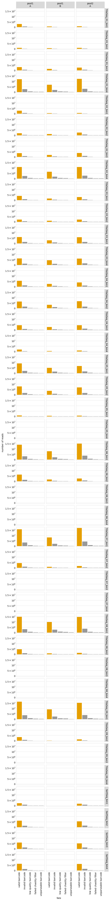

# Count variants in each sample
This Python Jupyter notebook counts occurrences of each barcode in each sample from Illumina barcode sequencing, and adds these counts to the codon variant table.

## Set up analysis
### Import Python modules.
Use [plotnine](https://plotnine.readthedocs.io/en/stable/) for ggplot2-like plotting.

The analysis relies heavily on the Bloom lab's [dms_variants](https://jbloomlab.github.io/dms_variants) package:


```python
import itertools
import multiprocessing
import multiprocessing.pool
import os
import warnings

import alignparse
import alignparse.targets

import dms_variants.codonvarianttable
from dms_variants.constants import CBPALETTE
import dms_variants.illuminabarcodeparser
import dms_variants.utils
import dms_variants.plotnine_themes

from IPython.display import display, HTML

import pandas as pd

from plotnine import *

import yaml
```

Set [plotnine](https://plotnine.readthedocs.io/en/stable/) theme to the gray-grid one defined in `dms_variants`:


```python
theme_set(dms_variants.plotnine_themes.theme_graygrid())
```

Versions of key software:


```python
print(f"Using alignparse version {alignparse.__version__}")
print(f"Using dms_variants version {dms_variants.__version__}")
```

    Using alignparse version 0.2.4
    Using dms_variants version 0.8.9


Ignore warnings that clutter output:


```python
warnings.simplefilter('ignore')
```

### Parameters for notebook
Read the configuration file:


```python
with open('config.yaml') as f:
    config = yaml.safe_load(f)
```

Make output directory if needed:


```python
os.makedirs(config['counts_dir'], exist_ok=True)
os.makedirs(config['figs_dir'], exist_ok=True)
```

## Input variant tables
Initialize the table of barcode-variant pairs from the respective `process_ccs` notebooks for each background.


```python
variants = pd.read_csv(config['codon_variant_table_file_Wuhan_Hu_1'], na_filter=None)
variants = variants.append(pd.read_csv(config['codon_variant_table_file_E484K'], na_filter=None))
variants = variants.append(pd.read_csv(config['codon_variant_table_file_N501Y'], na_filter=None))
variants = variants.append(pd.read_csv(config['codon_variant_table_file_B1351'], na_filter=None))

variants = variants.reset_index(drop=True)

display(HTML(variants.head().to_html(index=False)))
```


<table border="1" class="dataframe">
  <thead>
    <tr style="text-align: right;">
      <th>target</th>
      <th>library</th>
      <th>barcode</th>
      <th>variant_call_support</th>
      <th>codon_substitutions</th>
      <th>aa_substitutions</th>
      <th>n_codon_substitutions</th>
      <th>n_aa_substitutions</th>
    </tr>
  </thead>
  <tbody>
    <tr>
      <td>Wuhan_Hu_1</td>
      <td>pool1</td>
      <td>AAAAAAAAAAAGGAGA</td>
      <td>4</td>
      <td>GGT166ATG</td>
      <td>G166M</td>
      <td>1</td>
      <td>1</td>
    </tr>
    <tr>
      <td>Wuhan_Hu_1</td>
      <td>pool1</td>
      <td>AAAAAAAAAAATTTAA</td>
      <td>4</td>
      <td></td>
      <td></td>
      <td>0</td>
      <td>0</td>
    </tr>
    <tr>
      <td>Wuhan_Hu_1</td>
      <td>pool1</td>
      <td>AAAAAAAAAACGCGTA</td>
      <td>3</td>
      <td>GAA154ACT</td>
      <td>E154T</td>
      <td>1</td>
      <td>1</td>
    </tr>
    <tr>
      <td>Wuhan_Hu_1</td>
      <td>pool1</td>
      <td>AAAAAAAAAACTCCAA</td>
      <td>2</td>
      <td>TTT156ATG</td>
      <td>F156M</td>
      <td>1</td>
      <td>1</td>
    </tr>
    <tr>
      <td>Wuhan_Hu_1</td>
      <td>pool1</td>
      <td>AAAAAAAAACCGATTA</td>
      <td>2</td>
      <td>CAG84GAA</td>
      <td>Q84E</td>
      <td>1</td>
      <td>1</td>
    </tr>
  </tbody>
</table>


Are there any barcodes in the same library that are shared across targets?
If so, we need to get rid of those as they will be confounded in barcode parsing:


```python
dup_barcodes = (
    variants
    .groupby(['library', 'barcode'])
    .size()
    .rename('duplicate_count')
    .reset_index()
    .query('duplicate_count > 1')
    )

print('Here are duplicated barcodes:')
display(HTML(dup_barcodes.head().to_html(index=False)))

print(f"\nRemoving the {len(dup_barcodes)} duplicated barcodes."
      f"Started with {len(variants)} barcodes:")
variants = (
    variants
    .merge(dup_barcodes, on=['library', 'barcode'], how='outer')
    .query('duplicate_count.isnull()', engine='python')
    )
print(f"After removing duplicates, there are {len(variants)} barcodes.")
```

    Here are duplicated barcodes:


<table border="1" class="dataframe">
  <thead>
    <tr style="text-align: right;">
      <th>library</th>
      <th>barcode</th>
      <th>duplicate_count</th>
    </tr>
  </thead>
  <tbody>
    <tr>
      <td>pool1</td>
      <td>AAAGAGACAATTCGTT</td>
      <td>2</td>
    </tr>
    <tr>
      <td>pool1</td>
      <td>AAAGCCGGATTCGTAC</td>
      <td>2</td>
    </tr>
    <tr>
      <td>pool1</td>
      <td>AAATATGAAAGATACA</td>
      <td>2</td>
    </tr>
    <tr>
      <td>pool1</td>
      <td>AACAGCCGATTTACAA</td>
      <td>2</td>
    </tr>
    <tr>
      <td>pool1</td>
      <td>AAGAGCATAAGCCCCA</td>
      <td>2</td>
    </tr>
  </tbody>
</table>


    
    Removing the 347 duplicated barcodes.Started with 338323 barcodes:
    After removing duplicates, there are 337629 barcodes.


Pull out a target sequence for matching to the barcode and flanking sequence regions. Note, in this pipeline this is ok because our different backgrounds don't have differing flanks or other features within the actual N16 region covered in Illumina sequencing. If ever placing in-line barcodes here in the future, we would need to modify this.


```python
# get wildtype gene sequence for primary target
targets = alignparse.targets.Targets(seqsfile=config['amplicons_Wuhan_Hu_1'],
                                     feature_parse_specs=config['feature_parse_specs_Wuhan_Hu_1'])
```

## Setup to parse barcodes
Read data frame with list of all barcode runs.


```python
# barcode runs with R1 files by semicolon string split
barcode_runs = (pd.read_csv(config['barcode_runs'])
                .assign(R1=lambda x: x['R1'].str.split('; '))
                )

display(HTML(barcode_runs.to_html(index=False)))
```


<table border="1" class="dataframe">
  <thead>
    <tr style="text-align: right;">
      <th>library</th>
      <th>replicate</th>
      <th>sample</th>
      <th>sample_type</th>
      <th>sort_bin</th>
      <th>concentration</th>
      <th>date</th>
      <th>number_cells</th>
      <th>R1</th>
    </tr>
  </thead>
  <tbody>
    <tr>
      <td>pool1</td>
      <td>A</td>
      <td>TiteSeq_01_bin1</td>
      <td>TiteSeq</td>
      <td>1</td>
      <td>1.0</td>
      <td>210816</td>
      <td>1410589</td>
      <td>[/shared/ngs/illumina/tstarr/210903_D00300_1313_AHMJJTBCX3/Unaligned/Project_tstarr/210816_s01-b1_S1_R1_001.fastq.gz, /shared/ngs/illumina/tstarr/210907_D00300_1314_BHMJK5BCX3/Unaligned/Project_tstarr/210816_s01-b1_S1_R1_001.fastq.gz]</td>
    </tr>
    <tr>
      <td>pool1</td>
      <td>A</td>
      <td>TiteSeq_01_bin2</td>
      <td>TiteSeq</td>
      <td>2</td>
      <td>1.0</td>
      <td>210816</td>
      <td>533374</td>
      <td>[/shared/ngs/illumina/tstarr/210903_D00300_1313_AHMJJTBCX3/Unaligned/Project_tstarr/210816_s01-b2_S2_R1_001.fastq.gz, /shared/ngs/illumina/tstarr/210907_D00300_1314_BHMJK5BCX3/Unaligned/Project_tstarr/210816_s01-b2_S2_R1_001.fastq.gz]</td>
    </tr>
    <tr>
      <td>pool1</td>
      <td>A</td>
      <td>TiteSeq_01_bin3</td>
      <td>TiteSeq</td>
      <td>3</td>
      <td>1.0</td>
      <td>210816</td>
      <td>1697538</td>
      <td>[/shared/ngs/illumina/tstarr/210903_D00300_1313_AHMJJTBCX3/Unaligned/Project_tstarr/210816_s01-b3_S3_R1_001.fastq.gz, /shared/ngs/illumina/tstarr/210907_D00300_1314_BHMJK5BCX3/Unaligned/Project_tstarr/210816_s01-b3_S3_R1_001.fastq.gz]</td>
    </tr>
    <tr>
      <td>pool1</td>
      <td>A</td>
      <td>TiteSeq_01_bin4</td>
      <td>TiteSeq</td>
      <td>4</td>
      <td>1.0</td>
      <td>210816</td>
      <td>6497928</td>
      <td>[/shared/ngs/illumina/tstarr/210903_D00300_1313_AHMJJTBCX3/Unaligned/Project_tstarr/210816_s01-b4_S4_R1_001.fastq.gz, /shared/ngs/illumina/tstarr/210907_D00300_1314_BHMJK5BCX3/Unaligned/Project_tstarr/210816_s01-b4_S4_R1_001.fastq.gz]</td>
    </tr>
    <tr>
      <td>pool1</td>
      <td>A</td>
      <td>TiteSeq_02_bin1</td>
      <td>TiteSeq</td>
      <td>1</td>
      <td>2.0</td>
      <td>210816</td>
      <td>1587111</td>
      <td>[/shared/ngs/illumina/tstarr/210903_D00300_1313_AHMJJTBCX3/Unaligned/Project_tstarr/210816_s02-b1_S5_R1_001.fastq.gz, /shared/ngs/illumina/tstarr/210907_D00300_1314_BHMJK5BCX3/Unaligned/Project_tstarr/210816_s02-b1_S5_R1_001.fastq.gz]</td>
    </tr>
    <tr>
      <td>pool1</td>
      <td>A</td>
      <td>TiteSeq_02_bin2</td>
      <td>TiteSeq</td>
      <td>2</td>
      <td>2.0</td>
      <td>210816</td>
      <td>882688</td>
      <td>[/shared/ngs/illumina/tstarr/210903_D00300_1313_AHMJJTBCX3/Unaligned/Project_tstarr/210816_s02-b2_S6_R1_001.fastq.gz, /shared/ngs/illumina/tstarr/210907_D00300_1314_BHMJK5BCX3/Unaligned/Project_tstarr/210816_s02-b2_S6_R1_001.fastq.gz]</td>
    </tr>
    <tr>
      <td>pool1</td>
      <td>A</td>
      <td>TiteSeq_02_bin3</td>
      <td>TiteSeq</td>
      <td>3</td>
      <td>2.0</td>
      <td>210816</td>
      <td>2168488</td>
      <td>[/shared/ngs/illumina/tstarr/210903_D00300_1313_AHMJJTBCX3/Unaligned/Project_tstarr/210816_s02-b3_S7_R1_001.fastq.gz, /shared/ngs/illumina/tstarr/210907_D00300_1314_BHMJK5BCX3/Unaligned/Project_tstarr/210816_s02-b3_S7_R1_001.fastq.gz]</td>
    </tr>
    <tr>
      <td>pool1</td>
      <td>A</td>
      <td>TiteSeq_02_bin4</td>
      <td>TiteSeq</td>
      <td>4</td>
      <td>2.0</td>
      <td>210816</td>
      <td>5908495</td>
      <td>[/shared/ngs/illumina/tstarr/210903_D00300_1313_AHMJJTBCX3/Unaligned/Project_tstarr/210816_s02-b4_S8_R1_001.fastq.gz, /shared/ngs/illumina/tstarr/210907_D00300_1314_BHMJK5BCX3/Unaligned/Project_tstarr/210816_s02-b4_S8_R1_001.fastq.gz]</td>
    </tr>
    <tr>
      <td>pool1</td>
      <td>A</td>
      <td>TiteSeq_03_bin1</td>
      <td>TiteSeq</td>
      <td>1</td>
      <td>3.0</td>
      <td>210816</td>
      <td>2236680</td>
      <td>[/shared/ngs/illumina/tstarr/210903_D00300_1313_AHMJJTBCX3/Unaligned/Project_tstarr/210816_s03-b1_S9_R1_001.fastq.gz, /shared/ngs/illumina/tstarr/210907_D00300_1314_BHMJK5BCX3/Unaligned/Project_tstarr/210816_s03-b1_S9_R1_001.fastq.gz]</td>
    </tr>
    <tr>
      <td>pool1</td>
      <td>A</td>
      <td>TiteSeq_03_bin2</td>
      <td>TiteSeq</td>
      <td>2</td>
      <td>3.0</td>
      <td>210816</td>
      <td>1125722</td>
      <td>[/shared/ngs/illumina/tstarr/210903_D00300_1313_AHMJJTBCX3/Unaligned/Project_tstarr/210816_s03-b2_S10_R1_001.fastq.gz, /shared/ngs/illumina/tstarr/210907_D00300_1314_BHMJK5BCX3/Unaligned/Project_tstarr/210816_s03-b2_S10_R1_001.fastq.gz]</td>
    </tr>
    <tr>
      <td>pool1</td>
      <td>A</td>
      <td>TiteSeq_03_bin3</td>
      <td>TiteSeq</td>
      <td>3</td>
      <td>3.0</td>
      <td>210816</td>
      <td>3404113</td>
      <td>[/shared/ngs/illumina/tstarr/210903_D00300_1313_AHMJJTBCX3/Unaligned/Project_tstarr/210816_s03-b3_S11_R1_001.fastq.gz, /shared/ngs/illumina/tstarr/210907_D00300_1314_BHMJK5BCX3/Unaligned/Project_tstarr/210816_s03-b3_S11_R1_001.fastq.gz]</td>
    </tr>
    <tr>
      <td>pool1</td>
      <td>A</td>
      <td>TiteSeq_03_bin4</td>
      <td>TiteSeq</td>
      <td>4</td>
      <td>3.0</td>
      <td>210816</td>
      <td>3354021</td>
      <td>[/shared/ngs/illumina/tstarr/210903_D00300_1313_AHMJJTBCX3/Unaligned/Project_tstarr/210816_s03-b4_S12_R1_001.fastq.gz, /shared/ngs/illumina/tstarr/210907_D00300_1314_BHMJK5BCX3/Unaligned/Project_tstarr/210816_s03-b4_S12_R1_001.fastq.gz]</td>
    </tr>
    <tr>
      <td>pool1</td>
      <td>A</td>
      <td>TiteSeq_04_bin1</td>
      <td>TiteSeq</td>
      <td>1</td>
      <td>4.0</td>
      <td>210816</td>
      <td>3228357</td>
      <td>[/shared/ngs/illumina/tstarr/210903_D00300_1313_AHMJJTBCX3/Unaligned/Project_tstarr/210816_s04-b1_S13_R1_001.fastq.gz, /shared/ngs/illumina/tstarr/210907_D00300_1314_BHMJK5BCX3/Unaligned/Project_tstarr/210816_s04-b1_S13_R1_001.fastq.gz]</td>
    </tr>
    <tr>
      <td>pool1</td>
      <td>A</td>
      <td>TiteSeq_04_bin2</td>
      <td>TiteSeq</td>
      <td>2</td>
      <td>4.0</td>
      <td>210816</td>
      <td>3777633</td>
      <td>[/shared/ngs/illumina/tstarr/210903_D00300_1313_AHMJJTBCX3/Unaligned/Project_tstarr/210816_s04-b2_S14_R1_001.fastq.gz, /shared/ngs/illumina/tstarr/210907_D00300_1314_BHMJK5BCX3/Unaligned/Project_tstarr/210816_s04-b2_S14_R1_001.fastq.gz]</td>
    </tr>
    <tr>
      <td>pool1</td>
      <td>A</td>
      <td>TiteSeq_04_bin3</td>
      <td>TiteSeq</td>
      <td>3</td>
      <td>4.0</td>
      <td>210816</td>
      <td>2507212</td>
      <td>[/shared/ngs/illumina/tstarr/210903_D00300_1313_AHMJJTBCX3/Unaligned/Project_tstarr/210816_s04-b3_S15_R1_001.fastq.gz, /shared/ngs/illumina/tstarr/210907_D00300_1314_BHMJK5BCX3/Unaligned/Project_tstarr/210816_s04-b3_S15_R1_001.fastq.gz]</td>
    </tr>
    <tr>
      <td>pool1</td>
      <td>A</td>
      <td>TiteSeq_04_bin4</td>
      <td>TiteSeq</td>
      <td>4</td>
      <td>4.0</td>
      <td>210816</td>
      <td>522258</td>
      <td>[/shared/ngs/illumina/tstarr/210903_D00300_1313_AHMJJTBCX3/Unaligned/Project_tstarr/210816_s04-b4_S16_R1_001.fastq.gz, /shared/ngs/illumina/tstarr/210907_D00300_1314_BHMJK5BCX3/Unaligned/Project_tstarr/210816_s04-b4_S16_R1_001.fastq.gz]</td>
    </tr>
    <tr>
      <td>pool1</td>
      <td>A</td>
      <td>TiteSeq_05_bin1</td>
      <td>TiteSeq</td>
      <td>1</td>
      <td>5.0</td>
      <td>210816</td>
      <td>5380520</td>
      <td>[/shared/ngs/illumina/tstarr/210903_D00300_1313_AHMJJTBCX3/Unaligned/Project_tstarr/210816_s05-b1_S17_R1_001.fastq.gz, /shared/ngs/illumina/tstarr/210907_D00300_1314_BHMJK5BCX3/Unaligned/Project_tstarr/210816_s05-b1_S17_R1_001.fastq.gz]</td>
    </tr>
    <tr>
      <td>pool1</td>
      <td>A</td>
      <td>TiteSeq_05_bin2</td>
      <td>TiteSeq</td>
      <td>2</td>
      <td>5.0</td>
      <td>210816</td>
      <td>4516641</td>
      <td>[/shared/ngs/illumina/tstarr/210903_D00300_1313_AHMJJTBCX3/Unaligned/Project_tstarr/210816_s05-b2_S18_R1_001.fastq.gz, /shared/ngs/illumina/tstarr/210907_D00300_1314_BHMJK5BCX3/Unaligned/Project_tstarr/210816_s05-b2_S18_R1_001.fastq.gz]</td>
    </tr>
    <tr>
      <td>pool1</td>
      <td>A</td>
      <td>TiteSeq_05_bin3</td>
      <td>TiteSeq</td>
      <td>3</td>
      <td>5.0</td>
      <td>210816</td>
      <td>458022</td>
      <td>[/shared/ngs/illumina/tstarr/210903_D00300_1313_AHMJJTBCX3/Unaligned/Project_tstarr/210816_s05-b3_S19_R1_001.fastq.gz, /shared/ngs/illumina/tstarr/210907_D00300_1314_BHMJK5BCX3/Unaligned/Project_tstarr/210816_s05-b3_S19_R1_001.fastq.gz]</td>
    </tr>
    <tr>
      <td>pool1</td>
      <td>A</td>
      <td>TiteSeq_05_bin4</td>
      <td>TiteSeq</td>
      <td>4</td>
      <td>5.0</td>
      <td>210816</td>
      <td>2412</td>
      <td>[/shared/ngs/illumina/tstarr/210903_D00300_1313_AHMJJTBCX3/Unaligned/Project_tstarr/210816_s05-b4_S20_R1_001.fastq.gz, /shared/ngs/illumina/tstarr/210907_D00300_1314_BHMJK5BCX3/Unaligned/Project_tstarr/210816_s05-b4_S20_R1_001.fastq.gz]</td>
    </tr>
    <tr>
      <td>pool1</td>
      <td>A</td>
      <td>TiteSeq_06_bin1</td>
      <td>TiteSeq</td>
      <td>1</td>
      <td>6.0</td>
      <td>210816</td>
      <td>6953452</td>
      <td>[/shared/ngs/illumina/tstarr/210903_D00300_1313_AHMJJTBCX3/Unaligned/Project_tstarr/210816_s06-b1_S21_R1_001.fastq.gz, /shared/ngs/illumina/tstarr/210907_D00300_1314_BHMJK5BCX3/Unaligned/Project_tstarr/210816_s06-b1_S21_R1_001.fastq.gz]</td>
    </tr>
    <tr>
      <td>pool1</td>
      <td>A</td>
      <td>TiteSeq_06_bin2</td>
      <td>TiteSeq</td>
      <td>2</td>
      <td>6.0</td>
      <td>210816</td>
      <td>3350686</td>
      <td>[/shared/ngs/illumina/tstarr/210903_D00300_1313_AHMJJTBCX3/Unaligned/Project_tstarr/210816_s06-b2_S22_R1_001.fastq.gz, /shared/ngs/illumina/tstarr/210907_D00300_1314_BHMJK5BCX3/Unaligned/Project_tstarr/210816_s06-b2_S22_R1_001.fastq.gz]</td>
    </tr>
    <tr>
      <td>pool1</td>
      <td>A</td>
      <td>TiteSeq_06_bin3</td>
      <td>TiteSeq</td>
      <td>3</td>
      <td>6.0</td>
      <td>210816</td>
      <td>4212</td>
      <td>[/shared/ngs/illumina/tstarr/210903_D00300_1313_AHMJJTBCX3/Unaligned/Project_tstarr/210816_s06-b3_S23_R1_001.fastq.gz, /shared/ngs/illumina/tstarr/210907_D00300_1314_BHMJK5BCX3/Unaligned/Project_tstarr/210816_s06-b3_S23_R1_001.fastq.gz]</td>
    </tr>
    <tr>
      <td>pool1</td>
      <td>A</td>
      <td>TiteSeq_06_bin4</td>
      <td>TiteSeq</td>
      <td>4</td>
      <td>6.0</td>
      <td>210816</td>
      <td>304</td>
      <td>[/shared/ngs/illumina/tstarr/210903_D00300_1313_AHMJJTBCX3/Unaligned/Project_tstarr/210816_s06-b4_S24_R1_001.fastq.gz, /shared/ngs/illumina/tstarr/210907_D00300_1314_BHMJK5BCX3/Unaligned/Project_tstarr/210816_s06-b4_S24_R1_001.fastq.gz]</td>
    </tr>
    <tr>
      <td>pool1</td>
      <td>A</td>
      <td>TiteSeq_07_bin1</td>
      <td>TiteSeq</td>
      <td>1</td>
      <td>7.0</td>
      <td>210816</td>
      <td>8037439</td>
      <td>[/shared/ngs/illumina/tstarr/210903_D00300_1313_AHMJJTBCX3/Unaligned/Project_tstarr/210816_s07-b1_S25_R1_001.fastq.gz, /shared/ngs/illumina/tstarr/210907_D00300_1314_BHMJK5BCX3/Unaligned/Project_tstarr/210816_s07-b1_S25_R1_001.fastq.gz]</td>
    </tr>
    <tr>
      <td>pool1</td>
      <td>A</td>
      <td>TiteSeq_07_bin2</td>
      <td>TiteSeq</td>
      <td>2</td>
      <td>7.0</td>
      <td>210816</td>
      <td>2440419</td>
      <td>[/shared/ngs/illumina/tstarr/210903_D00300_1313_AHMJJTBCX3/Unaligned/Project_tstarr/210816_s07-b2_S26_R1_001.fastq.gz, /shared/ngs/illumina/tstarr/210907_D00300_1314_BHMJK5BCX3/Unaligned/Project_tstarr/210816_s07-b2_S26_R1_001.fastq.gz]</td>
    </tr>
    <tr>
      <td>pool1</td>
      <td>A</td>
      <td>TiteSeq_07_bin3</td>
      <td>TiteSeq</td>
      <td>3</td>
      <td>7.0</td>
      <td>210816</td>
      <td>1587</td>
      <td>[/shared/ngs/illumina/tstarr/210903_D00300_1313_AHMJJTBCX3/Unaligned/Project_tstarr/210816_s07-b3_S27_R1_001.fastq.gz, /shared/ngs/illumina/tstarr/210907_D00300_1314_BHMJK5BCX3/Unaligned/Project_tstarr/210816_s07-b3_S27_R1_001.fastq.gz]</td>
    </tr>
    <tr>
      <td>pool1</td>
      <td>A</td>
      <td>TiteSeq_07_bin4</td>
      <td>TiteSeq</td>
      <td>4</td>
      <td>7.0</td>
      <td>210816</td>
      <td>470</td>
      <td>[/shared/ngs/illumina/tstarr/210903_D00300_1313_AHMJJTBCX3/Unaligned/Project_tstarr/210816_s07-b4_S28_R1_001.fastq.gz, /shared/ngs/illumina/tstarr/210907_D00300_1314_BHMJK5BCX3/Unaligned/Project_tstarr/210816_s07-b4_S28_R1_001.fastq.gz]</td>
    </tr>
    <tr>
      <td>pool1</td>
      <td>A</td>
      <td>TiteSeq_08_bin1</td>
      <td>TiteSeq</td>
      <td>1</td>
      <td>8.0</td>
      <td>210816</td>
      <td>8013743</td>
      <td>[/shared/ngs/illumina/tstarr/210903_D00300_1313_AHMJJTBCX3/Unaligned/Project_tstarr/210816_s08-b1_S29_R1_001.fastq.gz, /shared/ngs/illumina/tstarr/210907_D00300_1314_BHMJK5BCX3/Unaligned/Project_tstarr/210816_s08-b1_S29_R1_001.fastq.gz]</td>
    </tr>
    <tr>
      <td>pool1</td>
      <td>A</td>
      <td>TiteSeq_08_bin2</td>
      <td>TiteSeq</td>
      <td>2</td>
      <td>8.0</td>
      <td>210816</td>
      <td>2313562</td>
      <td>[/shared/ngs/illumina/tstarr/210903_D00300_1313_AHMJJTBCX3/Unaligned/Project_tstarr/210816_s08-b2_S30_R1_001.fastq.gz, /shared/ngs/illumina/tstarr/210907_D00300_1314_BHMJK5BCX3/Unaligned/Project_tstarr/210816_s08-b2_S30_R1_001.fastq.gz]</td>
    </tr>
    <tr>
      <td>pool1</td>
      <td>A</td>
      <td>TiteSeq_08_bin3</td>
      <td>TiteSeq</td>
      <td>3</td>
      <td>8.0</td>
      <td>210816</td>
      <td>1458</td>
      <td>[/shared/ngs/illumina/tstarr/210903_D00300_1313_AHMJJTBCX3/Unaligned/Project_tstarr/210816_s08-b3_S31_R1_001.fastq.gz, /shared/ngs/illumina/tstarr/210907_D00300_1314_BHMJK5BCX3/Unaligned/Project_tstarr/210816_s08-b3_S31_R1_001.fastq.gz]</td>
    </tr>
    <tr>
      <td>pool1</td>
      <td>A</td>
      <td>TiteSeq_08_bin4</td>
      <td>TiteSeq</td>
      <td>4</td>
      <td>8.0</td>
      <td>210816</td>
      <td>276</td>
      <td>[/shared/ngs/illumina/tstarr/210903_D00300_1313_AHMJJTBCX3/Unaligned/Project_tstarr/210816_s08-b4_S32_R1_001.fastq.gz, /shared/ngs/illumina/tstarr/210907_D00300_1314_BHMJK5BCX3/Unaligned/Project_tstarr/210816_s08-b4_S32_R1_001.fastq.gz]</td>
    </tr>
    <tr>
      <td>pool1</td>
      <td>A</td>
      <td>TiteSeq_09_bin1</td>
      <td>TiteSeq</td>
      <td>1</td>
      <td>9.0</td>
      <td>210816</td>
      <td>8191465</td>
      <td>[/shared/ngs/illumina/tstarr/210903_D00300_1313_AHMJJTBCX3/Unaligned/Project_tstarr/210816_s09-b1_S33_R1_001.fastq.gz, /shared/ngs/illumina/tstarr/210907_D00300_1314_BHMJK5BCX3/Unaligned/Project_tstarr/210816_s09-b1_S33_R1_001.fastq.gz]</td>
    </tr>
    <tr>
      <td>pool1</td>
      <td>A</td>
      <td>TiteSeq_09_bin2</td>
      <td>TiteSeq</td>
      <td>2</td>
      <td>9.0</td>
      <td>210816</td>
      <td>2003725</td>
      <td>[/shared/ngs/illumina/tstarr/210903_D00300_1313_AHMJJTBCX3/Unaligned/Project_tstarr/210816_s09-b2_S34_R1_001.fastq.gz, /shared/ngs/illumina/tstarr/210907_D00300_1314_BHMJK5BCX3/Unaligned/Project_tstarr/210816_s09-b2_S34_R1_001.fastq.gz]</td>
    </tr>
    <tr>
      <td>pool1</td>
      <td>A</td>
      <td>TiteSeq_09_bin3</td>
      <td>TiteSeq</td>
      <td>3</td>
      <td>9.0</td>
      <td>210816</td>
      <td>882</td>
      <td>[/shared/ngs/illumina/tstarr/210903_D00300_1313_AHMJJTBCX3/Unaligned/Project_tstarr/210816_s09-b3_S35_R1_001.fastq.gz, /shared/ngs/illumina/tstarr/210907_D00300_1314_BHMJK5BCX3/Unaligned/Project_tstarr/210816_s09-b3_S35_R1_001.fastq.gz]</td>
    </tr>
    <tr>
      <td>pool1</td>
      <td>A</td>
      <td>TiteSeq_09_bin4</td>
      <td>TiteSeq</td>
      <td>4</td>
      <td>9.0</td>
      <td>210816</td>
      <td>275</td>
      <td>[/shared/ngs/illumina/tstarr/210903_D00300_1313_AHMJJTBCX3/Unaligned/Project_tstarr/210816_s09-b4_S36_R1_001.fastq.gz, /shared/ngs/illumina/tstarr/210907_D00300_1314_BHMJK5BCX3/Unaligned/Project_tstarr/210816_s09-b4_S36_R1_001.fastq.gz]</td>
    </tr>
    <tr>
      <td>pool2</td>
      <td>A</td>
      <td>TiteSeq_01_bin1</td>
      <td>TiteSeq</td>
      <td>1</td>
      <td>1.0</td>
      <td>210816</td>
      <td>747246</td>
      <td>[/shared/ngs/illumina/tstarr/210903_D00300_1313_AHMJJTBCX3/Unaligned/Project_tstarr/210816_s10-b1_S37_R1_001.fastq.gz, /shared/ngs/illumina/tstarr/210907_D00300_1314_BHMJK5BCX3/Unaligned/Project_tstarr/210816_s10-b1_S37_R1_001.fastq.gz]</td>
    </tr>
    <tr>
      <td>pool2</td>
      <td>A</td>
      <td>TiteSeq_01_bin2</td>
      <td>TiteSeq</td>
      <td>2</td>
      <td>1.0</td>
      <td>210816</td>
      <td>632407</td>
      <td>[/shared/ngs/illumina/tstarr/210903_D00300_1313_AHMJJTBCX3/Unaligned/Project_tstarr/210816_s10-b2_S38_R1_001.fastq.gz, /shared/ngs/illumina/tstarr/210907_D00300_1314_BHMJK5BCX3/Unaligned/Project_tstarr/210816_s10-b2_S38_R1_001.fastq.gz]</td>
    </tr>
    <tr>
      <td>pool2</td>
      <td>A</td>
      <td>TiteSeq_01_bin3</td>
      <td>TiteSeq</td>
      <td>3</td>
      <td>1.0</td>
      <td>210816</td>
      <td>1569589</td>
      <td>[/shared/ngs/illumina/tstarr/210903_D00300_1313_AHMJJTBCX3/Unaligned/Project_tstarr/210816_s10-b3_S39_R1_001.fastq.gz, /shared/ngs/illumina/tstarr/210907_D00300_1314_BHMJK5BCX3/Unaligned/Project_tstarr/210816_s10-b3_S39_R1_001.fastq.gz]</td>
    </tr>
    <tr>
      <td>pool2</td>
      <td>A</td>
      <td>TiteSeq_01_bin4</td>
      <td>TiteSeq</td>
      <td>4</td>
      <td>1.0</td>
      <td>210816</td>
      <td>7076796</td>
      <td>[/shared/ngs/illumina/tstarr/210903_D00300_1313_AHMJJTBCX3/Unaligned/Project_tstarr/210816_s10-b4_S40_R1_001.fastq.gz, /shared/ngs/illumina/tstarr/210907_D00300_1314_BHMJK5BCX3/Unaligned/Project_tstarr/210816_s10-b4_S40_R1_001.fastq.gz]</td>
    </tr>
    <tr>
      <td>pool2</td>
      <td>A</td>
      <td>TiteSeq_02_bin1</td>
      <td>TiteSeq</td>
      <td>1</td>
      <td>2.0</td>
      <td>210816</td>
      <td>508269</td>
      <td>[/shared/ngs/illumina/tstarr/210903_D00300_1313_AHMJJTBCX3/Unaligned/Project_tstarr/210816_s11-b1_S41_R1_001.fastq.gz, /shared/ngs/illumina/tstarr/210907_D00300_1314_BHMJK5BCX3/Unaligned/Project_tstarr/210816_s11-b1_S41_R1_001.fastq.gz]</td>
    </tr>
    <tr>
      <td>pool2</td>
      <td>A</td>
      <td>TiteSeq_02_bin2</td>
      <td>TiteSeq</td>
      <td>2</td>
      <td>2.0</td>
      <td>210816</td>
      <td>1360633</td>
      <td>[/shared/ngs/illumina/tstarr/210903_D00300_1313_AHMJJTBCX3/Unaligned/Project_tstarr/210816_s11-b2_S42_R1_001.fastq.gz, /shared/ngs/illumina/tstarr/210907_D00300_1314_BHMJK5BCX3/Unaligned/Project_tstarr/210816_s11-b2_S42_R1_001.fastq.gz]</td>
    </tr>
    <tr>
      <td>pool2</td>
      <td>A</td>
      <td>TiteSeq_02_bin3</td>
      <td>TiteSeq</td>
      <td>3</td>
      <td>2.0</td>
      <td>210816</td>
      <td>2122153</td>
      <td>[/shared/ngs/illumina/tstarr/210903_D00300_1313_AHMJJTBCX3/Unaligned/Project_tstarr/210816_s11-b3_S43_R1_001.fastq.gz, /shared/ngs/illumina/tstarr/210907_D00300_1314_BHMJK5BCX3/Unaligned/Project_tstarr/210816_s11-b3_S43_R1_001.fastq.gz]</td>
    </tr>
    <tr>
      <td>pool2</td>
      <td>A</td>
      <td>TiteSeq_02_bin4</td>
      <td>TiteSeq</td>
      <td>4</td>
      <td>2.0</td>
      <td>210816</td>
      <td>6133995</td>
      <td>[/shared/ngs/illumina/tstarr/210903_D00300_1313_AHMJJTBCX3/Unaligned/Project_tstarr/210816_s11-b4_S44_R1_001.fastq.gz, /shared/ngs/illumina/tstarr/210907_D00300_1314_BHMJK5BCX3/Unaligned/Project_tstarr/210816_s11-b4_S44_R1_001.fastq.gz]</td>
    </tr>
    <tr>
      <td>pool2</td>
      <td>A</td>
      <td>TiteSeq_03_bin1</td>
      <td>TiteSeq</td>
      <td>1</td>
      <td>3.0</td>
      <td>210816</td>
      <td>1471208</td>
      <td>[/shared/ngs/illumina/tstarr/210903_D00300_1313_AHMJJTBCX3/Unaligned/Project_tstarr/210816_s12-b1_S45_R1_001.fastq.gz, /shared/ngs/illumina/tstarr/210907_D00300_1314_BHMJK5BCX3/Unaligned/Project_tstarr/210816_s12-b1_S45_R1_001.fastq.gz]</td>
    </tr>
    <tr>
      <td>pool2</td>
      <td>A</td>
      <td>TiteSeq_03_bin2</td>
      <td>TiteSeq</td>
      <td>2</td>
      <td>3.0</td>
      <td>210816</td>
      <td>1351829</td>
      <td>[/shared/ngs/illumina/tstarr/210903_D00300_1313_AHMJJTBCX3/Unaligned/Project_tstarr/210816_s12-b2_S46_R1_001.fastq.gz, /shared/ngs/illumina/tstarr/210907_D00300_1314_BHMJK5BCX3/Unaligned/Project_tstarr/210816_s12-b2_S46_R1_001.fastq.gz]</td>
    </tr>
    <tr>
      <td>pool2</td>
      <td>A</td>
      <td>TiteSeq_03_bin3</td>
      <td>TiteSeq</td>
      <td>3</td>
      <td>3.0</td>
      <td>210816</td>
      <td>3465388</td>
      <td>[/shared/ngs/illumina/tstarr/210903_D00300_1313_AHMJJTBCX3/Unaligned/Project_tstarr/210816_s12-b3_S47_R1_001.fastq.gz, /shared/ngs/illumina/tstarr/210907_D00300_1314_BHMJK5BCX3/Unaligned/Project_tstarr/210816_s12-b3_S47_R1_001.fastq.gz]</td>
    </tr>
    <tr>
      <td>pool2</td>
      <td>A</td>
      <td>TiteSeq_03_bin4</td>
      <td>TiteSeq</td>
      <td>4</td>
      <td>3.0</td>
      <td>210816</td>
      <td>3785496</td>
      <td>[/shared/ngs/illumina/tstarr/210903_D00300_1313_AHMJJTBCX3/Unaligned/Project_tstarr/210816_s12-b4_S48_R1_001.fastq.gz, /shared/ngs/illumina/tstarr/210907_D00300_1314_BHMJK5BCX3/Unaligned/Project_tstarr/210816_s12-b4_S48_R1_001.fastq.gz]</td>
    </tr>
    <tr>
      <td>pool2</td>
      <td>A</td>
      <td>TiteSeq_04_bin1</td>
      <td>TiteSeq</td>
      <td>1</td>
      <td>4.0</td>
      <td>210816</td>
      <td>2711471</td>
      <td>[/shared/ngs/illumina/tstarr/210903_D00300_1313_AHMJJTBCX3/Unaligned/Project_tstarr/210816_s13-b1_S49_R1_001.fastq.gz, /shared/ngs/illumina/tstarr/210907_D00300_1314_BHMJK5BCX3/Unaligned/Project_tstarr/210816_s13-b1_S49_R1_001.fastq.gz]</td>
    </tr>
    <tr>
      <td>pool2</td>
      <td>A</td>
      <td>TiteSeq_04_bin2</td>
      <td>TiteSeq</td>
      <td>2</td>
      <td>4.0</td>
      <td>210816</td>
      <td>3855154</td>
      <td>[/shared/ngs/illumina/tstarr/210903_D00300_1313_AHMJJTBCX3/Unaligned/Project_tstarr/210816_s13-b2_S50_R1_001.fastq.gz, /shared/ngs/illumina/tstarr/210907_D00300_1314_BHMJK5BCX3/Unaligned/Project_tstarr/210816_s13-b2_S50_R1_001.fastq.gz]</td>
    </tr>
    <tr>
      <td>pool2</td>
      <td>A</td>
      <td>TiteSeq_04_bin3</td>
      <td>TiteSeq</td>
      <td>3</td>
      <td>4.0</td>
      <td>210816</td>
      <td>3017813</td>
      <td>[/shared/ngs/illumina/tstarr/210903_D00300_1313_AHMJJTBCX3/Unaligned/Project_tstarr/210816_s13-b3_S51_R1_001.fastq.gz, /shared/ngs/illumina/tstarr/210907_D00300_1314_BHMJK5BCX3/Unaligned/Project_tstarr/210816_s13-b3_S51_R1_001.fastq.gz]</td>
    </tr>
    <tr>
      <td>pool2</td>
      <td>A</td>
      <td>TiteSeq_04_bin4</td>
      <td>TiteSeq</td>
      <td>4</td>
      <td>4.0</td>
      <td>210816</td>
      <td>564315</td>
      <td>[/shared/ngs/illumina/tstarr/210903_D00300_1313_AHMJJTBCX3/Unaligned/Project_tstarr/210816_s13-b4_S52_R1_001.fastq.gz, /shared/ngs/illumina/tstarr/210907_D00300_1314_BHMJK5BCX3/Unaligned/Project_tstarr/210816_s13-b4_S52_R1_001.fastq.gz]</td>
    </tr>
    <tr>
      <td>pool2</td>
      <td>A</td>
      <td>TiteSeq_05_bin1</td>
      <td>TiteSeq</td>
      <td>1</td>
      <td>5.0</td>
      <td>210816</td>
      <td>6181987</td>
      <td>[/shared/ngs/illumina/tstarr/210903_D00300_1313_AHMJJTBCX3/Unaligned/Project_tstarr/210816_s14-b1_S53_R1_001.fastq.gz, /shared/ngs/illumina/tstarr/210907_D00300_1314_BHMJK5BCX3/Unaligned/Project_tstarr/210816_s14-b1_S53_R1_001.fastq.gz]</td>
    </tr>
    <tr>
      <td>pool2</td>
      <td>A</td>
      <td>TiteSeq_05_bin2</td>
      <td>TiteSeq</td>
      <td>2</td>
      <td>5.0</td>
      <td>210816</td>
      <td>3991649</td>
      <td>[/shared/ngs/illumina/tstarr/210903_D00300_1313_AHMJJTBCX3/Unaligned/Project_tstarr/210816_s14-b2_S54_R1_001.fastq.gz, /shared/ngs/illumina/tstarr/210907_D00300_1314_BHMJK5BCX3/Unaligned/Project_tstarr/210816_s14-b2_S54_R1_001.fastq.gz]</td>
    </tr>
    <tr>
      <td>pool2</td>
      <td>A</td>
      <td>TiteSeq_05_bin3</td>
      <td>TiteSeq</td>
      <td>3</td>
      <td>5.0</td>
      <td>210816</td>
      <td>438596</td>
      <td>[/shared/ngs/illumina/tstarr/210903_D00300_1313_AHMJJTBCX3/Unaligned/Project_tstarr/210816_s14-b3_S55_R1_001.fastq.gz, /shared/ngs/illumina/tstarr/210907_D00300_1314_BHMJK5BCX3/Unaligned/Project_tstarr/210816_s14-b3_S55_R1_001.fastq.gz]</td>
    </tr>
    <tr>
      <td>pool2</td>
      <td>A</td>
      <td>TiteSeq_05_bin4</td>
      <td>TiteSeq</td>
      <td>4</td>
      <td>5.0</td>
      <td>210816</td>
      <td>1844</td>
      <td>[/shared/ngs/illumina/tstarr/210903_D00300_1313_AHMJJTBCX3/Unaligned/Project_tstarr/210816_s14-b4_S56_R1_001.fastq.gz, /shared/ngs/illumina/tstarr/210907_D00300_1314_BHMJK5BCX3/Unaligned/Project_tstarr/210816_s14-b4_S56_R1_001.fastq.gz]</td>
    </tr>
    <tr>
      <td>pool2</td>
      <td>A</td>
      <td>TiteSeq_06_bin1</td>
      <td>TiteSeq</td>
      <td>1</td>
      <td>6.0</td>
      <td>210816</td>
      <td>8575711</td>
      <td>[/shared/ngs/illumina/tstarr/210903_D00300_1313_AHMJJTBCX3/Unaligned/Project_tstarr/210816_s15-b1_S57_R1_001.fastq.gz, /shared/ngs/illumina/tstarr/210907_D00300_1314_BHMJK5BCX3/Unaligned/Project_tstarr/210816_s15-b1_S57_R1_001.fastq.gz]</td>
    </tr>
    <tr>
      <td>pool2</td>
      <td>A</td>
      <td>TiteSeq_06_bin2</td>
      <td>TiteSeq</td>
      <td>2</td>
      <td>6.0</td>
      <td>210816</td>
      <td>1572345</td>
      <td>[/shared/ngs/illumina/tstarr/210903_D00300_1313_AHMJJTBCX3/Unaligned/Project_tstarr/210816_s15-b2_S58_R1_001.fastq.gz, /shared/ngs/illumina/tstarr/210907_D00300_1314_BHMJK5BCX3/Unaligned/Project_tstarr/210816_s15-b2_S58_R1_001.fastq.gz]</td>
    </tr>
    <tr>
      <td>pool2</td>
      <td>A</td>
      <td>TiteSeq_06_bin3</td>
      <td>TiteSeq</td>
      <td>3</td>
      <td>6.0</td>
      <td>210816</td>
      <td>2862</td>
      <td>[/shared/ngs/illumina/tstarr/210903_D00300_1313_AHMJJTBCX3/Unaligned/Project_tstarr/210816_s15-b3_S59_R1_001.fastq.gz, /shared/ngs/illumina/tstarr/210907_D00300_1314_BHMJK5BCX3/Unaligned/Project_tstarr/210816_s15-b3_S59_R1_001.fastq.gz]</td>
    </tr>
    <tr>
      <td>pool2</td>
      <td>A</td>
      <td>TiteSeq_06_bin4</td>
      <td>TiteSeq</td>
      <td>4</td>
      <td>6.0</td>
      <td>210816</td>
      <td>190</td>
      <td>[/shared/ngs/illumina/tstarr/210903_D00300_1313_AHMJJTBCX3/Unaligned/Project_tstarr/210816_s15-b4_S60_R1_001.fastq.gz, /shared/ngs/illumina/tstarr/210907_D00300_1314_BHMJK5BCX3/Unaligned/Project_tstarr/210816_s15-b4_S60_R1_001.fastq.gz]</td>
    </tr>
    <tr>
      <td>pool2</td>
      <td>A</td>
      <td>TiteSeq_07_bin1</td>
      <td>TiteSeq</td>
      <td>1</td>
      <td>7.0</td>
      <td>210816</td>
      <td>9233079</td>
      <td>[/shared/ngs/illumina/tstarr/210903_D00300_1313_AHMJJTBCX3/Unaligned/Project_tstarr/210816_s16-b1_S61_R1_001.fastq.gz, /shared/ngs/illumina/tstarr/210907_D00300_1314_BHMJK5BCX3/Unaligned/Project_tstarr/210816_s16-b1_S61_R1_001.fastq.gz]</td>
    </tr>
    <tr>
      <td>pool2</td>
      <td>A</td>
      <td>TiteSeq_07_bin2</td>
      <td>TiteSeq</td>
      <td>2</td>
      <td>7.0</td>
      <td>210816</td>
      <td>870320</td>
      <td>[/shared/ngs/illumina/tstarr/210903_D00300_1313_AHMJJTBCX3/Unaligned/Project_tstarr/210816_s16-b2_S62_R1_001.fastq.gz, /shared/ngs/illumina/tstarr/210907_D00300_1314_BHMJK5BCX3/Unaligned/Project_tstarr/210816_s16-b2_S62_R1_001.fastq.gz]</td>
    </tr>
    <tr>
      <td>pool2</td>
      <td>A</td>
      <td>TiteSeq_07_bin3</td>
      <td>TiteSeq</td>
      <td>3</td>
      <td>7.0</td>
      <td>210816</td>
      <td>617</td>
      <td>[/shared/ngs/illumina/tstarr/210903_D00300_1313_AHMJJTBCX3/Unaligned/Project_tstarr/210816_s16-b3_S63_R1_001.fastq.gz, /shared/ngs/illumina/tstarr/210907_D00300_1314_BHMJK5BCX3/Unaligned/Project_tstarr/210816_s16-b3_S63_R1_001.fastq.gz]</td>
    </tr>
    <tr>
      <td>pool2</td>
      <td>A</td>
      <td>TiteSeq_07_bin4</td>
      <td>TiteSeq</td>
      <td>4</td>
      <td>7.0</td>
      <td>210816</td>
      <td>129</td>
      <td>[/shared/ngs/illumina/tstarr/210903_D00300_1313_AHMJJTBCX3/Unaligned/Project_tstarr/210816_s16-b4_S64_R1_001.fastq.gz, /shared/ngs/illumina/tstarr/210907_D00300_1314_BHMJK5BCX3/Unaligned/Project_tstarr/210816_s16-b4_S64_R1_001.fastq.gz]</td>
    </tr>
    <tr>
      <td>pool2</td>
      <td>A</td>
      <td>TiteSeq_08_bin1</td>
      <td>TiteSeq</td>
      <td>1</td>
      <td>8.0</td>
      <td>210816</td>
      <td>9320303</td>
      <td>[/shared/ngs/illumina/tstarr/210903_D00300_1313_AHMJJTBCX3/Unaligned/Project_tstarr/210816_s17-b1_S65_R1_001.fastq.gz, /shared/ngs/illumina/tstarr/210907_D00300_1314_BHMJK5BCX3/Unaligned/Project_tstarr/210816_s17-b1_S65_R1_001.fastq.gz]</td>
    </tr>
    <tr>
      <td>pool2</td>
      <td>A</td>
      <td>TiteSeq_08_bin2</td>
      <td>TiteSeq</td>
      <td>2</td>
      <td>8.0</td>
      <td>210816</td>
      <td>772536</td>
      <td>[/shared/ngs/illumina/tstarr/210903_D00300_1313_AHMJJTBCX3/Unaligned/Project_tstarr/210816_s17-b2_S66_R1_001.fastq.gz, /shared/ngs/illumina/tstarr/210907_D00300_1314_BHMJK5BCX3/Unaligned/Project_tstarr/210816_s17-b2_S66_R1_001.fastq.gz]</td>
    </tr>
    <tr>
      <td>pool2</td>
      <td>A</td>
      <td>TiteSeq_08_bin3</td>
      <td>TiteSeq</td>
      <td>3</td>
      <td>8.0</td>
      <td>210816</td>
      <td>571</td>
      <td>[/shared/ngs/illumina/tstarr/210903_D00300_1313_AHMJJTBCX3/Unaligned/Project_tstarr/210816_s17-b3_S67_R1_001.fastq.gz, /shared/ngs/illumina/tstarr/210907_D00300_1314_BHMJK5BCX3/Unaligned/Project_tstarr/210816_s17-b3_S67_R1_001.fastq.gz]</td>
    </tr>
    <tr>
      <td>pool2</td>
      <td>A</td>
      <td>TiteSeq_08_bin4</td>
      <td>TiteSeq</td>
      <td>4</td>
      <td>8.0</td>
      <td>210816</td>
      <td>141</td>
      <td>[/shared/ngs/illumina/tstarr/210903_D00300_1313_AHMJJTBCX3/Unaligned/Project_tstarr/210816_s17-b4_S68_R1_001.fastq.gz, /shared/ngs/illumina/tstarr/210907_D00300_1314_BHMJK5BCX3/Unaligned/Project_tstarr/210816_s17-b4_S68_R1_001.fastq.gz]</td>
    </tr>
    <tr>
      <td>pool2</td>
      <td>A</td>
      <td>TiteSeq_09_bin1</td>
      <td>TiteSeq</td>
      <td>1</td>
      <td>9.0</td>
      <td>210816</td>
      <td>9320303</td>
      <td>[/shared/ngs/illumina/tstarr/210903_D00300_1313_AHMJJTBCX3/Unaligned/Project_tstarr/210816_s18-b1_S69_R1_001.fastq.gz, /shared/ngs/illumina/tstarr/210907_D00300_1314_BHMJK5BCX3/Unaligned/Project_tstarr/210816_s18-b1_S69_R1_001.fastq.gz]</td>
    </tr>
    <tr>
      <td>pool2</td>
      <td>A</td>
      <td>TiteSeq_09_bin2</td>
      <td>TiteSeq</td>
      <td>2</td>
      <td>9.0</td>
      <td>210816</td>
      <td>772536</td>
      <td>[/shared/ngs/illumina/tstarr/210903_D00300_1313_AHMJJTBCX3/Unaligned/Project_tstarr/210816_s18-b2_S70_R1_001.fastq.gz, /shared/ngs/illumina/tstarr/210907_D00300_1314_BHMJK5BCX3/Unaligned/Project_tstarr/210816_s18-b2_S70_R1_001.fastq.gz]</td>
    </tr>
    <tr>
      <td>pool2</td>
      <td>A</td>
      <td>TiteSeq_09_bin3</td>
      <td>TiteSeq</td>
      <td>3</td>
      <td>9.0</td>
      <td>210816</td>
      <td>571</td>
      <td>[/shared/ngs/illumina/tstarr/210903_D00300_1313_AHMJJTBCX3/Unaligned/Project_tstarr/210816_s18-b3_S71_R1_001.fastq.gz, /shared/ngs/illumina/tstarr/210907_D00300_1314_BHMJK5BCX3/Unaligned/Project_tstarr/210816_s18-b3_S71_R1_001.fastq.gz]</td>
    </tr>
    <tr>
      <td>pool2</td>
      <td>A</td>
      <td>TiteSeq_09_bin4</td>
      <td>TiteSeq</td>
      <td>4</td>
      <td>9.0</td>
      <td>210816</td>
      <td>141</td>
      <td>[/shared/ngs/illumina/tstarr/210903_D00300_1313_AHMJJTBCX3/Unaligned/Project_tstarr/210816_s18-b4_S72_R1_001.fastq.gz, /shared/ngs/illumina/tstarr/210907_D00300_1314_BHMJK5BCX3/Unaligned/Project_tstarr/210816_s18-b4_S72_R1_001.fastq.gz]</td>
    </tr>
    <tr>
      <td>pool1</td>
      <td>A</td>
      <td>SortSeq_bin1</td>
      <td>SortSeq</td>
      <td>1</td>
      <td>NaN</td>
      <td>210811</td>
      <td>1480000</td>
      <td>[/shared/ngs/illumina/tstarr/210903_D00300_1313_AHMJJTBCX3/Unaligned/Project_tstarr/210811_lib1_bin1_1_S73_R1_001.fastq.gz, /shared/ngs/illumina/tstarr/210907_D00300_1314_BHMJK5BCX3/Unaligned/Project_tstarr/210811_lib1_bin1_1_S73_R1_001.fastq.gz, /shared/ngs/illumina/tstarr/210903_D00300_1313_AHMJJTBCX3/Unaligned/Project_tstarr/210811_lib1_bin1_2_S74_R1_001.fastq.gz, /shared/ngs/illumina/tstarr/210907_D00300_1314_BHMJK5BCX3/Unaligned/Project_tstarr/210811_lib1_bin1_2_S74_R1_001.fastq.gz, /shared/ngs/illumina/tstarr/210903_D00300_1313_AHMJJTBCX3/Unaligned/Project_tstarr/210811_lib1_bin1_3_S75_R1_001.fastq.gz, /shared/ngs/illumina/tstarr/210907_D00300_1314_BHMJK5BCX3/Unaligned/Project_tstarr/210811_lib1_bin1_3_S75_R1_001.fastq.gz]</td>
    </tr>
    <tr>
      <td>pool1</td>
      <td>A</td>
      <td>SortSeq_bin2</td>
      <td>SortSeq</td>
      <td>2</td>
      <td>NaN</td>
      <td>210811</td>
      <td>3840000</td>
      <td>[/shared/ngs/illumina/tstarr/210903_D00300_1313_AHMJJTBCX3/Unaligned/Project_tstarr/210811_lib1_bin2_1_S76_R1_001.fastq.gz, /shared/ngs/illumina/tstarr/210907_D00300_1314_BHMJK5BCX3/Unaligned/Project_tstarr/210811_lib1_bin2_1_S76_R1_001.fastq.gz, /shared/ngs/illumina/tstarr/210903_D00300_1313_AHMJJTBCX3/Unaligned/Project_tstarr/210811_lib1_bin2_2_S77_R1_001.fastq.gz, /shared/ngs/illumina/tstarr/210907_D00300_1314_BHMJK5BCX3/Unaligned/Project_tstarr/210811_lib1_bin2_2_S77_R1_001.fastq.gz, /shared/ngs/illumina/tstarr/210903_D00300_1313_AHMJJTBCX3/Unaligned/Project_tstarr/210811_lib1_bin2_3_S78_R1_001.fastq.gz, /shared/ngs/illumina/tstarr/210907_D00300_1314_BHMJK5BCX3/Unaligned/Project_tstarr/210811_lib1_bin2_3_S78_R1_001.fastq.gz]</td>
    </tr>
    <tr>
      <td>pool1</td>
      <td>A</td>
      <td>SortSeq_bin3</td>
      <td>SortSeq</td>
      <td>3</td>
      <td>NaN</td>
      <td>210811</td>
      <td>3272500</td>
      <td>[/shared/ngs/illumina/tstarr/210903_D00300_1313_AHMJJTBCX3/Unaligned/Project_tstarr/210811_lib1_bin3_1_S79_R1_001.fastq.gz, /shared/ngs/illumina/tstarr/210907_D00300_1314_BHMJK5BCX3/Unaligned/Project_tstarr/210811_lib1_bin3_1_S79_R1_001.fastq.gz, /shared/ngs/illumina/tstarr/210903_D00300_1313_AHMJJTBCX3/Unaligned/Project_tstarr/210811_lib1_bin3_2_S80_R1_001.fastq.gz, /shared/ngs/illumina/tstarr/210907_D00300_1314_BHMJK5BCX3/Unaligned/Project_tstarr/210811_lib1_bin3_2_S80_R1_001.fastq.gz, /shared/ngs/illumina/tstarr/210903_D00300_1313_AHMJJTBCX3/Unaligned/Project_tstarr/210811_lib1_bin3_3_S81_R1_001.fastq.gz, /shared/ngs/illumina/tstarr/210907_D00300_1314_BHMJK5BCX3/Unaligned/Project_tstarr/210811_lib1_bin3_3_S81_R1_001.fastq.gz]</td>
    </tr>
    <tr>
      <td>pool1</td>
      <td>A</td>
      <td>SortSeq_bin4</td>
      <td>SortSeq</td>
      <td>4</td>
      <td>NaN</td>
      <td>210811</td>
      <td>3336000</td>
      <td>[/shared/ngs/illumina/tstarr/210903_D00300_1313_AHMJJTBCX3/Unaligned/Project_tstarr/210811_lib1_bin4_1_S82_R1_001.fastq.gz, /shared/ngs/illumina/tstarr/210907_D00300_1314_BHMJK5BCX3/Unaligned/Project_tstarr/210811_lib1_bin4_1_S82_R1_001.fastq.gz, /shared/ngs/illumina/tstarr/210903_D00300_1313_AHMJJTBCX3/Unaligned/Project_tstarr/210811_lib1_bin4_2_S83_R1_001.fastq.gz, /shared/ngs/illumina/tstarr/210907_D00300_1314_BHMJK5BCX3/Unaligned/Project_tstarr/210811_lib1_bin4_2_S83_R1_001.fastq.gz, /shared/ngs/illumina/tstarr/210903_D00300_1313_AHMJJTBCX3/Unaligned/Project_tstarr/210811_lib1_bin4_3_S84_R1_001.fastq.gz, /shared/ngs/illumina/tstarr/210907_D00300_1314_BHMJK5BCX3/Unaligned/Project_tstarr/210811_lib1_bin4_3_S84_R1_001.fastq.gz]</td>
    </tr>
    <tr>
      <td>pool2</td>
      <td>A</td>
      <td>SortSeq_bin1</td>
      <td>SortSeq</td>
      <td>1</td>
      <td>NaN</td>
      <td>210811</td>
      <td>1280000</td>
      <td>[/shared/ngs/illumina/tstarr/210903_D00300_1313_AHMJJTBCX3/Unaligned/Project_tstarr/210811_lib2_bin1_1_S85_R1_001.fastq.gz, /shared/ngs/illumina/tstarr/210907_D00300_1314_BHMJK5BCX3/Unaligned/Project_tstarr/210811_lib2_bin1_1_S85_R1_001.fastq.gz, /shared/ngs/illumina/tstarr/210903_D00300_1313_AHMJJTBCX3/Unaligned/Project_tstarr/210811_lib2_bin1_2_S86_R1_001.fastq.gz, /shared/ngs/illumina/tstarr/210907_D00300_1314_BHMJK5BCX3/Unaligned/Project_tstarr/210811_lib2_bin1_2_S86_R1_001.fastq.gz, /shared/ngs/illumina/tstarr/210903_D00300_1313_AHMJJTBCX3/Unaligned/Project_tstarr/210811_lib2_bin1_3_S87_R1_001.fastq.gz, /shared/ngs/illumina/tstarr/210907_D00300_1314_BHMJK5BCX3/Unaligned/Project_tstarr/210811_lib2_bin1_3_S87_R1_001.fastq.gz]</td>
    </tr>
    <tr>
      <td>pool2</td>
      <td>A</td>
      <td>SortSeq_bin2</td>
      <td>SortSeq</td>
      <td>2</td>
      <td>NaN</td>
      <td>210811</td>
      <td>3120000</td>
      <td>[/shared/ngs/illumina/tstarr/210903_D00300_1313_AHMJJTBCX3/Unaligned/Project_tstarr/210811_lib2_bin2_1_S88_R1_001.fastq.gz, /shared/ngs/illumina/tstarr/210907_D00300_1314_BHMJK5BCX3/Unaligned/Project_tstarr/210811_lib2_bin2_1_S88_R1_001.fastq.gz, /shared/ngs/illumina/tstarr/210903_D00300_1313_AHMJJTBCX3/Unaligned/Project_tstarr/210811_lib2_bin2_2_S89_R1_001.fastq.gz, /shared/ngs/illumina/tstarr/210907_D00300_1314_BHMJK5BCX3/Unaligned/Project_tstarr/210811_lib2_bin2_2_S89_R1_001.fastq.gz, /shared/ngs/illumina/tstarr/210903_D00300_1313_AHMJJTBCX3/Unaligned/Project_tstarr/210811_lib2_bin2_3_S90_R1_001.fastq.gz, /shared/ngs/illumina/tstarr/210907_D00300_1314_BHMJK5BCX3/Unaligned/Project_tstarr/210811_lib2_bin2_3_S90_R1_001.fastq.gz]</td>
    </tr>
    <tr>
      <td>pool2</td>
      <td>A</td>
      <td>SortSeq_bin3</td>
      <td>SortSeq</td>
      <td>3</td>
      <td>NaN</td>
      <td>210811</td>
      <td>3025000</td>
      <td>[/shared/ngs/illumina/tstarr/210903_D00300_1313_AHMJJTBCX3/Unaligned/Project_tstarr/210811_lib2_bin3_1_S91_R1_001.fastq.gz, /shared/ngs/illumina/tstarr/210907_D00300_1314_BHMJK5BCX3/Unaligned/Project_tstarr/210811_lib2_bin3_1_S91_R1_001.fastq.gz, /shared/ngs/illumina/tstarr/210903_D00300_1313_AHMJJTBCX3/Unaligned/Project_tstarr/210811_lib2_bin3_2_S92_R1_001.fastq.gz, /shared/ngs/illumina/tstarr/210907_D00300_1314_BHMJK5BCX3/Unaligned/Project_tstarr/210811_lib2_bin3_2_S92_R1_001.fastq.gz, /shared/ngs/illumina/tstarr/210903_D00300_1313_AHMJJTBCX3/Unaligned/Project_tstarr/210811_lib2_bin3_3_S93_R1_001.fastq.gz, /shared/ngs/illumina/tstarr/210907_D00300_1314_BHMJK5BCX3/Unaligned/Project_tstarr/210811_lib2_bin3_3_S93_R1_001.fastq.gz]</td>
    </tr>
    <tr>
      <td>pool2</td>
      <td>A</td>
      <td>SortSeq_bin4</td>
      <td>SortSeq</td>
      <td>4</td>
      <td>NaN</td>
      <td>210811</td>
      <td>3360000</td>
      <td>[/shared/ngs/illumina/tstarr/210903_D00300_1313_AHMJJTBCX3/Unaligned/Project_tstarr/210811_lib2_bin4_1_S94_R1_001.fastq.gz, /shared/ngs/illumina/tstarr/210907_D00300_1314_BHMJK5BCX3/Unaligned/Project_tstarr/210811_lib2_bin4_1_S94_R1_001.fastq.gz, /shared/ngs/illumina/tstarr/210903_D00300_1313_AHMJJTBCX3/Unaligned/Project_tstarr/210811_lib2_bin4_2_S95_R1_001.fastq.gz, /shared/ngs/illumina/tstarr/210907_D00300_1314_BHMJK5BCX3/Unaligned/Project_tstarr/210811_lib2_bin4_2_S95_R1_001.fastq.gz, /shared/ngs/illumina/tstarr/210903_D00300_1313_AHMJJTBCX3/Unaligned/Project_tstarr/210811_lib2_bin4_3_S96_R1_001.fastq.gz, /shared/ngs/illumina/tstarr/210907_D00300_1314_BHMJK5BCX3/Unaligned/Project_tstarr/210811_lib2_bin4_3_S96_R1_001.fastq.gz]</td>
    </tr>
    <tr>
      <td>pool1</td>
      <td>B</td>
      <td>TiteSeq_01_bin1</td>
      <td>TiteSeq</td>
      <td>1</td>
      <td>1.0</td>
      <td>211103</td>
      <td>982488</td>
      <td>[/shared/ngs/illumina/tstarr/211116_D00300_1369_AHNH57BCX3/Unaligned/Project_tstarr/211103_s1-b1_S37_R1_001.fastq.gz]</td>
    </tr>
    <tr>
      <td>pool1</td>
      <td>B</td>
      <td>TiteSeq_01_bin2</td>
      <td>TiteSeq</td>
      <td>2</td>
      <td>1.0</td>
      <td>211103</td>
      <td>810921</td>
      <td>[/shared/ngs/illumina/tstarr/211116_D00300_1369_AHNH57BCX3/Unaligned/Project_tstarr/211103_s1-b2_S38_R1_001.fastq.gz]</td>
    </tr>
    <tr>
      <td>pool1</td>
      <td>B</td>
      <td>TiteSeq_01_bin3</td>
      <td>TiteSeq</td>
      <td>3</td>
      <td>1.0</td>
      <td>211103</td>
      <td>1995010</td>
      <td>[/shared/ngs/illumina/tstarr/211116_D00300_1369_AHNH57BCX3/Unaligned/Project_tstarr/211103_s1-b3_S39_R1_001.fastq.gz]</td>
    </tr>
    <tr>
      <td>pool1</td>
      <td>B</td>
      <td>TiteSeq_01_bin4</td>
      <td>TiteSeq</td>
      <td>4</td>
      <td>1.0</td>
      <td>211103</td>
      <td>9115053</td>
      <td>[/shared/ngs/illumina/tstarr/211116_D00300_1369_AHNH57BCX3/Unaligned/Project_tstarr/211103_s1-b4_S40_R1_001.fastq.gz]</td>
    </tr>
    <tr>
      <td>pool1</td>
      <td>B</td>
      <td>TiteSeq_02_bin1</td>
      <td>TiteSeq</td>
      <td>1</td>
      <td>2.0</td>
      <td>211103</td>
      <td>825640</td>
      <td>[/shared/ngs/illumina/tstarr/211116_D00300_1369_AHNH57BCX3/Unaligned/Project_tstarr/211103_s2-b1_S41_R1_001.fastq.gz]</td>
    </tr>
    <tr>
      <td>pool1</td>
      <td>B</td>
      <td>TiteSeq_02_bin2</td>
      <td>TiteSeq</td>
      <td>2</td>
      <td>2.0</td>
      <td>211103</td>
      <td>1598308</td>
      <td>[/shared/ngs/illumina/tstarr/211116_D00300_1369_AHNH57BCX3/Unaligned/Project_tstarr/211103_s2-b2_S42_R1_001.fastq.gz]</td>
    </tr>
    <tr>
      <td>pool1</td>
      <td>B</td>
      <td>TiteSeq_02_bin3</td>
      <td>TiteSeq</td>
      <td>3</td>
      <td>2.0</td>
      <td>211103</td>
      <td>2610353</td>
      <td>[/shared/ngs/illumina/tstarr/211116_D00300_1369_AHNH57BCX3/Unaligned/Project_tstarr/211103_s2-b3_S43_R1_001.fastq.gz]</td>
    </tr>
    <tr>
      <td>pool1</td>
      <td>B</td>
      <td>TiteSeq_02_bin4</td>
      <td>TiteSeq</td>
      <td>4</td>
      <td>2.0</td>
      <td>211103</td>
      <td>7681074</td>
      <td>[/shared/ngs/illumina/tstarr/211116_D00300_1369_AHNH57BCX3/Unaligned/Project_tstarr/211103_s2-b4_S44_R1_001.fastq.gz]</td>
    </tr>
    <tr>
      <td>pool1</td>
      <td>B</td>
      <td>TiteSeq_03_bin1</td>
      <td>TiteSeq</td>
      <td>1</td>
      <td>3.0</td>
      <td>211103</td>
      <td>2060732</td>
      <td>[/shared/ngs/illumina/tstarr/211116_D00300_1369_AHNH57BCX3/Unaligned/Project_tstarr/211103_s3-b1_S45_R1_001.fastq.gz]</td>
    </tr>
    <tr>
      <td>pool1</td>
      <td>B</td>
      <td>TiteSeq_03_bin2</td>
      <td>TiteSeq</td>
      <td>2</td>
      <td>3.0</td>
      <td>211103</td>
      <td>1550344</td>
      <td>[/shared/ngs/illumina/tstarr/211116_D00300_1369_AHNH57BCX3/Unaligned/Project_tstarr/211103_s3-b2_S46_R1_001.fastq.gz]</td>
    </tr>
    <tr>
      <td>pool1</td>
      <td>B</td>
      <td>TiteSeq_03_bin3</td>
      <td>TiteSeq</td>
      <td>3</td>
      <td>3.0</td>
      <td>211103</td>
      <td>4185244</td>
      <td>[/shared/ngs/illumina/tstarr/211116_D00300_1369_AHNH57BCX3/Unaligned/Project_tstarr/211103_s3-b3_S47_R1_001.fastq.gz]</td>
    </tr>
    <tr>
      <td>pool1</td>
      <td>B</td>
      <td>TiteSeq_03_bin4</td>
      <td>TiteSeq</td>
      <td>4</td>
      <td>3.0</td>
      <td>211103</td>
      <td>4948664</td>
      <td>[/shared/ngs/illumina/tstarr/211116_D00300_1369_AHNH57BCX3/Unaligned/Project_tstarr/211103_s3-b4_S48_R1_001.fastq.gz]</td>
    </tr>
    <tr>
      <td>pool1</td>
      <td>B</td>
      <td>TiteSeq_04_bin1</td>
      <td>TiteSeq</td>
      <td>1</td>
      <td>4.0</td>
      <td>211103</td>
      <td>3675600</td>
      <td>[/shared/ngs/illumina/tstarr/211116_D00300_1369_AHNH57BCX3/Unaligned/Project_tstarr/211103_s4-b1_S49_R1_001.fastq.gz]</td>
    </tr>
    <tr>
      <td>pool1</td>
      <td>B</td>
      <td>TiteSeq_04_bin2</td>
      <td>TiteSeq</td>
      <td>2</td>
      <td>4.0</td>
      <td>211103</td>
      <td>4792998</td>
      <td>[/shared/ngs/illumina/tstarr/211116_D00300_1369_AHNH57BCX3/Unaligned/Project_tstarr/211103_s4-b2_S50_R1_001.fastq.gz]</td>
    </tr>
    <tr>
      <td>pool1</td>
      <td>B</td>
      <td>TiteSeq_04_bin3</td>
      <td>TiteSeq</td>
      <td>3</td>
      <td>4.0</td>
      <td>211103</td>
      <td>3570540</td>
      <td>[/shared/ngs/illumina/tstarr/211116_D00300_1369_AHNH57BCX3/Unaligned/Project_tstarr/211103_s4-b3_S51_R1_001.fastq.gz]</td>
    </tr>
    <tr>
      <td>pool1</td>
      <td>B</td>
      <td>TiteSeq_04_bin4</td>
      <td>TiteSeq</td>
      <td>4</td>
      <td>4.0</td>
      <td>211103</td>
      <td>761817</td>
      <td>[/shared/ngs/illumina/tstarr/211116_D00300_1369_AHNH57BCX3/Unaligned/Project_tstarr/211103_s4-b4_S52_R1_001.fastq.gz]</td>
    </tr>
    <tr>
      <td>pool1</td>
      <td>B</td>
      <td>TiteSeq_05_bin1</td>
      <td>TiteSeq</td>
      <td>1</td>
      <td>5.0</td>
      <td>211103</td>
      <td>7475340</td>
      <td>[/shared/ngs/illumina/tstarr/211116_D00300_1369_AHNH57BCX3/Unaligned/Project_tstarr/211103_s5-b1_S53_R1_001.fastq.gz]</td>
    </tr>
    <tr>
      <td>pool1</td>
      <td>B</td>
      <td>TiteSeq_05_bin2</td>
      <td>TiteSeq</td>
      <td>2</td>
      <td>5.0</td>
      <td>211103</td>
      <td>4610970</td>
      <td>[/shared/ngs/illumina/tstarr/211116_D00300_1369_AHNH57BCX3/Unaligned/Project_tstarr/211103_s5-b2_S54_R1_001.fastq.gz]</td>
    </tr>
    <tr>
      <td>pool1</td>
      <td>B</td>
      <td>TiteSeq_05_bin3</td>
      <td>TiteSeq</td>
      <td>3</td>
      <td>5.0</td>
      <td>211103</td>
      <td>665621</td>
      <td>[/shared/ngs/illumina/tstarr/211116_D00300_1369_AHNH57BCX3/Unaligned/Project_tstarr/211103_s5-b3_S55_R1_001.fastq.gz]</td>
    </tr>
    <tr>
      <td>pool1</td>
      <td>B</td>
      <td>TiteSeq_05_bin4</td>
      <td>TiteSeq</td>
      <td>4</td>
      <td>5.0</td>
      <td>211103</td>
      <td>3074</td>
      <td>[/shared/ngs/illumina/tstarr/211116_D00300_1369_AHNH57BCX3/Unaligned/Project_tstarr/211103_s5-b4_S56_R1_001.fastq.gz]</td>
    </tr>
    <tr>
      <td>pool1</td>
      <td>B</td>
      <td>TiteSeq_06_bin1</td>
      <td>TiteSeq</td>
      <td>1</td>
      <td>6.0</td>
      <td>211103</td>
      <td>10495964</td>
      <td>[/shared/ngs/illumina/tstarr/211116_D00300_1369_AHNH57BCX3/Unaligned/Project_tstarr/211103_s6-b1_S57_R1_001.fastq.gz]</td>
    </tr>
    <tr>
      <td>pool1</td>
      <td>B</td>
      <td>TiteSeq_06_bin2</td>
      <td>TiteSeq</td>
      <td>2</td>
      <td>6.0</td>
      <td>211103</td>
      <td>2207037</td>
      <td>[/shared/ngs/illumina/tstarr/211116_D00300_1369_AHNH57BCX3/Unaligned/Project_tstarr/211103_s6-b2_S58_R1_001.fastq.gz]</td>
    </tr>
    <tr>
      <td>pool1</td>
      <td>B</td>
      <td>TiteSeq_06_bin3</td>
      <td>TiteSeq</td>
      <td>3</td>
      <td>6.0</td>
      <td>211103</td>
      <td>5443</td>
      <td>[/shared/ngs/illumina/tstarr/211116_D00300_1369_AHNH57BCX3/Unaligned/Project_tstarr/211103_s6-b3_S59_R1_001.fastq.gz]</td>
    </tr>
    <tr>
      <td>pool1</td>
      <td>B</td>
      <td>TiteSeq_06_bin4</td>
      <td>TiteSeq</td>
      <td>4</td>
      <td>6.0</td>
      <td>211103</td>
      <td>369</td>
      <td>[/shared/ngs/illumina/tstarr/211116_D00300_1369_AHNH57BCX3/Unaligned/Project_tstarr/211103_s6-b4_S60_R1_001.fastq.gz]</td>
    </tr>
    <tr>
      <td>pool1</td>
      <td>B</td>
      <td>TiteSeq_07_bin1</td>
      <td>TiteSeq</td>
      <td>1</td>
      <td>7.0</td>
      <td>211103</td>
      <td>11334929</td>
      <td>[/shared/ngs/illumina/tstarr/211116_D00300_1369_AHNH57BCX3/Unaligned/Project_tstarr/211103_s7-b1_S61_R1_001.fastq.gz]</td>
    </tr>
    <tr>
      <td>pool1</td>
      <td>B</td>
      <td>TiteSeq_07_bin2</td>
      <td>TiteSeq</td>
      <td>2</td>
      <td>7.0</td>
      <td>211103</td>
      <td>1223668</td>
      <td>[/shared/ngs/illumina/tstarr/211116_D00300_1369_AHNH57BCX3/Unaligned/Project_tstarr/211103_s7-b2_S62_R1_001.fastq.gz]</td>
    </tr>
    <tr>
      <td>pool1</td>
      <td>B</td>
      <td>TiteSeq_07_bin3</td>
      <td>TiteSeq</td>
      <td>3</td>
      <td>7.0</td>
      <td>211103</td>
      <td>1952</td>
      <td>[/shared/ngs/illumina/tstarr/211116_D00300_1369_AHNH57BCX3/Unaligned/Project_tstarr/211103_s7-b3_S63_R1_001.fastq.gz]</td>
    </tr>
    <tr>
      <td>pool1</td>
      <td>B</td>
      <td>TiteSeq_07_bin4</td>
      <td>TiteSeq</td>
      <td>4</td>
      <td>7.0</td>
      <td>211103</td>
      <td>428</td>
      <td>[/shared/ngs/illumina/tstarr/211116_D00300_1369_AHNH57BCX3/Unaligned/Project_tstarr/211103_s7-b4_S64_R1_001.fastq.gz]</td>
    </tr>
    <tr>
      <td>pool1</td>
      <td>B</td>
      <td>TiteSeq_08_bin1</td>
      <td>TiteSeq</td>
      <td>1</td>
      <td>8.0</td>
      <td>211103</td>
      <td>11499427</td>
      <td>[/shared/ngs/illumina/tstarr/211116_D00300_1369_AHNH57BCX3/Unaligned/Project_tstarr/211103_s8-b1_S65_R1_001.fastq.gz]</td>
    </tr>
    <tr>
      <td>pool1</td>
      <td>B</td>
      <td>TiteSeq_08_bin2</td>
      <td>TiteSeq</td>
      <td>2</td>
      <td>8.0</td>
      <td>211103</td>
      <td>1139350</td>
      <td>[/shared/ngs/illumina/tstarr/211116_D00300_1369_AHNH57BCX3/Unaligned/Project_tstarr/211103_s8-b2_S66_R1_001.fastq.gz]</td>
    </tr>
    <tr>
      <td>pool1</td>
      <td>B</td>
      <td>TiteSeq_08_bin3</td>
      <td>TiteSeq</td>
      <td>3</td>
      <td>8.0</td>
      <td>211103</td>
      <td>1837</td>
      <td>[/shared/ngs/illumina/tstarr/211116_D00300_1369_AHNH57BCX3/Unaligned/Project_tstarr/211103_s8-b3_S67_R1_001.fastq.gz]</td>
    </tr>
    <tr>
      <td>pool1</td>
      <td>B</td>
      <td>TiteSeq_08_bin4</td>
      <td>TiteSeq</td>
      <td>4</td>
      <td>8.0</td>
      <td>211103</td>
      <td>391</td>
      <td>[/shared/ngs/illumina/tstarr/211116_D00300_1369_AHNH57BCX3/Unaligned/Project_tstarr/211103_s8-b4_S68_R1_001.fastq.gz]</td>
    </tr>
    <tr>
      <td>pool1</td>
      <td>B</td>
      <td>TiteSeq_09_bin1</td>
      <td>TiteSeq</td>
      <td>1</td>
      <td>9.0</td>
      <td>211103</td>
      <td>12353378</td>
      <td>[/shared/ngs/illumina/tstarr/211116_D00300_1369_AHNH57BCX3/Unaligned/Project_tstarr/211103_s9-b1_S69_R1_001.fastq.gz]</td>
    </tr>
    <tr>
      <td>pool1</td>
      <td>B</td>
      <td>TiteSeq_09_bin2</td>
      <td>TiteSeq</td>
      <td>2</td>
      <td>9.0</td>
      <td>211103</td>
      <td>292258</td>
      <td>[/shared/ngs/illumina/tstarr/211116_D00300_1369_AHNH57BCX3/Unaligned/Project_tstarr/211103_s9-b2_S70_R1_001.fastq.gz]</td>
    </tr>
    <tr>
      <td>pool1</td>
      <td>B</td>
      <td>TiteSeq_09_bin3</td>
      <td>TiteSeq</td>
      <td>3</td>
      <td>9.0</td>
      <td>211103</td>
      <td>1555</td>
      <td>[/shared/ngs/illumina/tstarr/211116_D00300_1369_AHNH57BCX3/Unaligned/Project_tstarr/211103_s9-b3_S71_R1_001.fastq.gz]</td>
    </tr>
    <tr>
      <td>pool1</td>
      <td>B</td>
      <td>TiteSeq_09_bin4</td>
      <td>TiteSeq</td>
      <td>4</td>
      <td>9.0</td>
      <td>211103</td>
      <td>577</td>
      <td>[/shared/ngs/illumina/tstarr/211116_D00300_1369_AHNH57BCX3/Unaligned/Project_tstarr/211103_s9-b4_S72_R1_001.fastq.gz]</td>
    </tr>
  </tbody>
</table>


Make sure library / sample combinations are unique:


```python
assert len(barcode_runs) == len(barcode_runs.groupby(['library', 'replicate', 'sample']))
```

Make sure the the libraries for which we have barcode runs are all in our variant table:


```python
unknown_libs = set(barcode_runs['library']) - set(variants['library'])
if unknown_libs:
    raise ValueError(f"Libraries with barcode runs not in variant table: {unknown_libs}")
```

Now we initialize an [IlluminaBarcodeParser](https://jbloomlab.github.io/dms_variants/dms_variants.illuminabarcodeparser.html#dms_variants.illuminabarcodeparser.IlluminaBarcodeParser) for each library.

First, get the length of the barcode from the alignment target after making sure the same length for all targets:


```python
bclen = len(targets.targets[0].get_feature('barcode').seq)

assert (bclen == len(target.get_feature('barcode').seq) for target in targets.targets)

print(f"Barcodes of length {bclen}")
```

    Barcodes of length 16


The other barcode parsing params come from the config file:


```python
parser_params = config['illumina_barcode_parser_params']

display(HTML(
    pd.Series(parser_params, name='value')
    .rename_axis(index='parameter')
    .reset_index()
    .to_html(index=False)
    ))
```


<table border="1" class="dataframe">
  <thead>
    <tr style="text-align: right;">
      <th>parameter</th>
      <th>value</th>
    </tr>
  </thead>
  <tbody>
    <tr>
      <td>upstream</td>
      <td>GGCCGC</td>
    </tr>
    <tr>
      <td>downstream</td>
      <td></td>
    </tr>
    <tr>
      <td>minq</td>
      <td>20</td>
    </tr>
    <tr>
      <td>upstream_mismatch</td>
      <td>1</td>
    </tr>
    <tr>
      <td>downstream_mismatch</td>
      <td>0</td>
    </tr>
  </tbody>
</table>


The parser needs to know the set of valid barcodes, which are stored in the variant table and are different for each library.
So we create a different parser for each library using these valid barcode sets:


```python
# create dict keyed by library, value is parser for library
parsers = {lib: dms_variants.illuminabarcodeparser.IlluminaBarcodeParser(
                    bclen=bclen,
                    valid_barcodes=variants.loc[variants['library']==lib]['barcode'],
                    **parser_params)
           for lib in set(variants['library'])}

print('Number of valid barcodes searched for by each parser:')
display(HTML(
    pd.DataFrame([(lib, len(p.valid_barcodes)) for lib, p in parsers.items()],
                 columns=['library', 'number of valid barcodes'])
    .to_html(index=False)
    ))
```

    Number of valid barcodes searched for by each parser:


<table border="1" class="dataframe">
  <thead>
    <tr style="text-align: right;">
      <th>library</th>
      <th>number of valid barcodes</th>
    </tr>
  </thead>
  <tbody>
    <tr>
      <td>pool2</td>
      <td>154919</td>
    </tr>
    <tr>
      <td>pool1</td>
      <td>182710</td>
    </tr>
  </tbody>
</table>


## Parse barcodes
We now parse the barcodes.
Since this will take a while, we utilize multiple CPUs via the Python [multiprocessing](https://docs.python.org/3.6/library/multiprocessing.html) module.
First, determine how many CPUs to use.
We use the minimum of the user-specified number hardcoded below and the number actually available.
(If you are running *interactively* on the Hutch cluster, you may need to reduce the number below in order to avoid an error as there is an enforced CPU limit on the home `rhino` nodes):


```python
ncpus = min(config['max_cpus'], multiprocessing.cpu_count())
print(f"Using {ncpus} CPUs")
```

    Using 8 CPUs


Parse the barcodes in parallel via a [multiprocessing.Pool](https://docs.python.org/3.6/library/multiprocessing.html#multiprocessing.pool.Pool) using all the available CPUs to get a list of the data frames with barcode counts / fates for each sample:


```python
def process_func(parser, r1files, library, replicate, sample):
    """Convenience function to be starmapped to multiprocessing pool."""
    return parser.parse(r1files, add_cols={'library': library, 'replicate': replicate, 'sample': sample})

# parallel computation of list of data frames
with multiprocessing.pool.Pool(processes=ncpus) as pool:
    bclist = pool.starmap(
                process_func,
                [(parsers[run.library], run.R1, run.library, run.replicate, run.sample)
                  for run in barcode_runs.itertuples()],
                )
```

Now concatenate the list into data frames of barcode counts and barcode fates:


```python
counts = pd.concat([samplecounts for samplecounts, _ in bclist],
                   sort=False,
                   ignore_index=True)

print('First few lines of counts data frame:')
display(HTML(counts.head().to_html(index=False)))

fates = pd.concat([samplefates for _, samplefates in bclist],
                  sort=False,
                  ignore_index=True)

print('First few lines of fates data frame:')
display(HTML(fates.head().to_html(index=False)))
```

    First few lines of counts data frame:


<table border="1" class="dataframe">
  <thead>
    <tr style="text-align: right;">
      <th>barcode</th>
      <th>count</th>
      <th>library</th>
      <th>replicate</th>
      <th>sample</th>
    </tr>
  </thead>
  <tbody>
    <tr>
      <td>ATACTTATGTATAGAC</td>
      <td>1047</td>
      <td>pool1</td>
      <td>A</td>
      <td>TiteSeq_01_bin1</td>
    </tr>
    <tr>
      <td>TCAGCACTACGGAAAC</td>
      <td>1041</td>
      <td>pool1</td>
      <td>A</td>
      <td>TiteSeq_01_bin1</td>
    </tr>
    <tr>
      <td>CGTCCTTGCTGTCGAG</td>
      <td>996</td>
      <td>pool1</td>
      <td>A</td>
      <td>TiteSeq_01_bin1</td>
    </tr>
    <tr>
      <td>AAGGAAGTAGCCCCTT</td>
      <td>978</td>
      <td>pool1</td>
      <td>A</td>
      <td>TiteSeq_01_bin1</td>
    </tr>
    <tr>
      <td>CTACTCTATATTCAAA</td>
      <td>925</td>
      <td>pool1</td>
      <td>A</td>
      <td>TiteSeq_01_bin1</td>
    </tr>
  </tbody>
</table>


    First few lines of fates data frame:


<table border="1" class="dataframe">
  <thead>
    <tr style="text-align: right;">
      <th>fate</th>
      <th>count</th>
      <th>library</th>
      <th>replicate</th>
      <th>sample</th>
    </tr>
  </thead>
  <tbody>
    <tr>
      <td>valid barcode</td>
      <td>2888895</td>
      <td>pool1</td>
      <td>A</td>
      <td>TiteSeq_01_bin1</td>
    </tr>
    <tr>
      <td>invalid barcode</td>
      <td>644686</td>
      <td>pool1</td>
      <td>A</td>
      <td>TiteSeq_01_bin1</td>
    </tr>
    <tr>
      <td>low quality barcode</td>
      <td>149315</td>
      <td>pool1</td>
      <td>A</td>
      <td>TiteSeq_01_bin1</td>
    </tr>
    <tr>
      <td>failed chastity filter</td>
      <td>67733</td>
      <td>pool1</td>
      <td>A</td>
      <td>TiteSeq_01_bin1</td>
    </tr>
    <tr>
      <td>unparseable barcode</td>
      <td>54890</td>
      <td>pool1</td>
      <td>A</td>
      <td>TiteSeq_01_bin1</td>
    </tr>
  </tbody>
</table>


## Examine fates of parsed barcodes
First, we'll analyze the "fates" of the parsed barcodes.
These fates represent what happened to each Illumina read we parsed:
 - Did the barcode read fail the Illumina chastity filter?
 - Was the barcode *unparseable* (i.e., the read didn't appear to be a valid barcode based on flanking regions)?
 - Was the barcode sequence too *low quality* based on the Illumina quality scores?
 - Was the barcode parseable but *invalid* (i.e., not in our list of variant-associated barcodes in the codon variant table)?
 - Was the barcode *valid*, and so will be added to variant counts.
 
First, we just write a CSV file with all the barcode fates:


```python
fatesfile = os.path.join(config['counts_dir'], 'barcode_fates.csv')
print(f"Writing barcode fates to {fatesfile}")
fates.to_csv(fatesfile, index=False)
```

    Writing barcode fates to results/counts/barcode_fates.csv


Next, we tabulate the barcode fates in wide format:


```python
display(HTML(fates
             .pivot_table(columns='fate',
                          values='count',
                          index=['library', 'replicate', 'sample'])
             .to_html()
             ))
```


<table border="1" class="dataframe">
  <thead>
    <tr style="text-align: right;">
      <th></th>
      <th></th>
      <th>fate</th>
      <th>failed chastity filter</th>
      <th>invalid barcode</th>
      <th>low quality barcode</th>
      <th>unparseable barcode</th>
      <th>valid barcode</th>
    </tr>
    <tr>
      <th>library</th>
      <th>replicate</th>
      <th>sample</th>
      <th></th>
      <th></th>
      <th></th>
      <th></th>
      <th></th>
    </tr>
  </thead>
  <tbody>
    <tr>
      <th rowspan="76" valign="top">pool1</th>
      <th rowspan="40" valign="top">A</th>
      <th>SortSeq_bin1</th>
      <td>61930</td>
      <td>898353</td>
      <td>133499</td>
      <td>67255</td>
      <td>2217534</td>
    </tr>
    <tr>
      <th>SortSeq_bin2</th>
      <td>143169</td>
      <td>1352119</td>
      <td>317406</td>
      <td>139741</td>
      <td>6046591</td>
    </tr>
    <tr>
      <th>SortSeq_bin3</th>
      <td>139209</td>
      <td>1331706</td>
      <td>307748</td>
      <td>123114</td>
      <td>5903862</td>
    </tr>
    <tr>
      <th>SortSeq_bin4</th>
      <td>148236</td>
      <td>1411298</td>
      <td>328540</td>
      <td>134280</td>
      <td>6198556</td>
    </tr>
    <tr>
      <th>TiteSeq_01_bin1</th>
      <td>67733</td>
      <td>644686</td>
      <td>149315</td>
      <td>54890</td>
      <td>2888895</td>
    </tr>
    <tr>
      <th>TiteSeq_01_bin2</th>
      <td>21421</td>
      <td>190527</td>
      <td>43801</td>
      <td>29876</td>
      <td>870624</td>
    </tr>
    <tr>
      <th>TiteSeq_01_bin3</th>
      <td>73645</td>
      <td>698114</td>
      <td>163297</td>
      <td>54586</td>
      <td>3162220</td>
    </tr>
    <tr>
      <th>TiteSeq_01_bin4</th>
      <td>285225</td>
      <td>2640423</td>
      <td>641788</td>
      <td>203541</td>
      <td>12043754</td>
    </tr>
    <tr>
      <th>TiteSeq_02_bin1</th>
      <td>65497</td>
      <td>625433</td>
      <td>144516</td>
      <td>58011</td>
      <td>2773020</td>
    </tr>
    <tr>
      <th>TiteSeq_02_bin2</th>
      <td>49469</td>
      <td>427561</td>
      <td>107493</td>
      <td>39255</td>
      <td>1957787</td>
    </tr>
    <tr>
      <th>TiteSeq_02_bin3</th>
      <td>82163</td>
      <td>778066</td>
      <td>181236</td>
      <td>82971</td>
      <td>3506448</td>
    </tr>
    <tr>
      <th>TiteSeq_02_bin4</th>
      <td>251772</td>
      <td>2325840</td>
      <td>547024</td>
      <td>199688</td>
      <td>10753533</td>
    </tr>
    <tr>
      <th>TiteSeq_03_bin1</th>
      <td>93594</td>
      <td>876180</td>
      <td>212503</td>
      <td>76518</td>
      <td>3948990</td>
    </tr>
    <tr>
      <th>TiteSeq_03_bin2</th>
      <td>51665</td>
      <td>471404</td>
      <td>107781</td>
      <td>41455</td>
      <td>2126801</td>
    </tr>
    <tr>
      <th>TiteSeq_03_bin3</th>
      <td>145041</td>
      <td>1402322</td>
      <td>322751</td>
      <td>111786</td>
      <td>5955242</td>
    </tr>
    <tr>
      <th>TiteSeq_03_bin4</th>
      <td>147367</td>
      <td>1275492</td>
      <td>321331</td>
      <td>134112</td>
      <td>6214521</td>
    </tr>
    <tr>
      <th>TiteSeq_04_bin1</th>
      <td>134345</td>
      <td>1262887</td>
      <td>281499</td>
      <td>99660</td>
      <td>5441043</td>
    </tr>
    <tr>
      <th>TiteSeq_04_bin2</th>
      <td>154240</td>
      <td>1525830</td>
      <td>333622</td>
      <td>110632</td>
      <td>6338082</td>
    </tr>
    <tr>
      <th>TiteSeq_04_bin3</th>
      <td>100733</td>
      <td>859298</td>
      <td>221166</td>
      <td>71618</td>
      <td>4327370</td>
    </tr>
    <tr>
      <th>TiteSeq_04_bin4</th>
      <td>42961</td>
      <td>327248</td>
      <td>95417</td>
      <td>33004</td>
      <td>1845192</td>
    </tr>
    <tr>
      <th>TiteSeq_05_bin1</th>
      <td>216349</td>
      <td>2117457</td>
      <td>472790</td>
      <td>151683</td>
      <td>9150308</td>
    </tr>
    <tr>
      <th>TiteSeq_05_bin2</th>
      <td>189439</td>
      <td>1676800</td>
      <td>401279</td>
      <td>147459</td>
      <td>7844199</td>
    </tr>
    <tr>
      <th>TiteSeq_05_bin3</th>
      <td>20811</td>
      <td>158782</td>
      <td>43100</td>
      <td>21511</td>
      <td>890730</td>
    </tr>
    <tr>
      <th>TiteSeq_05_bin4</th>
      <td>1462</td>
      <td>4325</td>
      <td>1004</td>
      <td>12484</td>
      <td>17317</td>
    </tr>
    <tr>
      <th>TiteSeq_06_bin1</th>
      <td>331981</td>
      <td>3103500</td>
      <td>728773</td>
      <td>231350</td>
      <td>13902098</td>
    </tr>
    <tr>
      <th>TiteSeq_06_bin2</th>
      <td>150910</td>
      <td>1322100</td>
      <td>320959</td>
      <td>105402</td>
      <td>6263250</td>
    </tr>
    <tr>
      <th>TiteSeq_06_bin3</th>
      <td>756</td>
      <td>4795</td>
      <td>1224</td>
      <td>1250</td>
      <td>23405</td>
    </tr>
    <tr>
      <th>TiteSeq_06_bin4</th>
      <td>923</td>
      <td>3677</td>
      <td>790</td>
      <td>8088</td>
      <td>14676</td>
    </tr>
    <tr>
      <th>TiteSeq_07_bin1</th>
      <td>379109</td>
      <td>3426994</td>
      <td>821111</td>
      <td>265672</td>
      <td>15680054</td>
    </tr>
    <tr>
      <th>TiteSeq_07_bin2</th>
      <td>106418</td>
      <td>964826</td>
      <td>230241</td>
      <td>89383</td>
      <td>4408191</td>
    </tr>
    <tr>
      <th>TiteSeq_07_bin3</th>
      <td>383</td>
      <td>1036</td>
      <td>263</td>
      <td>1047</td>
      <td>3599</td>
    </tr>
    <tr>
      <th>TiteSeq_07_bin4</th>
      <td>398</td>
      <td>1987</td>
      <td>493</td>
      <td>820</td>
      <td>8863</td>
    </tr>
    <tr>
      <th>TiteSeq_08_bin1</th>
      <td>334543</td>
      <td>3213912</td>
      <td>747481</td>
      <td>237131</td>
      <td>14760624</td>
    </tr>
    <tr>
      <th>TiteSeq_08_bin2</th>
      <td>114351</td>
      <td>1018363</td>
      <td>238378</td>
      <td>96638</td>
      <td>4602687</td>
    </tr>
    <tr>
      <th>TiteSeq_08_bin3</th>
      <td>278</td>
      <td>1024</td>
      <td>160</td>
      <td>2045</td>
      <td>2804</td>
    </tr>
    <tr>
      <th>TiteSeq_08_bin4</th>
      <td>416</td>
      <td>2719</td>
      <td>155</td>
      <td>4494</td>
      <td>515</td>
    </tr>
    <tr>
      <th>TiteSeq_09_bin1</th>
      <td>390750</td>
      <td>3565830</td>
      <td>836460</td>
      <td>306585</td>
      <td>16291931</td>
    </tr>
    <tr>
      <th>TiteSeq_09_bin2</th>
      <td>80032</td>
      <td>738756</td>
      <td>176660</td>
      <td>57263</td>
      <td>3338766</td>
    </tr>
    <tr>
      <th>TiteSeq_09_bin3</th>
      <td>739</td>
      <td>931</td>
      <td>240</td>
      <td>5649</td>
      <td>3658</td>
    </tr>
    <tr>
      <th>TiteSeq_09_bin4</th>
      <td>136</td>
      <td>434</td>
      <td>61</td>
      <td>1512</td>
      <td>984</td>
    </tr>
    <tr>
      <th rowspan="36" valign="top">B</th>
      <th>TiteSeq_01_bin1</th>
      <td>39238</td>
      <td>154539</td>
      <td>55963</td>
      <td>17508</td>
      <td>699488</td>
    </tr>
    <tr>
      <th>TiteSeq_01_bin2</th>
      <td>32802</td>
      <td>122609</td>
      <td>46846</td>
      <td>12489</td>
      <td>579746</td>
    </tr>
    <tr>
      <th>TiteSeq_01_bin3</th>
      <td>83953</td>
      <td>322904</td>
      <td>122838</td>
      <td>38262</td>
      <td>1504583</td>
    </tr>
    <tr>
      <th>TiteSeq_01_bin4</th>
      <td>396323</td>
      <td>1552568</td>
      <td>574596</td>
      <td>150215</td>
      <td>7201985</td>
    </tr>
    <tr>
      <th>TiteSeq_02_bin1</th>
      <td>33427</td>
      <td>127545</td>
      <td>46322</td>
      <td>18984</td>
      <td>567216</td>
    </tr>
    <tr>
      <th>TiteSeq_02_bin2</th>
      <td>72105</td>
      <td>280461</td>
      <td>104949</td>
      <td>27205</td>
      <td>1288295</td>
    </tr>
    <tr>
      <th>TiteSeq_02_bin3</th>
      <td>108795</td>
      <td>422945</td>
      <td>157510</td>
      <td>44769</td>
      <td>1922606</td>
    </tr>
    <tr>
      <th>TiteSeq_02_bin4</th>
      <td>382313</td>
      <td>1425920</td>
      <td>536885</td>
      <td>144272</td>
      <td>6687341</td>
    </tr>
    <tr>
      <th>TiteSeq_03_bin1</th>
      <td>86747</td>
      <td>336394</td>
      <td>127645</td>
      <td>31246</td>
      <td>1541628</td>
    </tr>
    <tr>
      <th>TiteSeq_03_bin2</th>
      <td>56263</td>
      <td>222049</td>
      <td>82447</td>
      <td>21284</td>
      <td>1005779</td>
    </tr>
    <tr>
      <th>TiteSeq_03_bin3</th>
      <td>178276</td>
      <td>723085</td>
      <td>254530</td>
      <td>71065</td>
      <td>3118625</td>
    </tr>
    <tr>
      <th>TiteSeq_03_bin4</th>
      <td>270298</td>
      <td>966097</td>
      <td>374728</td>
      <td>92818</td>
      <td>4699929</td>
    </tr>
    <tr>
      <th>TiteSeq_04_bin1</th>
      <td>146512</td>
      <td>588353</td>
      <td>213187</td>
      <td>51407</td>
      <td>2641777</td>
    </tr>
    <tr>
      <th>TiteSeq_04_bin2</th>
      <td>206245</td>
      <td>830253</td>
      <td>294721</td>
      <td>78122</td>
      <td>3520930</td>
    </tr>
    <tr>
      <th>TiteSeq_04_bin3</th>
      <td>154317</td>
      <td>564629</td>
      <td>224748</td>
      <td>56123</td>
      <td>2825339</td>
    </tr>
    <tr>
      <th>TiteSeq_04_bin4</th>
      <td>28048</td>
      <td>92065</td>
      <td>39091</td>
      <td>12102</td>
      <td>497897</td>
    </tr>
    <tr>
      <th>TiteSeq_05_bin1</th>
      <td>290746</td>
      <td>1204746</td>
      <td>436218</td>
      <td>102573</td>
      <td>5298455</td>
    </tr>
    <tr>
      <th>TiteSeq_05_bin2</th>
      <td>215712</td>
      <td>803266</td>
      <td>311989</td>
      <td>77124</td>
      <td>3839848</td>
    </tr>
    <tr>
      <th>TiteSeq_05_bin3</th>
      <td>27589</td>
      <td>92787</td>
      <td>39629</td>
      <td>11335</td>
      <td>506867</td>
    </tr>
    <tr>
      <th>TiteSeq_05_bin4</th>
      <td>305</td>
      <td>246</td>
      <td>98</td>
      <td>1686</td>
      <td>1422</td>
    </tr>
    <tr>
      <th>TiteSeq_06_bin1</th>
      <td>456367</td>
      <td>1815603</td>
      <td>660988</td>
      <td>163597</td>
      <td>8231328</td>
    </tr>
    <tr>
      <th>TiteSeq_06_bin2</th>
      <td>90428</td>
      <td>339899</td>
      <td>133206</td>
      <td>32305</td>
      <td>1663188</td>
    </tr>
    <tr>
      <th>TiteSeq_06_bin3</th>
      <td>347</td>
      <td>906</td>
      <td>345</td>
      <td>1380</td>
      <td>4213</td>
    </tr>
    <tr>
      <th>TiteSeq_06_bin4</th>
      <td>572</td>
      <td>430</td>
      <td>73</td>
      <td>3188</td>
      <td>400</td>
    </tr>
    <tr>
      <th>TiteSeq_07_bin1</th>
      <td>470850</td>
      <td>1842744</td>
      <td>694871</td>
      <td>186535</td>
      <td>8557233</td>
    </tr>
    <tr>
      <th>TiteSeq_07_bin2</th>
      <td>51246</td>
      <td>182875</td>
      <td>70562</td>
      <td>23844</td>
      <td>858383</td>
    </tr>
    <tr>
      <th>TiteSeq_07_bin3</th>
      <td>180</td>
      <td>366</td>
      <td>150</td>
      <td>1416</td>
      <td>1510</td>
    </tr>
    <tr>
      <th>TiteSeq_07_bin4</th>
      <td>217</td>
      <td>289</td>
      <td>56</td>
      <td>2681</td>
      <td>494</td>
    </tr>
    <tr>
      <th>TiteSeq_08_bin1</th>
      <td>620274</td>
      <td>2249478</td>
      <td>850268</td>
      <td>261970</td>
      <td>10438673</td>
    </tr>
    <tr>
      <th>TiteSeq_08_bin2</th>
      <td>50061</td>
      <td>190111</td>
      <td>72810</td>
      <td>17434</td>
      <td>887552</td>
    </tr>
    <tr>
      <th>TiteSeq_08_bin3</th>
      <td>152</td>
      <td>132</td>
      <td>35</td>
      <td>2174</td>
      <td>495</td>
    </tr>
    <tr>
      <th>TiteSeq_08_bin4</th>
      <td>203</td>
      <td>86</td>
      <td>24</td>
      <td>2410</td>
      <td>303</td>
    </tr>
    <tr>
      <th>TiteSeq_09_bin1</th>
      <td>527871</td>
      <td>2045984</td>
      <td>769657</td>
      <td>190830</td>
      <td>9489443</td>
    </tr>
    <tr>
      <th>TiteSeq_09_bin2</th>
      <td>9817</td>
      <td>36375</td>
      <td>14056</td>
      <td>7044</td>
      <td>169810</td>
    </tr>
    <tr>
      <th>TiteSeq_09_bin3</th>
      <td>753</td>
      <td>488</td>
      <td>74</td>
      <td>15442</td>
      <td>740</td>
    </tr>
    <tr>
      <th>TiteSeq_09_bin4</th>
      <td>256</td>
      <td>177</td>
      <td>44</td>
      <td>2838</td>
      <td>430</td>
    </tr>
    <tr>
      <th rowspan="40" valign="top">pool2</th>
      <th rowspan="40" valign="top">A</th>
      <th>SortSeq_bin1</th>
      <td>52794</td>
      <td>855339</td>
      <td>111885</td>
      <td>104882</td>
      <td>1731100</td>
    </tr>
    <tr>
      <th>SortSeq_bin2</th>
      <td>138158</td>
      <td>1482949</td>
      <td>301767</td>
      <td>133360</td>
      <td>5491014</td>
    </tr>
    <tr>
      <th>SortSeq_bin3</th>
      <td>129390</td>
      <td>1304593</td>
      <td>287743</td>
      <td>111726</td>
      <td>5133393</td>
    </tr>
    <tr>
      <th>SortSeq_bin4</th>
      <td>150367</td>
      <td>1508911</td>
      <td>328219</td>
      <td>138984</td>
      <td>6065441</td>
    </tr>
    <tr>
      <th>TiteSeq_01_bin1</th>
      <td>22576</td>
      <td>239111</td>
      <td>49395</td>
      <td>17767</td>
      <td>906659</td>
    </tr>
    <tr>
      <th>TiteSeq_01_bin2</th>
      <td>20837</td>
      <td>225158</td>
      <td>46729</td>
      <td>14957</td>
      <td>860745</td>
    </tr>
    <tr>
      <th>TiteSeq_01_bin3</th>
      <td>64647</td>
      <td>668378</td>
      <td>139526</td>
      <td>44485</td>
      <td>2613816</td>
    </tr>
    <tr>
      <th>TiteSeq_01_bin4</th>
      <td>295878</td>
      <td>3069921</td>
      <td>643174</td>
      <td>212411</td>
      <td>12239132</td>
    </tr>
    <tr>
      <th>TiteSeq_02_bin1</th>
      <td>16872</td>
      <td>183751</td>
      <td>38814</td>
      <td>12940</td>
      <td>711635</td>
    </tr>
    <tr>
      <th>TiteSeq_02_bin2</th>
      <td>62282</td>
      <td>652428</td>
      <td>132827</td>
      <td>42641</td>
      <td>2473150</td>
    </tr>
    <tr>
      <th>TiteSeq_02_bin3</th>
      <td>87526</td>
      <td>920209</td>
      <td>187095</td>
      <td>60155</td>
      <td>3615233</td>
    </tr>
    <tr>
      <th>TiteSeq_02_bin4</th>
      <td>268501</td>
      <td>2722542</td>
      <td>593172</td>
      <td>182723</td>
      <td>10777631</td>
    </tr>
    <tr>
      <th>TiteSeq_03_bin1</th>
      <td>73214</td>
      <td>773952</td>
      <td>161465</td>
      <td>51450</td>
      <td>2960691</td>
    </tr>
    <tr>
      <th>TiteSeq_03_bin2</th>
      <td>48023</td>
      <td>528843</td>
      <td>105841</td>
      <td>34818</td>
      <td>2026649</td>
    </tr>
    <tr>
      <th>TiteSeq_03_bin3</th>
      <td>139150</td>
      <td>1402183</td>
      <td>298141</td>
      <td>101466</td>
      <td>5731268</td>
    </tr>
    <tr>
      <th>TiteSeq_03_bin4</th>
      <td>148369</td>
      <td>1543668</td>
      <td>318213</td>
      <td>100033</td>
      <td>5980064</td>
    </tr>
    <tr>
      <th>TiteSeq_04_bin1</th>
      <td>96343</td>
      <td>1017945</td>
      <td>208371</td>
      <td>70726</td>
      <td>3950758</td>
    </tr>
    <tr>
      <th>TiteSeq_04_bin2</th>
      <td>162370</td>
      <td>1609245</td>
      <td>349256</td>
      <td>113999</td>
      <td>6601087</td>
    </tr>
    <tr>
      <th>TiteSeq_04_bin3</th>
      <td>110891</td>
      <td>1119091</td>
      <td>238573</td>
      <td>100549</td>
      <td>4444595</td>
    </tr>
    <tr>
      <th>TiteSeq_04_bin4</th>
      <td>25374</td>
      <td>288704</td>
      <td>54517</td>
      <td>21662</td>
      <td>1006850</td>
    </tr>
    <tr>
      <th>TiteSeq_05_bin1</th>
      <td>161845</td>
      <td>1670821</td>
      <td>363491</td>
      <td>110762</td>
      <td>6720081</td>
    </tr>
    <tr>
      <th>TiteSeq_05_bin2</th>
      <td>170299</td>
      <td>1740800</td>
      <td>370804</td>
      <td>129544</td>
      <td>6872546</td>
    </tr>
    <tr>
      <th>TiteSeq_05_bin3</th>
      <td>17068</td>
      <td>202594</td>
      <td>38831</td>
      <td>16559</td>
      <td>689422</td>
    </tr>
    <tr>
      <th>TiteSeq_05_bin4</th>
      <td>606</td>
      <td>2824</td>
      <td>459</td>
      <td>6620</td>
      <td>8241</td>
    </tr>
    <tr>
      <th>TiteSeq_06_bin1</th>
      <td>360948</td>
      <td>3748486</td>
      <td>804618</td>
      <td>247730</td>
      <td>14997778</td>
    </tr>
    <tr>
      <th>TiteSeq_06_bin2</th>
      <td>62065</td>
      <td>673565</td>
      <td>137892</td>
      <td>47846</td>
      <td>2525038</td>
    </tr>
    <tr>
      <th>TiteSeq_06_bin3</th>
      <td>302</td>
      <td>639</td>
      <td>90</td>
      <td>9188</td>
      <td>1385</td>
    </tr>
    <tr>
      <th>TiteSeq_06_bin4</th>
      <td>315</td>
      <td>82</td>
      <td>45</td>
      <td>3982</td>
      <td>313</td>
    </tr>
    <tr>
      <th>TiteSeq_07_bin1</th>
      <td>409881</td>
      <td>4319972</td>
      <td>889243</td>
      <td>275983</td>
      <td>16943475</td>
    </tr>
    <tr>
      <th>TiteSeq_07_bin2</th>
      <td>40518</td>
      <td>429229</td>
      <td>89309</td>
      <td>34787</td>
      <td>1675047</td>
    </tr>
    <tr>
      <th>TiteSeq_07_bin3</th>
      <td>300</td>
      <td>1086</td>
      <td>234</td>
      <td>3783</td>
      <td>4217</td>
    </tr>
    <tr>
      <th>TiteSeq_07_bin4</th>
      <td>2492</td>
      <td>253</td>
      <td>28</td>
      <td>13958</td>
      <td>250</td>
    </tr>
    <tr>
      <th>TiteSeq_08_bin1</th>
      <td>356595</td>
      <td>3672231</td>
      <td>776328</td>
      <td>268664</td>
      <td>14573102</td>
    </tr>
    <tr>
      <th>TiteSeq_08_bin2</th>
      <td>31758</td>
      <td>339607</td>
      <td>71253</td>
      <td>23160</td>
      <td>1309645</td>
    </tr>
    <tr>
      <th>TiteSeq_08_bin3</th>
      <td>210</td>
      <td>494</td>
      <td>114</td>
      <td>4835</td>
      <td>1918</td>
    </tr>
    <tr>
      <th>TiteSeq_08_bin4</th>
      <td>208</td>
      <td>86</td>
      <td>14</td>
      <td>2690</td>
      <td>85</td>
    </tr>
    <tr>
      <th>TiteSeq_09_bin1</th>
      <td>368816</td>
      <td>3842957</td>
      <td>833726</td>
      <td>267400</td>
      <td>15181813</td>
    </tr>
    <tr>
      <th>TiteSeq_09_bin2</th>
      <td>29833</td>
      <td>321742</td>
      <td>67188</td>
      <td>24528</td>
      <td>1249844</td>
    </tr>
    <tr>
      <th>TiteSeq_09_bin3</th>
      <td>1062</td>
      <td>6333</td>
      <td>535</td>
      <td>11667</td>
      <td>5621</td>
    </tr>
    <tr>
      <th>TiteSeq_09_bin4</th>
      <td>297</td>
      <td>196</td>
      <td>34</td>
      <td>4700</td>
      <td>171</td>
    </tr>
  </tbody>
</table>


Now we plot the barcode-read fates for each library / sample, showing the bars for valid barcodes in orange and the others in gray.
We see that the largest fraction of barcode reads correspond to valid barcodes, and most of the others are invalid barcodes (probably because the map to variants that aren't present in our variant table since we didn't associate all variants with barcodes). The exception to this is lib2 Titeseq_03_bin3; the PCR for this sample in the original sequencing run failed, so we followed it up with a single MiSeq lane. We did not filter out the PhiX reads from this data before parsing, so these PhiX reads will deflate the fraction of valid barcode reads as expected, but does not indicate any problems.


```python
barcode_fate_plot = (
    ggplot(
        fates
        .assign(sample=lambda x: pd.Categorical(x['sample'],
                                                x['sample'].unique(),
                                                ordered=True),
                fate=lambda x: pd.Categorical(x['fate'],
                                              x['fate'].unique(),
                                              ordered=True),
                is_valid=lambda x: x['fate'] == 'valid barcode'
                ), 
        aes('fate', 'count', fill='is_valid')) +
    geom_bar(stat='identity') +
    facet_grid('sample ~ library + replicate') +
    facet_grid('sample ~ library + replicate') +
    scale_fill_manual(CBPALETTE, guide=False) +
    theme(figure_size=(1.4 * (1 + fates['library'].nunique() + fates['replicate'].nunique()),
                       1.7 * (1.2 + fates['sample'].nunique())),
          axis_text_x=element_text(angle=90),
          panel_grid_major_x=element_blank()
          ) +
    scale_y_continuous(labels=dms_variants.utils.latex_sci_not,
                       name='number of reads')
    )

_ = barcode_fate_plot.draw()
```


    

    


## Output csv of barcode counts in variant-barcode lookup table


```python
print(f"Writing variant counts to {config['variant_counts_file']}")
counts.to_csv(config['variant_counts_file'], index=False)
```

    Writing variant counts to results/counts/variant_counts.csv


The [CodonVariantTable](https://jbloomlab.github.io/dms_variants/dms_variants.codonvarianttable.html#dms_variants.codonvarianttable.CodonVariantTable) has lots of nice functions that can be used to analyze the counts it contains.
However, we do that in the next notebook so we don't have to re-run this entire (rather computationally intensive) notebook every time we want to analyze a new aspect of the counts.


```python

```
