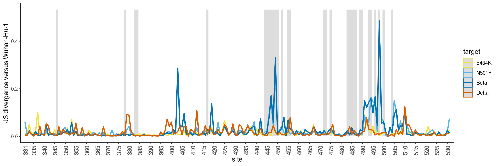
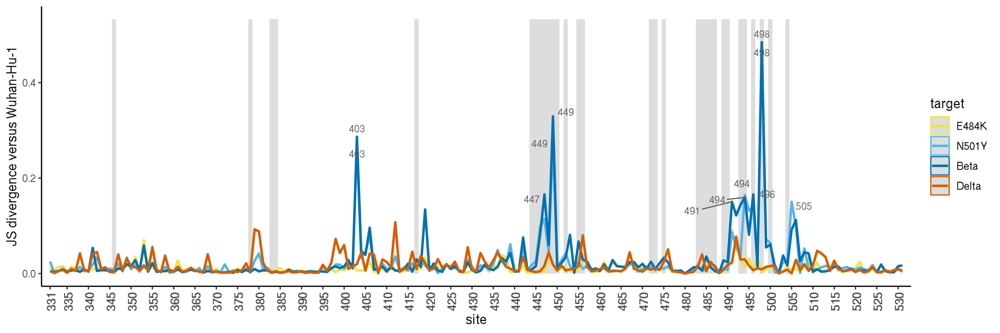
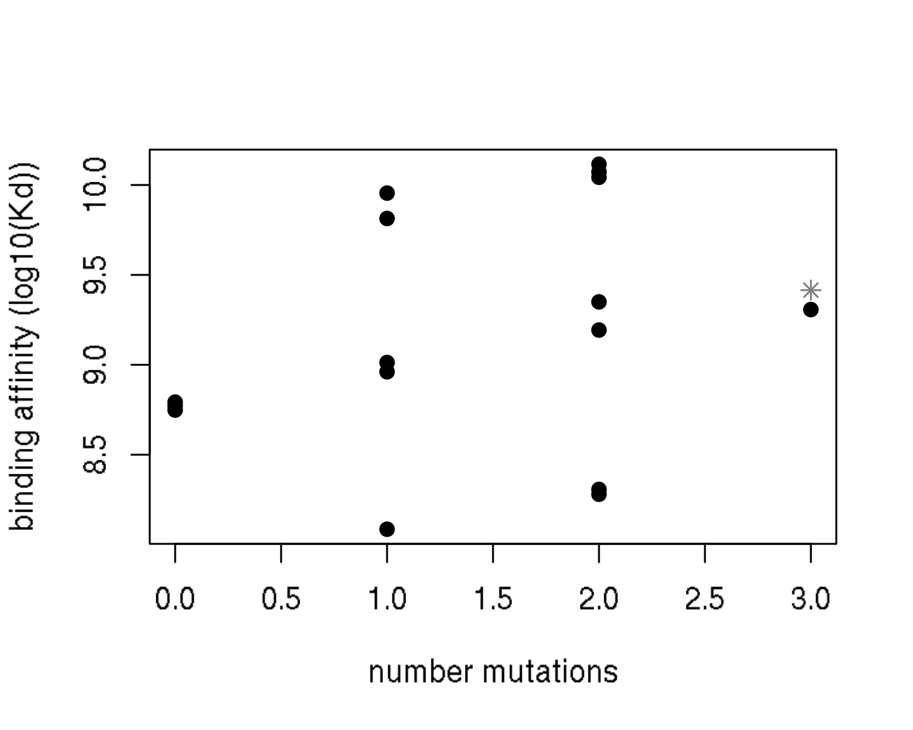
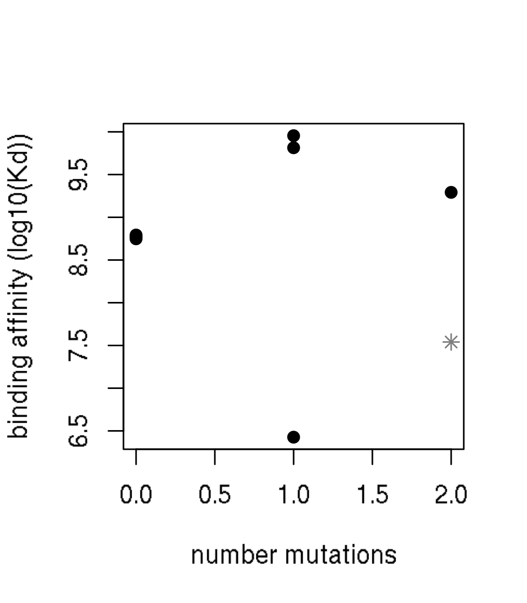
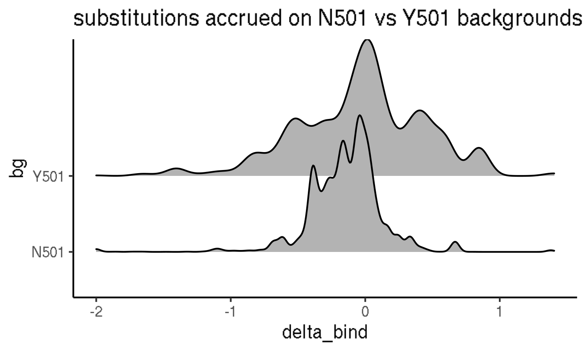
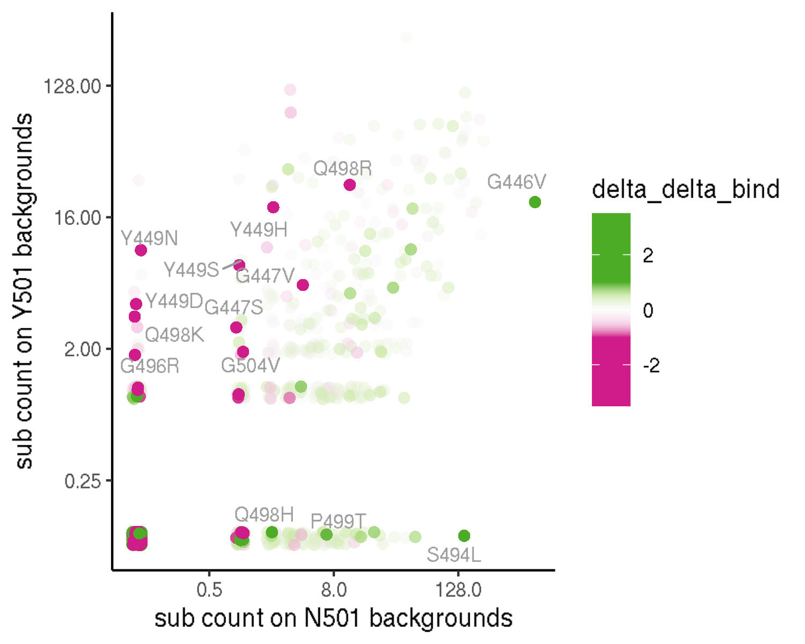
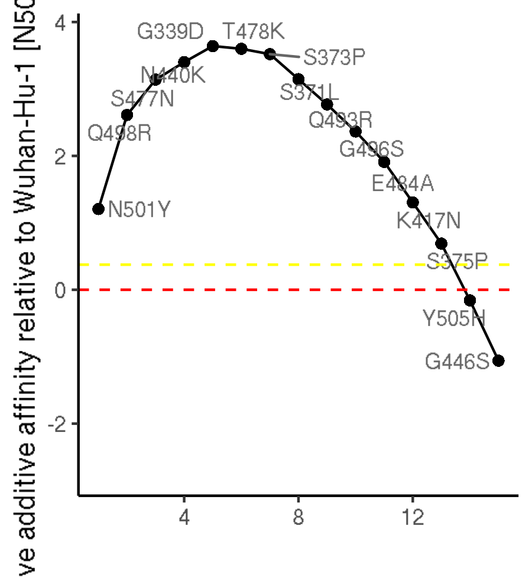
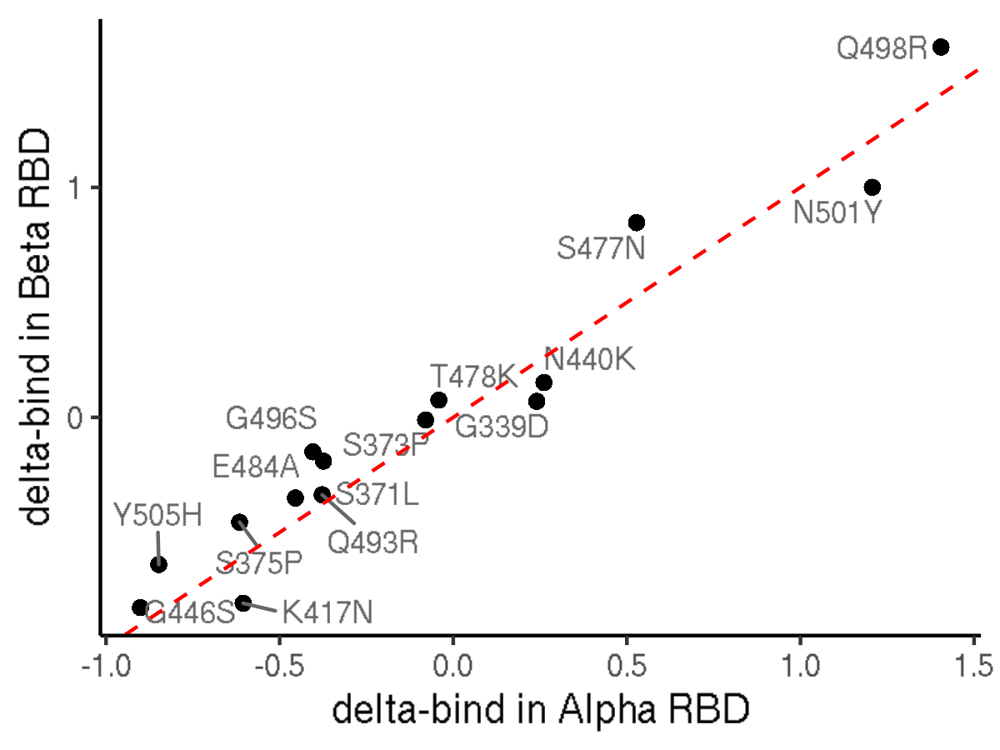
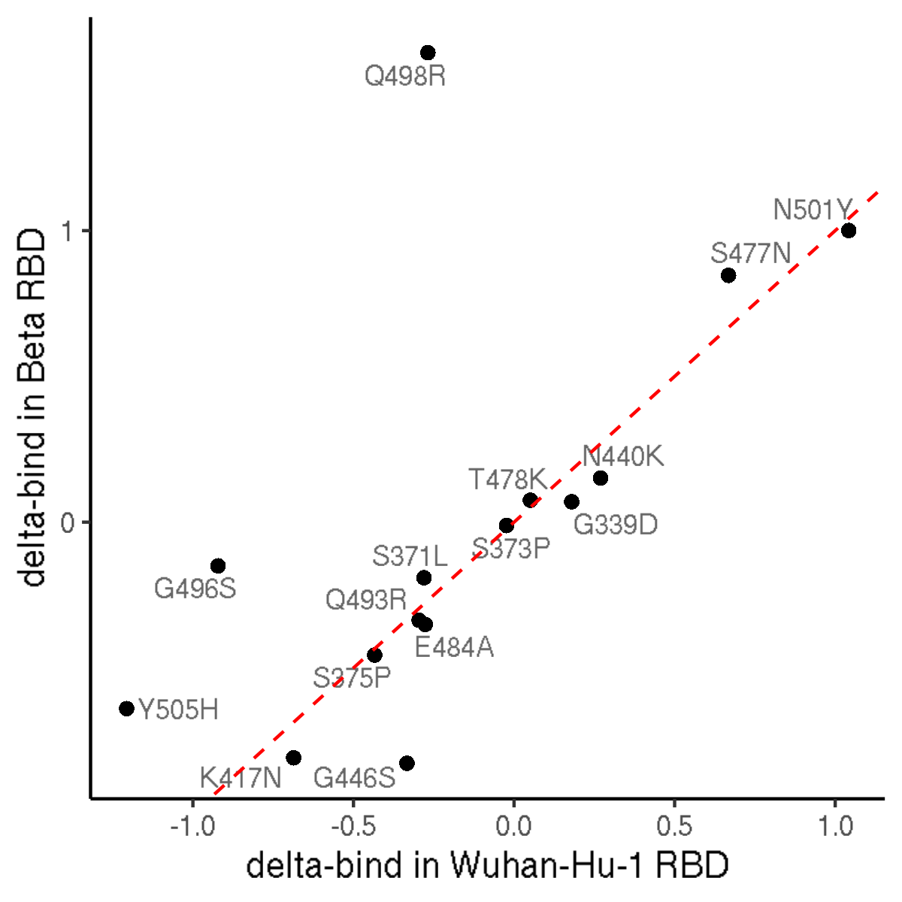

Shifts in mutation effects among variant backgrounds
================
Tyler Starr
10/11/2021

-   [Setup](#setup)
-   [Calculate site-wise Jensen-Shannon distance, a metric of divergence
    in site-specific mutational
    profiles](#calculate-site-wise-jensen-shannon-distance-a-metric-of-divergence-in-site-specific-mutational-profiles)
-   [Line plots of JS distance from WH1 across RBD
    sites](#line-plots-of-js-distance-from-wh1-across-rbd-sites)
-   [Map distance to pdb structure](#map-distance-to-pdb-structure)
-   [Epistatic cycles from binding
    data](#epistatic-cycles-from-binding-data)
-   [Comparison of mutant accumulation on N501 versus Y501
    backgrounds](#comparison-of-mutant-accumulation-on-n501-versus-y501-backgrounds)

This notebook analyzes sites whose mutation effects deviate most
strongly among the variant RBD backgrounds.

``` r
require("knitr")
knitr::opts_chunk$set(echo = T)
knitr::opts_chunk$set(dev.args = list(png = list(type = "cairo")))

#list of packages to install/load
packages = c("yaml","data.table","tidyverse","gridExtra","egg","bio3d","ggridges","ggrepel")
#install any packages not already installed
installed_packages <- packages %in% rownames(installed.packages())
if(any(installed_packages == F)){
  install.packages(packages[!installed_packages])
}
#load packages
invisible(lapply(packages, library, character.only=T))

#read in config file
config <- read_yaml("config.yaml")

#make output directory
if(!file.exists(config$epistatic_shifts_dir)){
  dir.create(file.path(config$epistatic_shifts_dir))
}

#make pdb output directory
if(!file.exists(paste(config$epistatic_shifts_dir,"/pdbs/",sep=""))){
  dir.create(file.path(paste(config$epistatic_shifts_dir,"/pdbs/",sep="")))
}
```

Session info for reproducing environment:

``` r
sessionInfo()
```

    ## R version 3.6.2 (2019-12-12)
    ## Platform: x86_64-pc-linux-gnu (64-bit)
    ## Running under: Ubuntu 18.04.4 LTS
    ## 
    ## Matrix products: default
    ## BLAS/LAPACK: /app/software/OpenBLAS/0.3.7-GCC-8.3.0/lib/libopenblas_haswellp-r0.3.7.so
    ## 
    ## locale:
    ##  [1] LC_CTYPE=en_US.UTF-8       LC_NUMERIC=C              
    ##  [3] LC_TIME=en_US.UTF-8        LC_COLLATE=en_US.UTF-8    
    ##  [5] LC_MONETARY=en_US.UTF-8    LC_MESSAGES=en_US.UTF-8   
    ##  [7] LC_PAPER=en_US.UTF-8       LC_NAME=C                 
    ##  [9] LC_ADDRESS=C               LC_TELEPHONE=C            
    ## [11] LC_MEASUREMENT=en_US.UTF-8 LC_IDENTIFICATION=C       
    ## 
    ## attached base packages:
    ## [1] stats     graphics  grDevices utils     datasets  methods   base     
    ## 
    ## other attached packages:
    ##  [1] ggrepel_0.8.1     ggridges_0.5.1    bio3d_2.4-0       egg_0.4.5        
    ##  [5] gridExtra_2.3     forcats_0.4.0     stringr_1.4.0     dplyr_0.8.3      
    ##  [9] purrr_0.3.3       readr_1.3.1       tidyr_1.0.0       tibble_3.0.2     
    ## [13] ggplot2_3.3.0     tidyverse_1.3.0   data.table_1.12.8 yaml_2.2.0       
    ## [17] knitr_1.26       
    ## 
    ## loaded via a namespace (and not attached):
    ##  [1] tidyselect_1.1.0 xfun_0.11        haven_2.2.0      colorspace_1.4-1
    ##  [5] vctrs_0.3.1      generics_0.0.2   htmltools_0.4.0  rlang_0.4.7     
    ##  [9] pillar_1.4.5     glue_1.3.1       withr_2.1.2      DBI_1.1.0       
    ## [13] dbplyr_1.4.2     modelr_0.1.5     readxl_1.3.1     plyr_1.8.5      
    ## [17] lifecycle_0.2.0  munsell_0.5.0    gtable_0.3.0     cellranger_1.1.0
    ## [21] rvest_0.3.5      evaluate_0.14    parallel_3.6.2   fansi_0.4.0     
    ## [25] broom_0.7.0      Rcpp_1.0.3       scales_1.1.0     backports_1.1.5 
    ## [29] jsonlite_1.6     fs_1.3.1         hms_0.5.2        digest_0.6.23   
    ## [33] stringi_1.4.3    grid_3.6.2       cli_2.0.0        tools_3.6.2     
    ## [37] magrittr_1.5     crayon_1.3.4     pkgconfig_2.0.3  ellipsis_0.3.0  
    ## [41] xml2_1.2.2       reprex_0.3.0     lubridate_1.7.4  assertthat_0.2.1
    ## [45] rmarkdown_2.0    httr_1.4.1       rstudioapi_0.10  R6_2.4.1        
    ## [49] compiler_3.6.2

Define colorblind-friendly palette

``` r
# The palette with grey:
cbPalette <- c("#999999", "#E69F00", "#56B4E9", "#009E73", "#F0E442", 
               "#0072B2", "#D55E00", "#CC79A7")
# The palette with black
cbbPalette <- c("#000000", "#E69F00", "#56B4E9", "#009E73", "#F0E442", 
                "#0072B2", "#D55E00", "#CC79A7")
```

## Setup

Read in tables of mutant measurements.

``` r
dt <- data.table(read.csv(file=config$final_variant_scores_mut_file,stringsAsFactors=F))
```

## Calculate site-wise Jensen-Shannon distance, a metric of divergence in site-specific mutational profiles

For each pair of backgrounds, at each site I want to compute the
Jensen-Shannon distance between the profile of mutation effects of all
mutations at the site. (Remove any measurements determined for \<3 or
\<5 bc to avoid measurements with lower precision driving noise in the
global JSD metric.)

``` r
#define a minbc bind measurement that requires three barcodes be averaged for a final determination, otherwise change to NA
dt[,bind_min3bc := bind]
dt[n_bc_bind < 3, bind_min3bc := NA]

dt[,bind_min5bc := bind]
dt[n_bc_bind < 5, bind_min5bc := NA]

#define a minbc expr measurement that requires three barcodes be averaged for a final determination, otherwise change to NA
dt[,expr_min3bc := expr]
dt[n_bc_expr < 3, expr_min3bc := NA]

dt[,expr_min5bc := expr]
dt[n_bc_expr < 5, expr_min5bc := NA]

#define a function for computing J-S distance between two affinity vectors (where affinity is given currently as log10-Kd)
JS <- function(vec1,vec2){
  vec1_pair <- vec1[!is.na(vec1) & !is.na(vec2)]
  vec2_pair <- vec2[!is.na(vec1) & !is.na(vec2)]
  pi1 <- 10^(vec1_pair)/sum(10^(vec1_pair))
  pi2 <- 10^(vec2_pair)/sum(10^(vec2_pair))
  n <- 0.5 * (pi1+pi2)
  JS <- 0.5 * (sum(pi1*log(pi1/n)) + sum(pi2*log(pi2/n)))
  #return(sqrt(JS)) #if doing divergence
  return(JS) #if doing distance
}

#first, for bind measurements
#data table for storing difference in correlation in profiles between bg pairs at each site
#generate table with all combinations of bg_1 and bg_2 for each site
diffs_bind <- data.table(expand.grid(site=unique(dt$position),bg_2=c("Wuhan-Hu-1","E484K","N501Y","Beta","Delta"),bg_1=c("Wuhan-Hu-1","E484K","N501Y","Beta","Delta")))

#remove duplicates -- either bg_1 and _2 the same, or combinations where the _2 _1 combo is already present in the _1 _2 orientation
diffs_bind <- diffs_bind[bg_1 != bg_2,]
diffs_bind <- diffs_bind[bg_1 == "Wuhan-Hu-1" | (bg_1=="E484K" & bg_2 %in% c("N501Y","Beta","Delta")) | (bg_1=="N501Y" & bg_2 %in% c("Beta","Delta")) | bg_1=="Beta" & bg_2=="Delta"]

#loop through and compute JSD for each site for each pair of bgs, for bind metric
diffs_bind$JSD <- as.numeric(NA) #jensen-shannon distance, from raw bind values (lower limit 5)
diffs_bind$JSD_min3bc <- as.numeric(NA) #jensen-shannon distance, require a minimum of 3 bcs averaged
diffs_bind$JSD_min5bc <- as.numeric(NA) #jensen-shannon distance, require a minimum of 5 bcs averaged
for(i in 1:nrow(diffs_bind)){
  x_uncens <- dt[target==diffs_bind[i,bg_1] & position==diffs_bind[i,site],bind]
  y_uncens <- dt[target==diffs_bind[i,bg_2] & position==diffs_bind[i,site],bind]
  x_min3bc <- dt[target==diffs_bind[i,bg_1] & position==diffs_bind[i,site],bind_min3bc]
  y_min3bc <- dt[target==diffs_bind[i,bg_2] & position==diffs_bind[i,site],bind_min3bc]
  x_min5bc <- dt[target==diffs_bind[i,bg_1] & position==diffs_bind[i,site],bind_min5bc]
  y_min5bc <- dt[target==diffs_bind[i,bg_2] & position==diffs_bind[i,site],bind_min5bc]
  diffs_bind[i,JSD := JS(x_uncens,y_uncens)]
  diffs_bind[i,JSD_min3bc := JS(x_min3bc,y_min3bc)]
  diffs_bind[i,JSD_min5bc := JS(x_min3bc,y_min5bc)]
}

#repeat for expr measurements
#data table for storign difference in correlation in profiles between bg pairs at each site
#generate table with all combinations of bg_1 and bg_2 for each site
diffs_expr <- data.table(expand.grid(site=unique(dt$position),bg_2=c("Wuhan-Hu-1","E484K","N501Y","Beta","Delta"),bg_1=c("Wuhan-Hu-1","E484K","N501Y","Beta","Delta")))

#remove duplicates -- either bg_1 and _2 the same, or combinations where the _2 _1 combo is already present in the _1 _2 orientation
diffs_expr <- diffs_expr[bg_1 != bg_2,]
diffs_expr <- diffs_expr[bg_1 == "Wuhan-Hu-1" | (bg_1=="E484K" & bg_2 %in% c("N501Y","Beta","Delta")) | (bg_1=="N501Y" & bg_2 %in% c("Beta","Delta")) | bg_1=="Beta" & bg_2=="Delta"]

#loop through and compute JSD for each site for each pair of bgs, for expr metric
diffs_expr$JSD <- as.numeric(NA) #jensen-shannon distance, from raw expr values
diffs_expr$JSD_min3bc <- as.numeric(NA) #jensen-shannon distance, require a minimum of 3 bcs averaged
diffs_expr$JSD_min5bc <- as.numeric(NA) #jensen-shannon distance, require a minimum of 5 bcs averaged
for(i in 1:nrow(diffs_expr)){
  x_uncens <- dt[target==diffs_expr[i,bg_1] & position==diffs_expr[i,site],expr]
  y_uncens <- dt[target==diffs_expr[i,bg_2] & position==diffs_expr[i,site],expr]
  x_min3bc <- dt[target==diffs_expr[i,bg_1] & position==diffs_expr[i,site],expr_min3bc]
  y_min3bc <- dt[target==diffs_expr[i,bg_2] & position==diffs_expr[i,site],expr_min3bc]
  x_min5bc <- dt[target==diffs_expr[i,bg_1] & position==diffs_expr[i,site],expr_min5bc]
  y_min5bc <- dt[target==diffs_expr[i,bg_2] & position==diffs_expr[i,site],expr_min5bc]
  diffs_expr[i,JSD := JS(x_uncens,y_uncens)]
  diffs_expr[i,JSD_min3bc := JS(x_min3bc,y_min3bc)]
  diffs_expr[i,JSD_min5bc := JS(x_min3bc,y_min5bc)]
}
```

Plotting/visualizing:

Utility function: plot scatterplot showing affinity of each of the 20
amino acids in a pair of sites

``` r
plot_scatter <- function(site, bg1, bg2, JSD=F, JSD_min3bc=T, JSD_min5bc=F,n_bc_cutoff=3,phenotype="bind"){
  x <- dt[target==bg1 & position==site,get(phenotype)]
  x_n_bc <- dt[target==bg1 & position==site,get(paste("n_bc_",phenotype,sep=""))]
  x_ref <- dt[target==bg1 & position==site & as.character(mutant)==as.character(wildtype),get(phenotype)]
  y <- dt[target==bg2 & position==site,get(phenotype)]
  y_n_bc <- dt[target==bg2 & position==site,get(paste("n_bc_",phenotype,sep=""))]
  y_ref <- dt[target==bg2 & position==site & as.character(mutant)==as.character(wildtype),get(phenotype)]
  x_min3bc <- dt[target==bg1 & position==site,get(paste(phenotype,"_min3bc",sep=""))]
  y_min3bc <- dt[target==bg2 & position==site,get(paste(phenotype,"_min3bc",sep=""))]
  x_min5bc <- dt[target==bg1 & position==site,get(paste(phenotype,"_min5bc",sep=""))]
  y_min5bc <- dt[target==bg2 & position==site,get(paste(phenotype,"_min5bc",sep=""))]
  chars <- dt[target==bg1 & position==site,mutant]
  cols <- rep("black",20); cols[which(x_n_bc < n_bc_cutoff | y_n_bc < n_bc_cutoff)] <- "orange"
  plot(x,y, xlim=if(phenotype=="bind"){c(4.5,12)}else{c(5.5,11)},ylim=if(phenotype=="bind"){c(4.5,12)}else{c(5.5,11)},pch=chars,xlab=paste(bg1,phenotype),ylab=paste(bg2,phenotype),col=cols,main=paste("site",site))
  abline(v=x_ref,lty=2,col="red")
  abline(h=y_ref,lty=2,col="red")
  if(JSD==T){
    val <- JS(x,y)
    legend("topleft",bty="n",cex=1,legend=paste("JSD:",format(val,digits=3)))
  }else if(JSD_min3bc==T){
    val <- JS(x_min3bc,y_min3bc)
    legend("topleft",bty="n",cex=1,legend=paste("JSD:",format(val,digits=3)))
  }else if(JSD_min5bc==T){
    val <- JS(x_min5bc,y_min5bc)
    legend("topleft",bty="n",cex=1,legend=paste("JSD:",format(val,digits=3)))
  }
}
```

``` r
par(mfrow=c(1,3))
plot_scatter(site=417,"Wuhan-Hu-1","Beta")
plot_scatter(site=484,"Wuhan-Hu-1","Beta")
plot_scatter(site=501,"Wuhan-Hu-1","Beta")
```


``` r
invisible(dev.print(pdf, paste(config$epistatic_shifts_dir,"/bg-scatters_Beta-muts.pdf",sep=""),useDingbats=F))
```

``` r
par(mfrow=c(1,3))
plot_scatter(site=446,"Wuhan-Hu-1","Beta")
plot_scatter(site=447,"Wuhan-Hu-1","Beta")
plot_scatter(site=449,"Wuhan-Hu-1","Beta")
```


``` r
invisible(dev.print(pdf, paste(config$epistatic_shifts_dir,"/bg-scatters_class3-loop-muts.pdf",sep=""),useDingbats=F))
```

``` r
par(mfrow=c(1,4))
plot_scatter(site=403,"Wuhan-Hu-1","Beta")
plot_scatter(site=406,"Wuhan-Hu-1","Beta")
plot_scatter(site=505,"Wuhan-Hu-1","Beta")
plot_scatter(site=506,"Wuhan-Hu-1","Beta")
```


``` r
invisible(dev.print(pdf, paste(config$epistatic_shifts_dir,"/bg-scatters_403-perturbation.pdf",sep=""),useDingbats=F))
```

``` r
par(mfrow=c(1,7))
plot_scatter(site=491,"Wuhan-Hu-1","Beta")
plot_scatter(site=492,"Wuhan-Hu-1","Beta")
plot_scatter(site=493,"Wuhan-Hu-1","Beta")
plot_scatter(site=494,"Wuhan-Hu-1","Beta")
plot_scatter(site=495,"Wuhan-Hu-1","Beta")
plot_scatter(site=496,"Wuhan-Hu-1","Beta")
plot_scatter(site=498,"Wuhan-Hu-1","Beta")
```


``` r
invisible(dev.print(pdf, paste(config$epistatic_shifts_dir,"/bg-scatters_RBM-perturbation.pdf",sep=""),useDingbats=F))
```

``` r
par(mfrow=c(1,3))
plot_scatter(site=419,"Wuhan-Hu-1","Beta")
invisible(dev.print(pdf, paste(config$epistatic_shifts_dir,"/bg-scatters_419-perturbation.pdf",sep=""),useDingbats=F))
```


``` r
par(mfrow=c(2,3))
plot_scatter(site=349,"Wuhan-Hu-1","Beta",phenotype="expr")
plot_scatter(site=401,"Wuhan-Hu-1","Beta",phenotype="expr")
plot_scatter(site=404,"Wuhan-Hu-1","Beta",phenotype="expr")
plot_scatter(site=409,"Wuhan-Hu-1","Beta",phenotype="expr")
plot_scatter(site=495,"Wuhan-Hu-1","Beta",phenotype="expr")
plot_scatter(site=506,"Wuhan-Hu-1","Beta",phenotype="expr")
```


``` r
invisible(dev.print(pdf, paste(config$epistatic_shifts_dir,"/bg-scatters_expression-sites.pdf",sep=""),useDingbats=F))
```

## Line plots of JS distance from WH1 across RBD sites

Make lineplots showing JS-D across sites for each variant compared to
WH1.

Also add gray shading for sites of escape from antibodies from our large
panel of antibodies we’ve profiled w.r.t. WH1 escape, downloaded from:
<https://raw.githubusercontent.com/jbloomlab/SARS2_RBD_Ab_escape_maps/main/processed_data/escape_data.csv>

First, define sites of substantial antibody escape

``` r
dt_mAb <- data.table(read.csv(file=config$mut_antibody_escape,stringsAsFactors = F))
dt_mAb <- unique(dt_mAb[condition_type=="antibody",.(condition, condition_type, condition_subtype, site, wildtype, site_total_escape, site_mean_escape, normalized_site_total_escape, normalized_site_mean_escape)])

dt_mAb[,site_average_escape:=mean(normalized_site_total_escape,na.rm=T),by=c("site")]

site_escape <- unique(dt_mAb[,.(wildtype, site, site_average_escape)])

#define sites for labeling as those with an average of 0.05 normalized site-wise escape across all mAbs
sig_mAb_sites <- site_escape[site_average_escape>0.05, site]


#define some epitope classes for adding highlights
label_df <- data.frame(xmin=sig_mAb_sites-0.5,
                       xmax=sig_mAb_sites+0.5)
```

``` r
#define focal bg for others to compare to
bg <- "Wuhan-Hu-1"
temp <- diffs_bind[bg_1==bg | bg_2 == bg]
temp$target <- as.character(NA)
for(i in 1:nrow(temp)){
  if(temp[i,bg_1]!=bg){
    temp[i,target:=temp[i,bg_1]]
  }else if(temp[i,bg_2]!=bg){
    temp[i,target:=temp[i,bg_2]]
  }
}

#define colors for each bg
group.colors <- c("Wuhan-Hu-1" = cbPalette[1], "N501Y" = cbPalette[3], "E484K" = cbPalette[5], "Beta"=cbPalette[6], "Delta"=cbPalette[7])

#define order for plotting of bgs
temp$target <- factor(temp$target,levels=c("E484K","N501Y","Beta","Delta"))


ggplot(data=temp, aes(x=site, y=JSD, color=target))+
  geom_rect(data=label_df, aes(x=NULL, y=NULL, color=NULL,xmin=xmin, xmax=xmax, ymin=0,ymax=1.1*max(temp$JSD,na.rm=T)), alpha=0.2)+
  geom_line(size=1)+
  scale_color_manual(values=group.colors)+
  theme_classic()+
  scale_x_continuous(expand=c(0.01,0.01),breaks=c(331,seq(335,530,by=5)))+
  theme(axis.text.x=element_text(angle=90,hjust=1,vjust=0.6,face="bold",size=10))+
  ylab("JS distance versus Wuhan-Hu-1")
```



``` r
invisible(dev.print(pdf, paste(config$epistatic_shifts_dir,"/JSD_v_WH1.pdf",sep=""),useDingbats=F))
```

Same but require minimum 3 bc for a measurement

``` r
ggplot(data=temp, aes(x=site, y=JSD_min3bc, color=target))+
  geom_rect(data=label_df, aes(x=NULL, y=NULL, color=NULL,xmin=xmin, xmax=xmax, ymin=0,ymax=1.1*max(temp$JSD,na.rm=T)), alpha=0.2)+
  geom_line(size=1)+
  scale_color_manual(values=group.colors)+
  theme_classic()+
  scale_x_continuous(expand=c(0.01,0.01),breaks=c(331,seq(335,530,by=5)))+
  theme(axis.text.x=element_text(angle=90,hjust=1,vjust=0.6,face="bold",size=10))+
  ylab("JS distance versus Wuhan-Hu-1")+
  geom_text_repel(aes(label=ifelse(((JSD_min3bc > 0.15)),as.character(site),'')),size=3,color="gray40")
```



``` r
invisible(dev.print(pdf, paste(config$epistatic_shifts_dir,"/JSD_v_WH1_min3bc.pdf",sep=""),useDingbats=F))
```

Output file with the site-pair JS distances.

``` r
temp[,.(target,site,JSD,JSD_min3bc,JSD_min5bc)] %>%
  mutate_if(is.numeric, round, digits=6) %>%
  write.csv(file=config$JSD_v_WH1_file, row.names=F,quote=F)
```

Repeat for expression measurements

``` r
#define focal bg for others to compare to
bg <- "Wuhan-Hu-1"
temp <- diffs_expr[bg_1==bg | bg_2 == bg]
temp$target <- as.character(NA)
for(i in 1:nrow(temp)){
  if(temp[i,bg_1]!=bg){
    temp[i,target:=temp[i,bg_1]]
  }else if(temp[i,bg_2]!=bg){
    temp[i,target:=temp[i,bg_2]]
  }
}

#define colors for each bg
group.colors <- c("Wuhan-Hu-1" = cbPalette[1], "N501Y" = cbPalette[3], "E484K" = cbPalette[5], "Beta"=cbPalette[6], "Delta"=cbPalette[7])

#define order for plotting of bgs
temp$target <- factor(temp$target,levels=c("E484K","N501Y","Beta","Delta"))


ggplot(data=temp, aes(x=site, y=JSD, color=target))+
  geom_rect(data=label_df, aes(x=NULL, y=NULL, color=NULL,xmin=xmin, xmax=xmax, ymin=0,ymax=1.1*max(temp$JSD,na.rm=T)), alpha=0.2)+
  geom_line(size=1)+
  scale_color_manual(values=group.colors)+
  theme_classic()+
  scale_x_continuous(expand=c(0.01,0.01),breaks=c(331,seq(335,530,by=5)))+
  theme(axis.text.x=element_text(angle=90,hjust=1,vjust=0.6,face="bold",size=10))+
  ylab("JS distance versus Wuhan-Hu-1")
```


``` r
invisible(dev.print(pdf, paste(config$epistatic_shifts_dir,"/JSD_v_WH1_expr.pdf",sep=""),useDingbats=F))
```

Same but require minimum 3 bc for a measurement

``` r
ggplot(data=temp, aes(x=site, y=JSD_min3bc, color=target))+
  geom_rect(data=label_df, aes(x=NULL, y=NULL, color=NULL,xmin=xmin, xmax=xmax, ymin=0,ymax=1.1*max(temp$JSD,na.rm=T)), alpha=0.2)+
  geom_line(size=1)+
  scale_color_manual(values=group.colors)+
  theme_classic()+
  scale_x_continuous(expand=c(0.01,0.01),breaks=c(331,seq(335,530,by=5)))+
  theme(axis.text.x=element_text(angle=90,hjust=1,vjust=0.6,face="bold",size=10))+
  ylab("JS distance versus Wuhan-Hu-1, expression DMS")+
  geom_text_repel(aes(label=ifelse(((JSD_min3bc > 0.06)),as.character(site),'')),size=3,color="gray40")
```


``` r
invisible(dev.print(pdf, paste(config$epistatic_shifts_dir,"/JSD_v_WH1_min3bc_expr.pdf",sep=""),useDingbats=F))
```

Output file with the site-pair JS distances.

``` r
temp[,.(target,site,JSD,JSD_min3bc,JSD_min5bc)] %>%
  mutate_if(is.numeric, round, digits=6) %>%
  write.csv(file=config$JSD_v_WH1_expr_file, row.names=F,quote=F)
```

## Map distance to pdb structure

First, bind

``` r
pdb_wh1 <- read.pdb(file=config$pdb_6m0j)
```

    ##    PDB has ALT records, taking A only, rm.alt=TRUE

``` r
#iterate through backgrounds, output a pdb comparing its distance to WH1 (using min3bc)
for(s in c("E484K","N501Y","Beta","Delta")){
  b <- rep(0, length(pdb_wh1$atom$b))
  for(i in 1:nrow(pdb_wh1$atom)){
    if(pdb_wh1$atom$chain[i]=="E"){
      res <- pdb_wh1$atom$resno[i]
      JSD <- diffs_bind[bg_1=="Wuhan-Hu-1" & bg_2==s & site==res, JSD_min3bc]
      if(length(JSD)>0){
        b[i] <- JSD
      }
    }
  }
  write.pdb(pdb=pdb_wh1, file=paste(config$epistatic_shifts_dir,"/pdbs/",s,"_v_WH1_JSD-min3bc.pdb",sep=""), b=b)
}
```

repeat for expression measures

``` r
pdb_wh1 <- read.pdb(file=config$pdb_6m0j)
```

    ##    PDB has ALT records, taking A only, rm.alt=TRUE

``` r
#iterate through backgrounds, output a pdb comparing its distance to WH1 (using min3bc)
for(s in c("E484K","N501Y","Beta","Delta")){
  b <- rep(0, length(pdb_wh1$atom$b))
  for(i in 1:nrow(pdb_wh1$atom)){
    if(pdb_wh1$atom$chain[i]=="E"){
      res <- pdb_wh1$atom$resno[i]
      JSD <- diffs_expr[bg_1=="Wuhan-Hu-1" & bg_2==s & site==res, JSD_min3bc]
      if(length(JSD)>0){
        b[i] <- JSD
      }
    }
  }
  write.pdb(pdb=pdb_wh1, file=paste(config$epistatic_shifts_dir,"/pdbs/",s,"_v_WH1_JSD-min3bc_expr.pdb",sep=""), b=b)
}
```

## Epistatic cycles from binding data

Additivity of 417/484/501 muts? Build out cycle of mutants from the
different places where each mutant is measured (e.g. WH1 is also
measured in E484K as the K484E mut)

``` r
cycle_bind <- data.table()

cycle_bind$geno <- "Wuhan-Hu-1"
cycle_bind$bind <- dt[target=="Wuhan-Hu-1" & position==331 & wildtype==mutant,bind]
cycle_bind$n_bc <- dt[target=="Wuhan-Hu-1" & position==331 & wildtype==mutant,n_bc_bind]
cycle_bind$nmut <- 0


cycle_bind <- rbind(cycle_bind,list("Wuhan-Hu-1",dt[target=="E484K" & position==484 & mutant=="E",bind],dt[target=="E484K" & position==484 & mutant=="E",n_bc_bind],0))
cycle_bind <- rbind(cycle_bind,list("Wuhan-Hu-1",dt[target=="N501Y" & position==501 & mutant=="N",bind],dt[target=="N501Y" & position==501 & mutant=="N",n_bc_bind],0))


#K417N
cycle_bind <- rbind(cycle_bind,list("K417N",dt[target=="Wuhan-Hu-1" & position==417 & mutant=="N",bind],dt[target=="Wuhan-Hu-1" & position==417 & mutant=="N",n_bc_bind],1))

#E484K
cycle_bind <- rbind(cycle_bind,list("E484K",dt[target=="Wuhan-Hu-1" & position==484 & mutant=="K",bind],dt[target=="Wuhan-Hu-1" & position==484 & mutant=="K",n_bc_bind],1))
cycle_bind <- rbind(cycle_bind,list("E484K",dt[target=="E484K" & position==484 & mutant==wildtype,bind],dt[target=="E484K" & position==484 & mutant==wildtype,n_bc_bind],1))

#N501Y
cycle_bind <- rbind(cycle_bind,list("N501Y",dt[target=="Wuhan-Hu-1" & position==501 & mutant=="Y",bind],dt[target=="Wuhan-Hu-1" & position==501 & mutant=="Y",n_bc_bind],1))
cycle_bind <- rbind(cycle_bind,list("N501Y",dt[target=="N501Y" & position==484 & mutant==wildtype,bind],dt[target=="N501Y" & position==484 & mutant==wildtype,n_bc_bind],1))

#K417N/E484K
cycle_bind <- rbind(cycle_bind,list("K417N/E484K",dt[target=="E484K" & position==417 & mutant=="N",bind],dt[target=="E484K" & position==417 & mutant=="N",n_bc_bind],2))
cycle_bind <- rbind(cycle_bind,list("K417N/E484K",dt[target=="Beta" & position==501 & mutant=="N",bind],dt[target=="Beta" & position==501 & mutant=="N",n_bc_bind],2))

#K417N/N501Y
cycle_bind <- rbind(cycle_bind,list("K417N/N501Y",dt[target=="N501Y" & position==417 & mutant=="N",bind],dt[target=="N501Y" & position==417 & mutant=="N",n_bc_bind],2))
cycle_bind <- rbind(cycle_bind,list("K417N/N501Y",dt[target=="Beta" & position==484 & mutant=="E",bind],dt[target=="Beta" & position==484 & mutant=="E",n_bc_bind],2))

#E484K/N501Y
cycle_bind <- rbind(cycle_bind,list("E484K/N501Y",dt[target=="E484K" & position==501 & mutant=="Y",bind],dt[target=="E484K" & position==501 & mutant=="Y",n_bc_bind],2))
cycle_bind <- rbind(cycle_bind,list("E484K/N501Y",dt[target=="N501Y" & position==484 & mutant=="K",bind],dt[target=="N501Y" & position==484 & mutant=="K",n_bc_bind],2))
cycle_bind <- rbind(cycle_bind,list("E484K/N501Y",dt[target=="Beta" & position==417 & mutant=="K",bind],dt[target=="Beta" & position==417 & mutant=="K",n_bc_bind],2))

#Beta
cycle_bind <- rbind(cycle_bind,list("Beta",dt[target=="Beta" & position==417 & mutant==wildtype,bind],dt[target=="Beta" & position==417 & mutant==wildtype,n_bc_bind],3))

plot(cycle_bind$nmut,cycle_bind$bind,pch=19,xlab="number mutations",ylab="binding affinity (log10(Kd))")

#additive prediction?
additive <- mean(cycle_bind[geno=="Wuhan-Hu-1",bind]) + (mean(cycle_bind[geno=="K417N",bind]) - mean(cycle_bind[geno=="Wuhan-Hu-1",bind])) + (mean(cycle_bind[geno=="E484K",bind]) - mean(cycle_bind[geno=="Wuhan-Hu-1",bind])) + ( mean(cycle_bind[geno=="N501Y",bind]) - mean(cycle_bind[geno=="Wuhan-Hu-1",bind]))

points(3,additive,pch=8,col="#7f7f7f")
```



``` r
invisible(dev.print(pdf, paste(config$epistatic_shifts_dir,"/Beta_epistasis_cycle_bind.pdf",sep=""),useDingbats=F))
```

``` r
cycle_bind <- data.table()

cycle_bind$geno <- "Wuhan-Hu-1"
cycle_bind$bind <- dt[target=="Wuhan-Hu-1" & position==331 & wildtype==mutant,bind]
cycle_bind$n_bc <- dt[target=="Wuhan-Hu-1" & position==331 & wildtype==mutant,n_bc_bind]
cycle_bind$nmut <- 0


cycle_bind <- rbind(cycle_bind,list("Wuhan-Hu-1",dt[target=="E484K" & position==484 & mutant=="E",bind],dt[target=="E484K" & position==484 & mutant=="E",n_bc_bind],0))
cycle_bind <- rbind(cycle_bind,list("Wuhan-Hu-1",dt[target=="N501Y" & position==501 & mutant=="N",bind],dt[target=="N501Y" & position==501 & mutant=="N",n_bc_bind],0))


#N501Y
cycle_bind <- rbind(cycle_bind,list("N501Y",dt[target=="Wuhan-Hu-1" & position==501 & mutant=="Y",bind],dt[target=="Wuhan-Hu-1" & position==501 & mutant=="Y",n_bc_bind],1))
cycle_bind <- rbind(cycle_bind,list("N501Y",dt[target=="N501Y" & position==484 & mutant==wildtype,bind],dt[target=="N501Y" & position==484 & mutant==wildtype,n_bc_bind],1))

#Y449H
cycle_bind <- rbind(cycle_bind,list("Y449H",dt[target=="Wuhan-Hu-1" & position==449 & mutant=="H",bind],dt[target=="Wuhan-Hu-1" & position==449 & mutant=="H",n_bc_bind],1))

#Y449H/N501Y
cycle_bind <- rbind(cycle_bind,list("Y449H/N501Y",dt[target=="N501Y" & position==449 & mutant=="H",bind],dt[target=="N501Y" & position==449 & mutant=="H",n_bc_bind],2))

plot(cycle_bind$nmut,cycle_bind$bind,pch=19,xlab="number mutations",ylab="binding affinity (log10(Kd))")

#additive prediction?
additive <- mean(cycle_bind[geno=="Wuhan-Hu-1",bind]) + (mean(cycle_bind[geno=="N501Y",bind]) - mean(cycle_bind[geno=="Wuhan-Hu-1",bind])) + (mean(cycle_bind[geno=="Y449H",bind]) - mean(cycle_bind[geno=="Wuhan-Hu-1",bind]))

points(2,additive,pch=8,col="#7f7f7f")
```



``` r
invisible(dev.print(pdf, paste(config$epistatic_shifts_dir,"/Y449H_N501Y_epistasis_cycle_bind.pdf",sep=""),useDingbats=F))
```

``` r
cycle_bind <- data.table()

cycle_bind$geno <- "Wuhan-Hu-1"
cycle_bind$bind <- dt[target=="Wuhan-Hu-1" & position==331 & wildtype==mutant,bind]
cycle_bind$n_bc <- dt[target=="Wuhan-Hu-1" & position==331 & wildtype==mutant,n_bc_bind]
cycle_bind$nmut <- 0


cycle_bind <- rbind(cycle_bind,list("Wuhan-Hu-1",dt[target=="E484K" & position==484 & mutant=="E",bind],dt[target=="E484K" & position==484 & mutant=="E",n_bc_bind],0))
cycle_bind <- rbind(cycle_bind,list("Wuhan-Hu-1",dt[target=="N501Y" & position==501 & mutant=="N",bind],dt[target=="N501Y" & position==501 & mutant=="N",n_bc_bind],0))


#N501Y
cycle_bind <- rbind(cycle_bind,list("N501Y",dt[target=="Wuhan-Hu-1" & position==501 & mutant=="Y",bind],dt[target=="Wuhan-Hu-1" & position==501 & mutant=="Y",n_bc_bind],1))
cycle_bind <- rbind(cycle_bind,list("N501Y",dt[target=="N501Y" & position==484 & mutant==wildtype,bind],dt[target=="N501Y" & position==484 & mutant==wildtype,n_bc_bind],1))

#G446V
cycle_bind <- rbind(cycle_bind,list("G446V",dt[target=="Wuhan-Hu-1" & position==446 & mutant=="V",bind],dt[target=="Wuhan-Hu-1" & position==446 & mutant=="V",n_bc_bind],1))

#G446V/N501Y
cycle_bind <- rbind(cycle_bind,list("G446V/N501Y",dt[target=="N501Y" & position==446 & mutant=="V",bind],dt[target=="N501Y" & position==446 & mutant=="V",n_bc_bind],2))

plot(cycle_bind$nmut,cycle_bind$bind,pch=19,xlab="number mutations",ylab="binding affinity (log10(Kd))")

#additive prediction?
additive <- mean(cycle_bind[geno=="Wuhan-Hu-1",bind]) + (mean(cycle_bind[geno=="N501Y",bind]) - mean(cycle_bind[geno=="Wuhan-Hu-1",bind])) + (mean(cycle_bind[geno=="G446V",bind]) - mean(cycle_bind[geno=="Wuhan-Hu-1",bind]))

points(2,additive,pch=8,col="#7f7f7f")
```


``` r
invisible(dev.print(pdf, paste(config$epistatic_shifts_dir,"/G446V_N501Y_epistasis_cycle_bind.pdf",sep=""),useDingbats=F))
```

``` r
cycle_bind <- data.table()

cycle_bind$geno <- "Wuhan-Hu-1"
cycle_bind$bind <- dt[target=="Wuhan-Hu-1" & position==331 & wildtype==mutant,bind]
cycle_bind$n_bc <- dt[target=="Wuhan-Hu-1" & position==331 & wildtype==mutant,n_bc_bind]
cycle_bind$nmut <- 0


cycle_bind <- rbind(cycle_bind,list("Wuhan-Hu-1",dt[target=="E484K" & position==484 & mutant=="E",bind],dt[target=="E484K" & position==484 & mutant=="E",n_bc_bind],0))
cycle_bind <- rbind(cycle_bind,list("Wuhan-Hu-1",dt[target=="N501Y" & position==501 & mutant=="N",bind],dt[target=="N501Y" & position==501 & mutant=="N",n_bc_bind],0))


#N501Y
cycle_bind <- rbind(cycle_bind,list("N501Y",dt[target=="Wuhan-Hu-1" & position==501 & mutant=="Y",bind],dt[target=="Wuhan-Hu-1" & position==501 & mutant=="Y",n_bc_bind],1))
cycle_bind <- rbind(cycle_bind,list("N501Y",dt[target=="N501Y" & position==484 & mutant==wildtype,bind],dt[target=="N501Y" & position==484 & mutant==wildtype,n_bc_bind],1))

#G446S
cycle_bind <- rbind(cycle_bind,list("G446S",dt[target=="Wuhan-Hu-1" & position==446 & mutant=="S",bind],dt[target=="Wuhan-Hu-1" & position==446 & mutant=="S",n_bc_bind],1))

#G446S/N501Y
cycle_bind <- rbind(cycle_bind,list("G446S/N501Y",dt[target=="N501Y" & position==446 & mutant=="S",bind],dt[target=="N501Y" & position==446 & mutant=="S",n_bc_bind],2))

plot(cycle_bind$nmut,cycle_bind$bind,pch=19,xlab="number mutations",ylab="binding affinity (log10(Kd))")

#additive prediction?
additive <- mean(cycle_bind[geno=="Wuhan-Hu-1",bind]) + (mean(cycle_bind[geno=="N501Y",bind]) - mean(cycle_bind[geno=="Wuhan-Hu-1",bind])) + (mean(cycle_bind[geno=="G446S",bind]) - mean(cycle_bind[geno=="Wuhan-Hu-1",bind]))

points(2,additive,pch=8,col="#7f7f7f")
```


``` r
invisible(dev.print(pdf, paste(config$epistatic_shifts_dir,"/G446S_N501Y_epistasis_cycle_bind.pdf",sep=""),useDingbats=F))
```

``` r
cycle_bind <- data.table()

cycle_bind$geno <- "Wuhan-Hu-1"
cycle_bind$bind <- dt[target=="Wuhan-Hu-1" & position==331 & wildtype==mutant,bind]
cycle_bind$n_bc <- dt[target=="Wuhan-Hu-1" & position==331 & wildtype==mutant,n_bc_bind]
cycle_bind$nmut <- 0


cycle_bind <- rbind(cycle_bind,list("Wuhan-Hu-1",dt[target=="E484K" & position==484 & mutant=="E",bind],dt[target=="E484K" & position==484 & mutant=="E",n_bc_bind],0))
cycle_bind <- rbind(cycle_bind,list("Wuhan-Hu-1",dt[target=="N501Y" & position==501 & mutant=="N",bind],dt[target=="N501Y" & position==501 & mutant=="N",n_bc_bind],0))


#N501Y
cycle_bind <- rbind(cycle_bind,list("N501Y",dt[target=="Wuhan-Hu-1" & position==501 & mutant=="Y",bind],dt[target=="Wuhan-Hu-1" & position==501 & mutant=="Y",n_bc_bind],1))
cycle_bind <- rbind(cycle_bind,list("N501Y",dt[target=="N501Y" & position==484 & mutant==wildtype,bind],dt[target=="N501Y" & position==484 & mutant==wildtype,n_bc_bind],1))

#Q498R
cycle_bind <- rbind(cycle_bind,list("Q498R",dt[target=="Wuhan-Hu-1" & position==498 & mutant=="R",bind],dt[target=="Wuhan-Hu-1" & position==498 & mutant=="R",n_bc_bind],1))

#Q498R/N501Y
cycle_bind <- rbind(cycle_bind,list("Q498R/N501Y",dt[target=="N501Y" & position==498 & mutant=="R",bind],dt[target=="N501Y" & position==498 & mutant=="R",n_bc_bind],2))

plot(cycle_bind$nmut,cycle_bind$bind,pch=19,xlab="number mutations",ylab="binding affinity (log10(Kd))")

#additive prediction?
additive <- mean(cycle_bind[geno=="Wuhan-Hu-1",bind]) + (mean(cycle_bind[geno=="N501Y",bind]) - mean(cycle_bind[geno=="Wuhan-Hu-1",bind])) + (mean(cycle_bind[geno=="Q498R",bind]) - mean(cycle_bind[geno=="Wuhan-Hu-1",bind]))

points(2,additive,pch=8,col="#7f7f7f")
```


``` r
invisible(dev.print(pdf, paste(config$epistatic_shifts_dir,"/Q498R_N501Y_epistasis_cycle_bind.pdf",sep=""),useDingbats=F))
```

## Comparison of mutant accumulation on N501 versus Y501 backgrounds

Does affinity enhancement of N501Y enable more robustness to
affinity-decreasing mutations on Y501 backgrounds?

Working with preliminary output generated by Will to enumerate
phylogenetic substitution occurrence (so, not simply sequence counts) of
mutations on N501 versus Y501 backgrounds. We can later integrate this
as a script into the analysis pipeline

Read in counts, add affinity change information, generate vectors of
mutant counts in each background, plot violin plots of distributions

``` r
subs <- data.table(read.csv(file=config$UShER_parsed_subs_N501Y,stringsAsFactors = F))

#keep just RBD changes
subs <- subs[POS %in% seq(331,531),]

#remove rows with single counts?
#subs <- subs[Count>1,]

#sort by bg and position for convenience
subs <- subs[order(subs$Background,subs$POS)]

subs$delta_bind <- as.numeric(NA)

#maybe only record subs from the "wildtype" state (WH1)?
for(i in 1:nrow(subs)){
  if(subs[i,WT] != "*" & subs[i,MUT] != "*"){
    if(subs[i,Background=="N501N"]){
      ref_bind <- dt[target=="Wuhan-Hu-1" & position==subs[i,POS] & mutant==as.character(subs[i,WT]),bind]
      mut_bind <- dt[target=="Wuhan-Hu-1" & position==subs[i,POS] & mutant==as.character(subs[i,MUT]),bind]
      subs[i,"delta_bind"] <- mut_bind - ref_bind
    }else if(subs[i,Background=="N501Y"]){
      ref_bind <- dt[target=="N501Y" & position==subs[i,POS] & mutant==as.character(subs[i,WT]),bind]
      mut_bind <- dt[target=="N501Y" & position==subs[i,POS] & mutant==as.character(subs[i,MUT]),bind]
      subs[i,"delta_bind"] <- mut_bind - ref_bind
    }
  }
}


#remove site 501 changes from these counts for now?
subs[POS == 501, delta_bind:=NA]

#build up vectors that include sub counts
delta_bind_N501 <- vector()
delta_bind_Y501 <- vector()

for(i in 1:nrow(subs)){
  if(subs[i,Background=="N501N"]){
    delta_bind_N501 <- c(delta_bind_N501,rep(subs[i,delta_bind],subs[i,Count]))
  }else if(subs[i,Background=="N501Y"]){
    delta_bind_Y501 <- c(delta_bind_Y501,rep(subs[i,delta_bind],subs[i,Count]))
  }
}

#collapse <= -2
delta_bind_N501[!is.na(delta_bind_N501) & delta_bind_N501 < -2] <- -2
delta_bind_Y501[!is.na(delta_bind_Y501) & delta_bind_Y501 < -2] <- -2
```

Show distributions as joyplots (ridge plots)

``` r
temp2 <- rbind(data.frame(bg=rep("N501",length(delta_bind_N501)),delta_bind=delta_bind_N501),data.frame(bg=rep("Y501",length(delta_bind_Y501)),delta_bind=delta_bind_Y501))

p1 <- ggplot(temp2, aes(y=bg, x=delta_bind, height= ..ndensity..))+
  geom_density_ridges(stat="density", na.rm=T)+
  ggtitle("substitutions accrued on N501 vs Y501 backgrounds")+theme_classic()

p1
```



``` r
invisible(dev.print(pdf, paste(config$epistatic_shifts_dir,"/N501_v_Y501_sub_affinity-effects_ridgeplot.pdf",sep=""),useDingbats=F))
```

Look at specific mutation occurrences on each background. Want to know
whether sites with strong differences in mutation effect profiles also
differ in rates of substitution occurrence. Doing first “WH1” (proxy:
N501 backgrounds) versus Y501 backgrounds

``` r
#make talbe for N501 versus Y501. Note, this is all done very hackily...
subs_N501Y <- dt[target=="Wuhan-Hu-1",.(wildtype,position,mutant,mutation,delta_bind,n_bc_bind)] 
setnames(subs_N501Y, "delta_bind", "delta_bind_N501")
setnames(subs_N501Y, "n_bc_bind", "n_bc_bind_N501")

subs_N501Y <- merge(subs_N501Y, dt[target=="N501Y",.(wildtype,position,mutant,mutation,delta_bind,n_bc_bind)])
setnames(subs_N501Y, "delta_bind", "delta_bind_Y501")
setnames(subs_N501Y, "n_bc_bind", "n_bc_bind_Y501")
setkey(subs_N501Y,position,mutant)

#calc delta-deltaKd as difference in mut effect on N501 minus mut effect on Y501
subs_N501Y$delta_delta_bind <- subs_N501Y$delta_bind_N501 - subs_N501Y$delta_bind_Y501

#add column given the sitewise JS-distance for that site between WH1 versus N501Y DMS data
subs_N501Y$site_JSD <- as.numeric(NA)
for(i in 1:nrow(subs_N501Y)){
  subs_N501Y[i,site_JSD := diffs_bind[bg_1=="Wuhan-Hu-1" & bg_2=="N501Y" & site==subs_N501Y[i,position], JSD_min3bc]]
}

#add columns giving counts of each mutation in N501 and Y501 backgrounds on USHER tree
subs_N501Y$sub_count_N501 <- 0
subs_N501Y$sub_count_Y501 <- 0

for(i in 1:nrow(subs)){
  if(subs[i,WT]!=subs[i,MUT] & subs[i,POS] != 501){
    if(subs[i,Background]=="N501N"){
      subs_N501Y[position==subs[i,POS] & mutant==subs[i,MUT] & wildtype==subs[i,WT], sub_count_N501 := subs[i,Count]]
    }else if(subs[i,Background]=="N501Y"){
      subs_N501Y[position==subs[i,POS] & mutant==subs[i,MUT] & wildtype==subs[i,WT], sub_count_Y501 := subs[i,Count]]
    }
  }
}

#and as sub frequency
subs_N501Y$sub_freq_N501 <- subs_N501Y$sub_count_N501/sum(subs_N501Y$sub_count_N501)
subs_N501Y$sub_freq_Y501 <- subs_N501Y$sub_count_Y501/sum(subs_N501Y$sub_count_Y501)

#plot(log2(subs_N501Y$sub_freq_N501+min(subs_N501Y[sub_freq_N501>0,sub_freq_N501])/4),log2(subs_N501Y$sub_freq_Y501+min(subs_N501Y[sub_freq_Y501>0,sub_freq_Y501])/4),pch=19,col="#00000067",xlab="sub frequency on N501 backgrounds",ylab="sub frequency on Y501 backgrounds")

#plot(subs_N501Y$sub_count_N501,subs_N501Y$sub_freq_Y501,pch=19,col="#00000067",xlab="sub count on N501 backgrounds",ylab="sub count on Y501 backgrounds")

ggplot(data=subs_N501Y, aes(x=sub_count_N501, y=sub_count_Y501, color=delta_delta_bind))+
  geom_point()+
  theme_classic()+
  ylab("sub count on Y501 backgrounds")+xlab("sub count on N501 backgrounds")+
  scale_color_gradientn(colours=c("#A94E35","#A94E35","#F48365","#FFFFFF","#7378B9","#383C6C","#383C6C"),limits=c(-3.5,3.5),values=c(0/7,2.5/7,3/7,3.5/7,4/7,4.5/7,7/7))
```


``` r
invisible(dev.print(pdf, paste(config$epistatic_shifts_dir,"/sub_count_Y501-v-N501_color-by-ddlog10Kd.pdf",sep=""),useDingbats=F))
```

Do similar but on log2 scale

``` r
#subs_N501Y$sub_count_N501_log2pc <- log2(subs_N501Y$sub_count_N501+1)
#subs_N501Y$sub_count_Y501_log2pc <- log2(subs_N501Y$sub_count_Y501+1)

subs_N501Y$sub_count_N501_pc <- subs_N501Y$sub_count_N501; subs_N501Y[sub_count_N501_pc==0,sub_count_N501_pc:=0.1]
subs_N501Y$sub_count_Y501_pc <- subs_N501Y$sub_count_Y501; subs_N501Y[sub_count_Y501_pc==0,sub_count_Y501_pc:=0.1]

set.seed(500)
ggplot(data=subs_N501Y[!is.na(delta_delta_bind),], aes(x=sub_count_N501_pc, y=sub_count_Y501_pc, color=delta_delta_bind))+
  geom_jitter(width=0.15,height=0.15,shape=16)+
  theme_classic()+
  ylab("sub count on Y501 backgrounds")+xlab("sub count on N501 backgrounds")+
  scale_color_gradientn(colours=c("#A94E35","#A94E35","#F4836590","#DDDDDD50","#7378B990","#383C6C","#383C6C"),limits=c(-3.5,3.5),values=c(0/7,2.5/7,3/7,3.5/7,4/7,4.5/7,7/7))+
  scale_x_continuous(trans = 'log2')+
  scale_y_continuous(trans = 'log2')+
  geom_text_repel(aes(label=ifelse(((delta_delta_bind < -1 | delta_delta_bind > 1) & (sub_count_N501 >1 | sub_count_Y501 >1) ),as.character(mutation),'')),size=3,color="gray60")
```



``` r
invisible(dev.print(pdf, paste(config$epistatic_shifts_dir,"/sub_count_Y501-v-N501_color-by-ddlog10Kd_logscale.pdf",sep=""),useDingbats=F))
```

Want a figure to illustrate concept of non-specific buffering of
mutations in Omicron. Make a table and diagram illustrating the DMS
effect of each of the 15 BA.1 RBD mutations as measured in the WH1
versus N501Y DMS datasets. Mutations in BA.1 RBD: G339D, S371L, S373P,
S375P, K417N, N440K, G446S, S477N, T478K, E484A, Q493R, G496S, Q498R,
N501Y, Y505H

``` r
subs_omicron <- data.table(data.table(mut=c("G339D", "S371L", "S373P", "S375P", "K417N", "N440K", "G446S", "S477N", "T478K", "E484A", "Q493R", "G496S", "Q498R", "N501Y", "Y505H"),site=c(339, 371, 373, 375, 417, 440, 446, 477, 478, 484, 493, 496, 498, 501, 505),aa=c("D", "L", "P", "P", "N", "K", "S", "N", "K", "A", "R", "S", "R", "Y", "H")))

subs_omicron$delta_bind_WH1 <- as.numeric(NA)
subs_omicron$delta_bind_N501Y <- as.numeric(NA)
subs_omicron$delta_bind_Beta <- as.numeric(NA)

for(i in 1:nrow(subs_omicron)){
  subs_omicron[i,"delta_bind_WH1"] <- dt[position==subs_omicron[i,site] & mutant==subs_omicron[i,aa] & target=="Wuhan-Hu-1",delta_bind]
  subs_omicron[i,"delta_bind_N501Y"] <- dt[position==subs_omicron[i,site] & mutant==subs_omicron[i,aa] & target=="N501Y",delta_bind]
  subs_omicron[i,"delta_bind_Beta"] <- dt[position==subs_omicron[i,site] & mutant==subs_omicron[i,aa] & target=="Beta",delta_bind]
}

# #replace the N501Y value in the N501Y and Beta column (don't want it as zero, want it as the WH1 N501Y value)
# subs_omicron[mut=="N501Y","delta_bind_N501Y"] <- subs_omicron[mut=="N501Y","delta_bind_WH1"]
# subs_omicron[mut=="N501Y","delta_bind_Beta"] <- subs_omicron[mut=="N501Y","delta_bind_WH1"]

#replace the N501Y value in the N501Y and Beta column (don't want it as zero, want it as the inverse of Y501N)
subs_omicron[mut=="N501Y","delta_bind_N501Y"] <- -dt[target=="N501Y" & mutation=="Y501N",delta_bind]
subs_omicron[mut=="N501Y","delta_bind_Beta"] <- -dt[target=="Beta" & mutation=="Y501N",delta_bind]

# #replace the K417N value in the Beta column (don't want it as zero, want it as the inverse of the N417K mutation)
# subs_omicron[mut=="K417N","delta_bind_Beta"] <- subs_omicron[mut=="K417N","delta_bind_WH1"]

#replace the K417N value in the Beta column (don't want it as zero, want it as the inverse of the N417K mutation)
subs_omicron[mut=="K417N","delta_bind_Beta"] <- -dt[target=="Beta" & mutation=="N417K",delta_bind]

# #replace the E484A value in the Beta column (don't want it as the K484A value, want it as the WH1 E484A value)
# subs_omicron[mut=="E484A","delta_bind_Beta"] <- subs_omicron[mut=="E484A","delta_bind_WH1"]

#replace the E484A value in the Beta column (don't want it as the K484A value, want it as the E484A difference)
subs_omicron[mut=="E484A","delta_bind_Beta"] <- dt[target=="Beta" & mutation=="K484A",delta_bind] - dt[target=="Beta" & mutation=="K484E",delta_bind]


subs_omicron_WH1order <- copy(subs_omicron[order(subs_omicron$delta_bind_WH1,decreasing=T),])
subs_omicron_N501Yorder <- copy(subs_omicron[order(subs_omicron$delta_bind_N501Y,decreasing=T),])
subs_omicron_Betaorder <- copy(subs_omicron[order(subs_omicron$delta_bind_Beta,decreasing=T),])
#put N501Y first one
subs_omicron_N501Yorder <- subs_omicron_N501Yorder[c(2,1,3:15)]
subs_omicron_Betaorder <- subs_omicron_Betaorder[c(2,1,3:15)]

#make cumulative affinity column for plotting
subs_omicron_WH1order[1,"value"] <- subs_omicron_WH1order[1,"delta_bind_WH1"]
for(i in 2:nrow(subs_omicron_WH1order)){
  subs_omicron_WH1order[i,"value"] <- subs_omicron_WH1order[i-1,"value"] + subs_omicron_WH1order[i,"delta_bind_WH1"]
}

subs_omicron_N501Yorder[1,"value"] <- subs_omicron_N501Yorder[1,"delta_bind_N501Y"]
for(i in 2:nrow(subs_omicron_N501Yorder)){
  subs_omicron_N501Yorder[i,"value"] <- subs_omicron_N501Yorder[i-1,"value"] + subs_omicron_N501Yorder[i,"delta_bind_N501Y"]
}

subs_omicron_Betaorder[1,"value"] <- subs_omicron_Betaorder[1,"delta_bind_Beta"]
for(i in 2:nrow(subs_omicron_Betaorder)){
  subs_omicron_Betaorder[i,"value"] <- subs_omicron_Betaorder[i-1,"value"] + subs_omicron_Betaorder[i,"delta_bind_Beta"]
}

ggplot(data=subs_omicron_WH1order, aes(y=value, x=as.numeric(row.names(subs_omicron_WH1order))))+
  geom_point(shape=16,size=2)+geom_line()+
  theme_classic()+
  ylim(-2.75,3.8)+
  ylab("cumulative additive affinity relative to Wuhan-Hu-1")+xlab("")+
  geom_text_repel(aes(label=as.character(mut)),size=3,color="gray40")+
  geom_hline(yintercept=0,linetype=2,color="red")
```


``` r
invisible(dev.print(pdf, paste(config$epistatic_shifts_dir,"/omicron-cumulative_affinity_WH1-muts.pdf",sep=""),useDingbats=F))
```

``` r
ggplot(data=subs_omicron_N501Yorder, aes(y=value, x=as.numeric(row.names(subs_omicron_N501Yorder))))+
  geom_point(shape=16,size=2)+geom_line()+
  theme_classic()+
  ylim(-2.75,3.8)+
  ylab("cumulative additive affinity relative to Wuhan-Hu-1 [N501Y measures]")+xlab("")+
  geom_text_repel(aes(label=as.character(mut)),size=3,color="gray40")+
  geom_hline(yintercept=0,linetype=2,color="red")
```



``` r
invisible(dev.print(pdf, paste(config$epistatic_shifts_dir,"/omicron-cumulative_affinity_N501Y-muts.pdf",sep=""),useDingbats=F))
```

``` r
ggplot(data=subs_omicron_Betaorder, aes(y=value, x=as.numeric(row.names(subs_omicron_Betaorder))))+
  geom_point(shape=16,size=2)+geom_line()+
  theme_classic()+
  ylim(-2.75,3.8)+
  ylab("cumulative additive affinity relative to Wuhan-Hu-1 [Beta measures]")+xlab("")+
  geom_text_repel(aes(label=as.character(mut)),size=3,color="gray40")+
  geom_hline(yintercept=0,linetype=2,color="red")
```


``` r
invisible(dev.print(pdf, paste(config$epistatic_shifts_dir,"/omicron-cumulative_affinity_Beta-muts.pdf",sep=""),useDingbats=F))
```

Why difference in Beta and Alpha plots? Likely what we’ve seen in other
contexts, some global effect in N501Y likely due to it having
significantly higher base affinity than the other wildtype backgrounds?
Can see this in the plot below, where mutations are biased to being
slightly to the left of the 1:1 line.

``` r
ggplot(data=subs_omicron_Betaorder, aes(y=delta_bind_Beta, x=delta_bind_N501Y))+
  geom_point(shape=16,size=2)+
  theme_classic()+
  ylab("delta-bind in Beta RBD")+xlab("delta-bind in Alpha RBD")+
  geom_text_repel(aes(label=as.character(mut)),size=3,color="gray40")+
  geom_abline(slope=1,intercept=0,lty=2,col="red")
```



Also, for completeness, Beta vs WH1 for the mutations on the diagram

``` r
ggplot(data=subs_omicron_Betaorder, aes(y=delta_bind_Beta, x=delta_bind_WH1))+
  geom_point(shape=16,size=2)+
  theme_classic()+
  ylab("delta-bind in Beta RBD")+xlab("delta-bind in Wuhan-Hu-1 RBD")+
  geom_text_repel(aes(label=as.character(mut)),size=3,color="gray40")+
  geom_abline(slope=1,intercept=0,lty=2,col="red")
```



``` r
invisible(dev.print(pdf, paste(config$epistatic_shifts_dir,"/omicron_mut-diffs-beta-v-wh1.pdf",sep=""),useDingbats=F))
```
