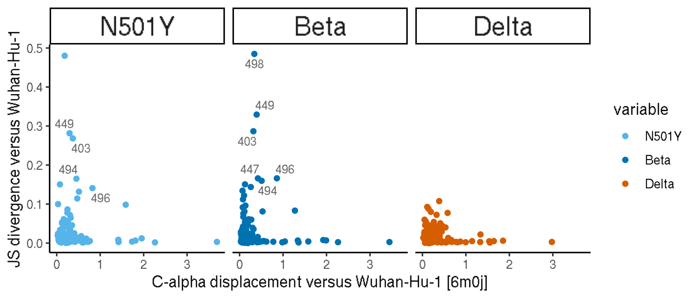

Analyze structural shift
================
Tyler Starr
1/26/2022

-   [Setup](#setup)
-   [Calculate pairwise C-alpha, beta, and gamma distances for each
    structure compared to
    WH1](#calculate-pairwise-c-alpha-beta-and-gamma-distances-for-each-structure-compared-to-wh1)
-   [Change in residue relative solvent
    accessibility](#change-in-residue-relative-solvent-accessibility)
-   [Compare structural shift to functional
    shift](#compare-structural-shift-to-functional-shift)
-   [Change in residue relative solvent accessibility **with ACE2
    bound**](#change-in-residue-relative-solvent-accessibility-with-ace2-bound)

This notebook analyzes structural shifts in the ACE2-bound RBD
structure, and compares to functional shifts in mutational effects.

``` r
require("knitr")
knitr::opts_chunk$set(echo = T)
knitr::opts_chunk$set(dev.args = list(png = list(type = "cairo")))

#list of packages to install/load
packages = c("yaml","data.table","tidyverse","gridExtra","egg","bio3d","ggrepel")
#install any packages not already installed
installed_packages <- packages %in% rownames(installed.packages())
if(any(installed_packages == F)){
  install.packages(packages[!installed_packages])
}
#load packages
invisible(lapply(packages, library, character.only=T))

#read in config file
config <- read_yaml("config.yaml")

#make output directory
if(!file.exists(config$structural_shifts_dir)){
  dir.create(file.path(config$structural_shifts_dir))
}
```

Session info for reproducing environment:

``` r
sessionInfo()
```

    ## R version 3.6.2 (2019-12-12)
    ## Platform: x86_64-pc-linux-gnu (64-bit)
    ## Running under: Ubuntu 18.04.5 LTS
    ## 
    ## Matrix products: default
    ## BLAS/LAPACK: /app/software/OpenBLAS/0.3.7-GCC-8.3.0/lib/libopenblas_haswellp-r0.3.7.so
    ## 
    ## locale:
    ##  [1] LC_CTYPE=en_US.UTF-8       LC_NUMERIC=C              
    ##  [3] LC_TIME=en_US.UTF-8        LC_COLLATE=en_US.UTF-8    
    ##  [5] LC_MONETARY=en_US.UTF-8    LC_MESSAGES=en_US.UTF-8   
    ##  [7] LC_PAPER=en_US.UTF-8       LC_NAME=C                 
    ##  [9] LC_ADDRESS=C               LC_TELEPHONE=C            
    ## [11] LC_MEASUREMENT=en_US.UTF-8 LC_IDENTIFICATION=C       
    ## 
    ## attached base packages:
    ## [1] stats     graphics  grDevices utils     datasets  methods   base     
    ## 
    ## other attached packages:
    ##  [1] ggrepel_0.8.1     bio3d_2.4-0       egg_0.4.5         gridExtra_2.3    
    ##  [5] forcats_0.4.0     stringr_1.4.0     dplyr_0.8.3       purrr_0.3.3      
    ##  [9] readr_1.3.1       tidyr_1.0.0       tibble_3.0.2      ggplot2_3.3.0    
    ## [13] tidyverse_1.3.0   data.table_1.12.8 yaml_2.2.0        knitr_1.26       
    ## 
    ## loaded via a namespace (and not attached):
    ##  [1] tidyselect_1.1.0 xfun_0.11        haven_2.2.0      colorspace_1.4-1
    ##  [5] vctrs_0.3.1      generics_0.0.2   htmltools_0.4.0  rlang_0.4.7     
    ##  [9] pillar_1.4.5     glue_1.3.1       withr_2.1.2      DBI_1.1.0       
    ## [13] dbplyr_1.4.2     modelr_0.1.5     readxl_1.3.1     lifecycle_0.2.0 
    ## [17] munsell_0.5.0    gtable_0.3.0     cellranger_1.1.0 rvest_0.3.5     
    ## [21] evaluate_0.14    parallel_3.6.2   fansi_0.4.0      broom_0.7.0     
    ## [25] Rcpp_1.0.3       scales_1.1.0     backports_1.1.5  jsonlite_1.6    
    ## [29] fs_1.3.1         hms_0.5.2        digest_0.6.23    stringi_1.4.3   
    ## [33] grid_3.6.2       cli_2.0.0        tools_3.6.2      magrittr_1.5    
    ## [37] crayon_1.3.4     pkgconfig_2.0.3  ellipsis_0.3.0   xml2_1.2.2      
    ## [41] reprex_0.3.0     lubridate_1.7.4  assertthat_0.2.1 rmarkdown_2.0   
    ## [45] httr_1.4.1       rstudioapi_0.10  R6_2.4.1         compiler_3.6.2

Define colorblind-friendly palette

``` r
# The palette with grey:
cbPalette <- c("#999999", "#E69F00", "#56B4E9", "#009E73", "#F0E442", 
               "#0072B2", "#D55E00", "#CC79A7")
# The palette with black
cbbPalette <- c("#000000", "#E69F00", "#56B4E9", "#009E73", "#F0E442", 
                "#0072B2", "#D55E00", "#CC79A7")
```

## Setup

Read in PDBs. These were aligned to minimize RBD Calpha RMSD using
PyMol. For beta, omicron structures, this was performed for both RBD
units in the asymmetric unit. (These structures also included mAbs used
in the crystallization.) RBD and ACE2s were then split into separate
objects/pdbs. The pdbs in these aligned coordinates were then output.
Structures include WH1 (6m0j), N501Y (7ekf, local refinement of a cryoEM
map), beta (beta1=7ekg, beta2,3 not yet published), and omicron (omicron
1,2 not yet published, omicron3=7wbp).

``` r
WH1 <- read.pdb(file=config$pdb_WH1)
```

    ##    PDB has ALT records, taking A only, rm.alt=TRUE

``` r
N501Y <- read.pdb(file=config$pdb_N501Y)
```

    ##    PDB has ALT records, taking A only, rm.alt=TRUE

``` r
beta1 <- read.pdb(file=config$pdb_beta1)
```

    ##    PDB has ALT records, taking A only, rm.alt=TRUE

``` r
beta2 <- read.pdb(file=config$pdb_beta2)
beta3 <- read.pdb(file=config$pdb_beta3)
delta1 <- read.pdb(file=config$pdb_delta1)
```

    ##    PDB has ALT records, taking A only, rm.alt=TRUE

``` r
delta2 <- read.pdb(file=config$pdb_delta2)
omicron1 <- read.pdb(file=config$pdb_omicron1)
```

    ##    PDB has ALT records, taking A only, rm.alt=TRUE

``` r
omicron2 <- read.pdb(file=config$pdb_omicron2)
```

    ##    PDB has ALT records, taking A only, rm.alt=TRUE

``` r
omicron3 <- read.pdb(file=config$pdb_omicron3)
```

## Calculate pairwise C-alpha, beta, and gamma distances for each structure compared to WH1

Note, the Cgamma calc excludes residues with no gamma-atom (alanine and
glycine) or beta-branching (and thus a gamma1 and gamma2 atom:
isoleucine, threonine, valine)

``` r
RBD_sites <- data.table(read.csv(file=config$RBD_sites))

for(voc in c("N501Y","beta1","beta2","beta3","delta1","delta2","omicron1","omicron2","omicron3")){
  RBD_sites[,paste(voc,"_v_WH1_Ca_dist",sep=""):=as.numeric(NA)]
  for(i in 1:nrow(RBD_sites)){
    site <- RBD_sites[i,site]
    WH1_calpha <- WH1$atom[WH1$atom$resno==site & WH1$atom$elety=="CA",]
    voc_calpha <- get(voc)$atom[get(voc)$atom$resno==site & get(voc)$atom$elety=="CA",]
    if(nrow(WH1_calpha)==1 & nrow(voc_calpha)==1){
      RBD_sites[i,paste(voc,"_v_WH1_Ca_dist",sep="") := sqrt((WH1_calpha$x - voc_calpha$x)^2 + (WH1_calpha$y - voc_calpha$y)^2 + (WH1_calpha$z - voc_calpha$z)^2)] 
    }else{
      #print(paste("no distance for", voc, "site",site))
    }
  }
}
```

``` r
for(voc in c("N501Y","beta1","beta2","beta3","delta1","delta2","omicron1","omicron2","omicron3")){
  RBD_sites[,paste(voc,"_v_WH1_Cb_dist",sep=""):=as.numeric(NA)]
  for(i in 1:nrow(RBD_sites)){
    site <- RBD_sites[i,site]
    WH1_cbeta <- WH1$atom[WH1$atom$resno==site & WH1$atom$elety=="CB",]
    voc_cbeta <- get(voc)$atom[get(voc)$atom$resno==site & get(voc)$atom$elety=="CB",]
    if(nrow(WH1_cbeta)==1 & nrow(voc_cbeta)==1){
      RBD_sites[i,paste(voc,"_v_WH1_Cb_dist",sep="") := sqrt((WH1_cbeta$x - voc_cbeta$x)^2 + (WH1_cbeta$y - voc_cbeta$y)^2 + (WH1_cbeta$z - voc_cbeta$z)^2)] 
    }else{
      #print(paste("no distance for", voc, "site",site))
    }
  }
}
```

``` r
for(voc in c("N501Y","beta1","beta2","beta3","delta1","delta2","omicron1","omicron2","omicron3")){
  RBD_sites[,paste(voc,"_v_WH1_Cg_dist",sep=""):=as.numeric(NA)]
  for(i in 1:nrow(RBD_sites)){
    site <- RBD_sites[i,site]
    WH1_cgamma <- WH1$atom[WH1$atom$resno==site & WH1$atom$elety %in% c("CG","SG","OG"),]
    voc_cgamma <- get(voc)$atom[get(voc)$atom$resno==site & get(voc)$atom$elety %in% c("CG","SG","OG"),]
    if(nrow(WH1_cgamma)==1 & nrow(voc_cgamma)==1){
      RBD_sites[i,paste(voc,"_v_WH1_Cg_dist",sep="") := sqrt((WH1_cgamma$x - voc_cgamma$x)^2 + (WH1_cgamma$y - voc_cgamma$y)^2 + (WH1_cgamma$z - voc_cgamma$z)^2)] 
    }else{
      #print(paste("no distance for", voc, "site",site))
    }
  }
}
```

Line plots of Calpha, beta, gamma displacement compared to WH1 structure

``` r
#define focal bg for others to compare to
calpha <- melt(RBD_sites[,.(site,N501Y_v_WH1_Ca_dist,beta1_v_WH1_Ca_dist,beta2_v_WH1_Ca_dist,beta3_v_WH1_Ca_dist,delta1_v_WH1_Ca_dist,delta2_v_WH1_Ca_dist)], id.vars=c("site"))
calpha[,rep:=1]
calpha[variable=="N501Y_v_WH1_Ca_dist",variable:="N501Y"]
calpha[variable=="beta1_v_WH1_Ca_dist",variable:="Beta"]
calpha[variable=="beta2_v_WH1_Ca_dist",rep:=2]
calpha[variable=="beta2_v_WH1_Ca_dist",variable:="Beta"]
calpha[variable=="beta3_v_WH1_Ca_dist",rep:=3]
calpha[variable=="beta3_v_WH1_Ca_dist",variable:="Beta"]
calpha[variable=="delta1_v_WH1_Ca_dist",variable:="Delta"]
calpha[variable=="delta2_v_WH1_Ca_dist",rep:=2]
calpha[variable=="delta2_v_WH1_Ca_dist",variable:="Delta"]

#define colors for each bg
group.colors <- c("Wuhan-Hu-1" = cbPalette[1], "N501Y" = cbPalette[3], "E484K" = cbPalette[5], "Beta"=cbPalette[6], "Delta"=cbPalette[7], "Omicron"=cbPalette[2])

#define order for plotting of bgs
calpha$variable <- factor(calpha$variable,levels=c("E484K","N501Y","Beta","Delta"))

ggplot(data=calpha[rep==1 & site %in% seq(334,515),], aes(x=site, y=value, color=variable))+
  geom_line(size=1)+
  scale_color_manual(values=group.colors)+
  theme_classic()+
  scale_x_continuous(expand=c(0.01,0.01),breaks=c(331,seq(335,530,by=5)))+
  theme(axis.text.x=element_text(angle=90,hjust=1,vjust=0.6,face="bold",size=10))+
  ylab("C-alpha distance versus Wuhan-Hu-1 [6m0j] (A)")+
  geom_text_repel(aes(label=ifelse(((value > 0.75) & variable=="Beta"),as.character(site),'')),size=3,color="gray40")
```


``` r
invisible(dev.print(pdf, paste(config$structural_shifts_dir,"/Calpha_v_WH1.pdf",sep=""),useDingbats=F))
```

``` r
#define focal bg for others to compare to
cbeta <- melt(RBD_sites[,.(site,N501Y_v_WH1_Cb_dist,beta1_v_WH1_Cb_dist,beta2_v_WH1_Cb_dist,beta3_v_WH1_Cb_dist,delta1_v_WH1_Cb_dist,delta2_v_WH1_Cb_dist)], id.vars=c("site"))
cbeta[,rep:=1]
cbeta[variable=="N501Y_v_WH1_Cb_dist",variable:="N501Y"]
cbeta[variable=="beta1_v_WH1_Cb_dist",variable:="Beta"]
cbeta[variable=="beta2_v_WH1_Cb_dist",rep:=2]
cbeta[variable=="beta2_v_WH1_Cb_dist",variable:="Beta"]
cbeta[variable=="beta3_v_WH1_Cb_dist",rep:=3]
cbeta[variable=="beta3_v_WH1_Cb_dist",variable:="Beta"]
cbeta[variable=="delta1_v_WH1_Cb_dist",variable:="Delta"]
cbeta[variable=="delta2_v_WH1_Cb_dist",rep:=2]
cbeta[variable=="delta2_v_WH1_Cb_dist",variable:="Delta"]

#define order for plotting of bgs
cbeta$variable <- factor(cbeta$variable,levels=c("E484K","N501Y","Beta","Delta"))

ggplot(data=cbeta[rep==1 & site %in% seq(334,515),], aes(x=site, y=value, color=variable))+
  geom_line(size=1)+
  scale_color_manual(values=group.colors)+
  theme_classic()+
  scale_x_continuous(expand=c(0.01,0.01),breaks=c(331,seq(335,530,by=5)))+
  theme(axis.text.x=element_text(angle=90,hjust=1,vjust=0.6,face="bold",size=10))+
  ylab("C-beta distance versus Wuhan-Hu-1 [6m0j] (A)")
```


``` r
invisible(dev.print(pdf, paste(config$structural_shifts_dir,"/Cbeta_v_WH1.pdf",sep=""),useDingbats=F))
```

``` r
#define focal bg for others to compare to
cgamma <- melt(RBD_sites[,.(site,N501Y_v_WH1_Cg_dist,beta1_v_WH1_Cg_dist,beta2_v_WH1_Cg_dist,beta3_v_WH1_Cg_dist,delta1_v_WH1_Cg_dist,delta2_v_WH1_Cg_dist)], id.vars=c("site"))
cgamma[,rep:=1]
cgamma[variable=="N501Y_v_WH1_Cg_dist",variable:="N501Y"]
cgamma[variable=="beta1_v_WH1_Cg_dist",variable:="Beta"]
cgamma[variable=="beta2_v_WH1_Cg_dist",rep:=2]
cgamma[variable=="beta2_v_WH1_Cg_dist",variable:="Beta"]
cgamma[variable=="beta3_v_WH1_Cg_dist",rep:=3]
cgamma[variable=="beta3_v_WH1_Cg_dist",variable:="Beta"]
cgamma[variable=="delta1_v_WH1_Cg_dist",variable:="Delta"]
cgamma[variable=="delta2_v_WH1_Cg_dist",rep:=2]
cgamma[variable=="delta2_v_WH1_Cg_dist",variable:="Delta"]

#define order for plotting of bgs
cgamma$variable <- factor(cgamma$variable,levels=c("E484K","N501Y","Beta","Delta"))

ggplot(data=cgamma[rep==1 & site %in% seq(334,515),], aes(x=site, y=value, color=variable))+
  geom_line(size=1)+
  scale_color_manual(values=group.colors)+
  theme_classic()+
  scale_x_continuous(expand=c(0.01,0.01),breaks=c(331,seq(335,530,by=5)))+
  theme(axis.text.x=element_text(angle=90,hjust=1,vjust=0.6,face="bold",size=10))+
  ylab("C-gamma distance versus Wuhan-Hu-1 [6m0j] (A)")
```


``` r
invisible(dev.print(pdf, paste(config$structural_shifts_dir,"/Cgamma_v_WH1.pdf",sep=""),useDingbats=F))
```

## Change in residue relative solvent accessibility

It could be that a site’s mutational profile changes not because of a
shift in the backbone or Cbeta orientation, but rather because mutations
between RBD backgrounds change the context of space surrounding the
focal residue. (E.g., site 501 modulation of 498 might not be because of
shift in backbone at 498, but rather because the “space” that the 498
side chain projects into is “different”, e.g. more filled by Y501).
Let’s compute relative solvent accessibility (RSA) of each side chain in
each structure (with ACE2 removed? Can also do adding ACE2 back), and
look at delta RSA of each structure compared to WH1.

``` r
#calculate RSA by normalizing SASA by maximum SASA of different amino acid types. Max from Tien et al.
max_SASA <- data.frame(AA=c("A","R","N","D","C","E","Q","G","H","I","L","K","M","F","P","S","T","W","Y","V"),max_SASA=c(121,265,187,187,148,214,214,97,216,195,191,230,203,228,154,143,163,264,255,165),stringsAsFactors = F)

WH1_dssp <- dssp(WH1, exefile="/fh/fast/bloom_j/computational_notebooks/tstarr/2020/SARS-CoV-2-RBD_DMS/env/bin/mkdssp")
```

    ## /fh/fast/bloom_j/computational_notebooks/tstarr/2020/SARS-CoV-2-RBD_DMS/env/bin/mkdssp

    ## Warning in dssp.pdb(WH1, exefile = "/fh/fast/bloom_j/computational_notebooks/
    ## tstarr/2020/SARS-CoV-2-RBD_DMS/env/bin/mkdssp"): Non-protein residues detected
    ## in input PDB: NAG, HOH

``` r
WH1_SASA <- data.frame(site=names(WH1_dssp$sse),SASA=WH1_dssp$acc,amino_acid=pdbseq(WH1),stringsAsFactors = F)
for(i in 1:nrow(WH1_SASA)){
  WH1_SASA$site[i] <- as.numeric(strsplit(as.character(WH1_SASA$site[i]),split="_")[[1]][1])
  WH1_SASA$RSA[i] <- WH1_SASA$SASA[i]/max_SASA[max_SASA$AA==WH1_SASA$amino_acid[i],"max_SASA"]
}

#N501Y
N501Y_dssp <- dssp(N501Y, exefile="/fh/fast/bloom_j/computational_notebooks/tstarr/2020/SARS-CoV-2-RBD_DMS/env/bin/mkdssp")
```

    ## /fh/fast/bloom_j/computational_notebooks/tstarr/2020/SARS-CoV-2-RBD_DMS/env/bin/mkdssp

``` r
N501Y_SASA <- data.frame(site=names(N501Y_dssp$sse),SASA=N501Y_dssp$acc,amino_acid=pdbseq(N501Y),stringsAsFactors = F)
for(i in 1:nrow(N501Y_SASA)){
  N501Y_SASA$site[i] <- as.numeric(strsplit(as.character(N501Y_SASA$site[i]),split="_")[[1]][1])
  N501Y_SASA$RSA[i] <- N501Y_SASA$SASA[i]/max_SASA[max_SASA$AA==N501Y_SASA$amino_acid[i],"max_SASA"]
}
  
#beta1
beta1_dssp <- dssp(beta1, exefile="/fh/fast/bloom_j/computational_notebooks/tstarr/2020/SARS-CoV-2-RBD_DMS/env/bin/mkdssp")
```

    ## /fh/fast/bloom_j/computational_notebooks/tstarr/2020/SARS-CoV-2-RBD_DMS/env/bin/mkdssp

    ## Warning in dssp.pdb(beta1, exefile = "/fh/fast/bloom_j/computational_notebooks/
    ## tstarr/2020/SARS-CoV-2-RBD_DMS/env/bin/mkdssp"): Non-protein residues detected
    ## in input PDB: NAG, HOH

``` r
beta1_SASA <- data.frame(site=names(beta1_dssp$sse),SASA=beta1_dssp$acc,amino_acid=pdbseq(beta1),stringsAsFactors = F)
for(i in 1:nrow(beta1_SASA)){
  beta1_SASA$site[i] <- as.numeric(strsplit(as.character(beta1_SASA$site[i]),split="_")[[1]][1])
  beta1_SASA$RSA[i] <- beta1_SASA$SASA[i]/max_SASA[max_SASA$AA==beta1_SASA$amino_acid[i],"max_SASA"]
}

#beta2
beta2_dssp <- dssp(beta2, exefile="/fh/fast/bloom_j/computational_notebooks/tstarr/2020/SARS-CoV-2-RBD_DMS/env/bin/mkdssp")
```

    ## /fh/fast/bloom_j/computational_notebooks/tstarr/2020/SARS-CoV-2-RBD_DMS/env/bin/mkdssp

    ## Warning in dssp.pdb(beta2, exefile = "/fh/fast/bloom_j/computational_notebooks/
    ## tstarr/2020/SARS-CoV-2-RBD_DMS/env/bin/mkdssp"): Non-protein residues detected
    ## in input PDB: NAG, BMA, MAN

``` r
beta2_SASA <- data.frame(site=names(beta2_dssp$sse),SASA=beta2_dssp$acc,amino_acid=pdbseq(beta2),stringsAsFactors = F)
for(i in 1:nrow(beta2_SASA)){
  beta2_SASA$site[i] <- as.numeric(strsplit(as.character(beta2_SASA$site[i]),split="_")[[1]][1])
  beta2_SASA$RSA[i] <- beta2_SASA$SASA[i]/max_SASA[max_SASA$AA==beta2_SASA$amino_acid[i],"max_SASA"]
}

#beta3
beta3_dssp <- dssp(beta3, exefile="/fh/fast/bloom_j/computational_notebooks/tstarr/2020/SARS-CoV-2-RBD_DMS/env/bin/mkdssp")
```

    ## /fh/fast/bloom_j/computational_notebooks/tstarr/2020/SARS-CoV-2-RBD_DMS/env/bin/mkdssp

    ## Warning in dssp.pdb(beta3, exefile = "/fh/fast/bloom_j/computational_notebooks/
    ## tstarr/2020/SARS-CoV-2-RBD_DMS/env/bin/mkdssp"): Non-protein residues detected
    ## in input PDB: NAG, BMA, MAN

``` r
beta3_SASA <- data.frame(site=names(beta3_dssp$sse),SASA=beta3_dssp$acc,amino_acid=pdbseq(beta3),stringsAsFactors = F)
for(i in 1:nrow(beta3_SASA)){
  beta3_SASA$site[i] <- as.numeric(strsplit(as.character(beta3_SASA$site[i]),split="_")[[1]][1])
  beta3_SASA$RSA[i] <- beta3_SASA$SASA[i]/max_SASA[max_SASA$AA==beta3_SASA$amino_acid[i],"max_SASA"]
}

#delta1
delta1_dssp <- dssp(delta1, exefile="/fh/fast/bloom_j/computational_notebooks/tstarr/2020/SARS-CoV-2-RBD_DMS/env/bin/mkdssp")
```

    ## /fh/fast/bloom_j/computational_notebooks/tstarr/2020/SARS-CoV-2-RBD_DMS/env/bin/mkdssp

    ## Warning in dssp.pdb(delta1, exefile = "/fh/fast/bloom_j/computational_notebooks/
    ## tstarr/2020/SARS-CoV-2-RBD_DMS/env/bin/mkdssp"): Non-protein residues detected
    ## in input PDB: NAG

``` r
delta1_SASA <- data.frame(site=names(delta1_dssp$sse),SASA=delta1_dssp$acc,amino_acid=pdbseq(delta1),stringsAsFactors = F)
for(i in 1:nrow(delta1_SASA)){
  delta1_SASA$site[i] <- as.numeric(strsplit(as.character(delta1_SASA$site[i]),split="_")[[1]][1])
  delta1_SASA$RSA[i] <- delta1_SASA$SASA[i]/max_SASA[max_SASA$AA==delta1_SASA$amino_acid[i],"max_SASA"]
}

#delta2
delta2_dssp <- dssp(delta2, exefile="/fh/fast/bloom_j/computational_notebooks/tstarr/2020/SARS-CoV-2-RBD_DMS/env/bin/mkdssp")
```

    ## /fh/fast/bloom_j/computational_notebooks/tstarr/2020/SARS-CoV-2-RBD_DMS/env/bin/mkdssp

``` r
delta2_SASA <- data.frame(site=names(delta2_dssp$sse),SASA=delta2_dssp$acc,amino_acid=pdbseq(delta2),stringsAsFactors = F)
for(i in 1:nrow(delta2_SASA)){
  delta2_SASA$site[i] <- as.numeric(strsplit(as.character(delta2_SASA$site[i]),split="_")[[1]][1])
  delta2_SASA$RSA[i] <- delta2_SASA$SASA[i]/max_SASA[max_SASA$AA==delta2_SASA$amino_acid[i],"max_SASA"]
}

#omicron1
omicron1_dssp <- dssp(omicron1, exefile="/fh/fast/bloom_j/computational_notebooks/tstarr/2020/SARS-CoV-2-RBD_DMS/env/bin/mkdssp")
```

    ## /fh/fast/bloom_j/computational_notebooks/tstarr/2020/SARS-CoV-2-RBD_DMS/env/bin/mkdssp

    ## Warning in dssp.pdb(omicron1, exefile = "/fh/fast/bloom_j/
    ## computational_notebooks/tstarr/2020/SARS-CoV-2-RBD_DMS/env/bin/mkdssp"): Non-
    ## protein residues detected in input PDB: CL, NAG

``` r
omicron1_SASA <- data.frame(site=names(omicron1_dssp$sse),SASA=omicron1_dssp$acc,amino_acid=pdbseq(omicron1),stringsAsFactors = F)
for(i in 1:nrow(omicron1_SASA)){
  omicron1_SASA$site[i] <- as.numeric(strsplit(as.character(omicron1_SASA$site[i]),split="_")[[1]][1])
  omicron1_SASA$RSA[i] <- omicron1_SASA$SASA[i]/max_SASA[max_SASA$AA==omicron1_SASA$amino_acid[i],"max_SASA"]
}

#omicron2
omicron2_dssp <- dssp(omicron2, exefile="/fh/fast/bloom_j/computational_notebooks/tstarr/2020/SARS-CoV-2-RBD_DMS/env/bin/mkdssp")
```

    ## /fh/fast/bloom_j/computational_notebooks/tstarr/2020/SARS-CoV-2-RBD_DMS/env/bin/mkdssp

    ## Warning in dssp.pdb(omicron2, exefile = "/fh/fast/bloom_j/
    ## computational_notebooks/tstarr/2020/SARS-CoV-2-RBD_DMS/env/bin/mkdssp"): Non-
    ## protein residues detected in input PDB: HOH, EDO, CL, NAG

``` r
omicron2_SASA <- data.frame(site=names(omicron2_dssp$sse),SASA=omicron2_dssp$acc,amino_acid=pdbseq(omicron2),stringsAsFactors = F)
for(i in 1:nrow(omicron2_SASA)){
  omicron2_SASA$site[i] <- as.numeric(strsplit(as.character(omicron2_SASA$site[i]),split="_")[[1]][1])
  omicron2_SASA$RSA[i] <- omicron2_SASA$SASA[i]/max_SASA[max_SASA$AA==omicron2_SASA$amino_acid[i],"max_SASA"]
}

#omicron3
omicron3_dssp <- dssp(omicron3, exefile="/fh/fast/bloom_j/computational_notebooks/tstarr/2020/SARS-CoV-2-RBD_DMS/env/bin/mkdssp")
```

    ## /fh/fast/bloom_j/computational_notebooks/tstarr/2020/SARS-CoV-2-RBD_DMS/env/bin/mkdssp

    ## Warning in dssp.pdb(omicron3, exefile = "/fh/fast/bloom_j/
    ## computational_notebooks/tstarr/2020/SARS-CoV-2-RBD_DMS/env/bin/mkdssp"): Non-
    ## protein residues detected in input PDB: NAG

``` r
omicron3_SASA <- data.frame(site=names(omicron3_dssp$sse),SASA=omicron3_dssp$acc,amino_acid=pdbseq(omicron3),stringsAsFactors = F)
for(i in 1:nrow(omicron3_SASA)){
  omicron3_SASA$site[i] <- as.numeric(strsplit(as.character(omicron3_SASA$site[i]),split="_")[[1]][1])
  omicron3_SASA$RSA[i] <- omicron3_SASA$SASA[i]/max_SASA[max_SASA$AA==omicron3_SASA$amino_acid[i],"max_SASA"]
}

for(voc in c("N501Y","beta1","beta2","beta3","delta1","delta2","omicron1","omicron2","omicron3")){
  RBD_sites[,paste(voc,"_v_WH1_dRSA",sep=""):=as.numeric(NA)]
  for(i in 1:nrow(RBD_sites)){
    site <- RBD_sites[i,site]
    WH1_RSA <- WH1_SASA[WH1_SASA$site==site,"RSA"]
    voc_RSA <- get(paste(voc,"_SASA",sep=""))[get(paste(voc,"_SASA",sep=""))$site==site,"RSA"]
    if(length(WH1_RSA)==1 & length(voc_RSA)==1){
      RBD_sites[i,paste(voc,"_v_WH1_dRSA",sep="") := WH1_RSA - voc_RSA] 
    }else{
      #print(paste("no distance for", voc, "site",site))
    }
  }
}
```

``` r
dRSA <- melt(RBD_sites[,.(site,N501Y_v_WH1_dRSA,beta1_v_WH1_dRSA,beta2_v_WH1_dRSA,beta3_v_WH1_dRSA,delta1_v_WH1_dRSA,delta2_v_WH1_dRSA)], id.vars=c("site"))
dRSA[,rep:=1]
dRSA[variable=="N501Y_v_WH1_dRSA",variable:="N501Y"]
dRSA[variable=="beta1_v_WH1_dRSA",variable:="Beta"]
dRSA[variable=="beta2_v_WH1_dRSA",rep:=2]
dRSA[variable=="beta2_v_WH1_dRSA",variable:="Beta"]
dRSA[variable=="beta3_v_WH1_dRSA",rep:=3]
dRSA[variable=="beta3_v_WH1_dRSA",variable:="Beta"]
dRSA[variable=="delta1_v_WH1_dRSA",variable:="Delta"]
dRSA[variable=="delta2_v_WH1_dRSA",rep:=2]
dRSA[variable=="delta2_v_WH1_dRSA",variable:="Delta"]

#define colors for each bg
group.colors <- c("Wuhan-Hu-1" = cbPalette[1], "N501Y" = cbPalette[3], "E484K" = cbPalette[5], "Beta"=cbPalette[6], "Delta"=cbPalette[7], "Omicron"=cbPalette[2])

#define order for plotting of bgs
dRSA$variable <- factor(dRSA$variable,levels=c("E484K","N501Y","Beta","Delta"))

ggplot(data=dRSA[rep==1 & site %in% seq(334,515),], aes(x=site, y=value, color=variable))+
  geom_line(size=1)+
  scale_color_manual(values=group.colors)+
  theme_classic()+
  scale_x_continuous(expand=c(0.01,0.01),breaks=c(331,seq(335,530,by=5)))+
  theme(axis.text.x=element_text(angle=90,hjust=1,vjust=0.6,face="bold",size=10))+
  ylab("Change in relative solvent accessibility \nversus Wuhan-Hu-1 [6m0j]")+
  geom_text_repel(aes(label=ifelse(((abs(value) > 0.15 & variable=="Beta")),as.character(site),'')),size=3,color="gray40")
```


``` r
invisible(dev.print(pdf, paste(config$structural_shifts_dir,"/dRSA_v_WH1.pdf",sep=""),useDingbats=F))
```

## Compare structural shift to functional shift

We have a metric of functional perturbation at a site, derived from our
deep mutational scanning measurements. Let’s see how structural
perturbations correlate (or don’t) with structural perturbations.

``` r
JSD_bind <- data.table(read.csv(file=config$JSD_v_WH1_file))
JSD_expr <- data.table(read.csv(file=config$JSD_v_WH1_expr_file))

dRSA$JSD_bind <- as.numeric(NA)
dRSA$JSD_expr <- as.numeric(NA)

for(i in 1:nrow(dRSA)){
  dRSA$JSD_bind[i] <- JSD_bind[site==dRSA$site[i] & target==dRSA$variable[i],JSD_min3bc]
  dRSA$JSD_expr[i] <- JSD_expr[site==dRSA$site[i] & target==dRSA$variable[i],JSD_min3bc]
}

for(i in 1:nrow(calpha)){
  calpha$JSD_bind[i] <- JSD_bind[site==calpha$site[i] & target==calpha$variable[i],JSD_min3bc]
  calpha$JSD_expr[i] <- JSD_expr[site==calpha$site[i] & target==calpha$variable[i],JSD_min3bc]
}

for(i in 1:nrow(cbeta)){
  cbeta$JSD_bind[i] <- JSD_bind[site==cbeta$site[i] & target==cbeta$variable[i],JSD_min3bc]
  cbeta$JSD_expr[i] <- JSD_expr[site==cbeta$site[i] & target==cbeta$variable[i],JSD_min3bc]
}

for(i in 1:nrow(cgamma)){
  cgamma$JSD_bind[i] <- JSD_bind[site==cgamma$site[i] & target==cgamma$variable[i],JSD_min3bc]
  cgamma$JSD_expr[i] <- JSD_expr[site==cgamma$site[i] & target==cgamma$variable[i],JSD_min3bc]
}
```

Calpha displacement:

``` r
ggplot(data=calpha[rep==1 & site %in% seq(334,515),],aes(x=abs(value),y=JSD_bind,color=variable))+
  geom_point(pch=19)+
  scale_color_manual(values=group.colors)+
  theme_classic()+
  xlab("C-alpha displacement versus Wuhan-Hu-1 [6m0j]")+
  ylab("JS distance versus Wuhan-Hu-1")+
  facet_wrap(~variable,nrow=1)+
  theme(strip.text.x = element_text(size = 18))+
  geom_text_repel(aes(label=ifelse(((JSD_bind > 0.1 & abs(value) > 0.75) | (JSD_bind > 0.15 & abs(value) > 0.25)),as.character(site),'')),size=3,color="gray40")
```



``` r
invisible(dev.print(pdf, paste(config$structural_shifts_dir,"/scatter_JSD_v_calpha.pdf",sep=""),useDingbats=F))
```

Cbeta displacement:

``` r
ggplot(data=cbeta[rep==1 & site %in% seq(334,515),],aes(x=abs(value),y=JSD_bind,color=variable))+
  geom_point(pch=19)+
  scale_color_manual(values=group.colors)+
  theme_classic()+
  xlab("C-beta displacement versus Wuhan-Hu-1 [6m0j]")+
  ylab("JS distance versus Wuhan-Hu-1")+
  facet_wrap(~variable,nrow=1)+
  theme(strip.text.x = element_text(size = 18))+
  geom_text_repel(aes(label=ifelse(((JSD_bind > 0.1 & abs(value) > 0.75) | (JSD_bind > 0.15 & abs(value) > 0.25)),as.character(site),'')),size=3,color="gray40")
```

    ## Warning: Removed 42 rows containing missing values (geom_point).

    ## Warning: Removed 42 rows containing missing values (geom_text_repel).


``` r
invisible(dev.print(pdf, paste(config$structural_shifts_dir,"/scatter_JSD_v_cbeta.pdf",sep=""),useDingbats=F))
```

C-gamma displacement:

``` r
ggplot(data=cgamma[rep==1 & site %in% seq(334,515),],aes(x=abs(value),y=JSD_bind,color=variable))+
  geom_point(pch=19)+
  scale_color_manual(values=group.colors)+
  theme_classic()+
  xlab("C-gamma displacement versus Wuhan-Hu-1 [6m0j]")+
  ylab("JS distance versus Wuhan-Hu-1")+
  facet_wrap(~variable,nrow=1)+
  theme(strip.text.x = element_text(size = 18))+
  geom_text_repel(aes(label=ifelse(((JSD_bind > 0.1 & abs(value) > 0.75) | (JSD_bind > 0.15 & abs(value) > 0.25)),as.character(site),'')),size=3,color="gray40")
```

    ## Warning: Removed 165 rows containing missing values (geom_point).

    ## Warning: Removed 165 rows containing missing values (geom_text_repel).


``` r
invisible(dev.print(pdf, paste(config$structural_shifts_dir,"/scatter_JSD_v_cgamma.pdf",sep=""),useDingbats=F))
```

Change in relative solvent accessibility:

``` r
ggplot(data=dRSA[rep==1 & site %in% seq(334,515),],aes(x=abs(value),y=JSD_bind,color=variable))+
  geom_point(pch=19)+
  scale_color_manual(values=group.colors)+
  theme_classic()+
  xlab("Change in relative solvent accessibility versus Wuhan-Hu-1 [6m0j]")+
  ylab("JS distance versus Wuhan-Hu-1")+
  facet_wrap(~variable,nrow=1)+
  theme(strip.text.x = element_text(size = 18))+
  geom_text_repel(aes(label=ifelse(((JSD_bind > 0.1 & abs(value) > 0.1)),as.character(site),'')),size=3,color="gray40")
```


``` r
invisible(dev.print(pdf, paste(config$structural_shifts_dir,"/scatter_JSD_v_dRSA.pdf",sep=""),useDingbats=F))
```

## Change in residue relative solvent accessibility **with ACE2 bound**

Analysis above is in split pdbs where it’s ACE2-bound RBD, but I’m
calculating RSA of RBD alone. Let’s repeat using pdbs with ACE2 present.
I used the same pdbs above, but now the pdbs keep the cognate ACE2
molecule from the structure. I do still split pdbs manually, because
some structures have two RBD:ACE2s in the asymmetric unit, or Fabs that
I remove for the RSA calculation.

``` r
WH1_ACE2 <- read.pdb(file=config$pdb_WH1_ACE2)
```

    ##    PDB has ALT records, taking A only, rm.alt=TRUE

``` r
WH1_ACE2 <- cat.pdb(WH1, WH1_ACE2)
WH1_ACE2_dssp <- dssp(WH1_ACE2, exefile="/fh/fast/bloom_j/computational_notebooks/tstarr/2020/SARS-CoV-2-RBD_DMS/env/bin/mkdssp")
```

    ## /fh/fast/bloom_j/computational_notebooks/tstarr/2020/SARS-CoV-2-RBD_DMS/env/bin/mkdssp

    ## Warning in dssp.pdb(WH1_ACE2, exefile = "/fh/fast/bloom_j/
    ## computational_notebooks/tstarr/2020/SARS-CoV-2-RBD_DMS/env/bin/mkdssp"): Non-
    ## protein residues detected in input PDB: NAG, HOH, ZN

``` r
WH1_ACE2_SASA <- data.frame(site=names(WH1_ACE2_dssp$sse),SASA=WH1_ACE2_dssp$acc,amino_acid=pdbseq(WH1_ACE2),stringsAsFactors = F)
for(i in 1:nrow(WH1_ACE2_SASA)){
    WH1_ACE2_SASA$chain[i] <- as.character(strsplit(as.character(WH1_ACE2_SASA$site[i]),split="_")[[1]][2])
    WH1_ACE2_SASA$site[i] <- as.numeric(strsplit(as.character(WH1_ACE2_SASA$site[i]),split="_")[[1]][1])
    WH1_ACE2_SASA$RSA[i] <- WH1_ACE2_SASA$SASA[i]/max_SASA[max_SASA$AA==WH1_ACE2_SASA$amino_acid[i],"max_SASA"]
}

#N501Y
N501Y_ACE2 <- read.pdb(file=config$pdb_N501Y_ACE2)
```

    ##    PDB has ALT records, taking A only, rm.alt=TRUE

``` r
N501Y_ACE2 <- cat.pdb(N501Y, N501Y_ACE2)
```

    ## Warning in cat.pdb(N501Y, N501Y_ACE2): possible chain break in molecule: chain A

``` r
N501Y_ACE2_dssp <- dssp(N501Y_ACE2, exefile="/fh/fast/bloom_j/computational_notebooks/tstarr/2020/SARS-CoV-2-RBD_DMS/env/bin/mkdssp")
```

    ## /fh/fast/bloom_j/computational_notebooks/tstarr/2020/SARS-CoV-2-RBD_DMS/env/bin/mkdssp

    ## Warning in dssp.pdb(N501Y_ACE2, exefile = "/fh/fast/bloom_j/
    ## computational_notebooks/tstarr/2020/SARS-CoV-2-RBD_DMS/env/bin/mkdssp"): Non-
    ## protein residues detected in input PDB: NAG, ZN

``` r
N501Y_ACE2_SASA <- data.frame(site=names(N501Y_ACE2_dssp$sse),SASA=N501Y_ACE2_dssp$acc,amino_acid=pdbseq(N501Y_ACE2),stringsAsFactors = F)
for(i in 1:nrow(N501Y_ACE2_SASA)){
    N501Y_ACE2_SASA$chain[i] <- as.character(strsplit(as.character(N501Y_ACE2_SASA$site[i]),split="_")[[1]][2])
    N501Y_ACE2_SASA$site[i] <- as.numeric(strsplit(as.character(N501Y_ACE2_SASA$site[i]),split="_")[[1]][1])
    N501Y_ACE2_SASA$RSA[i] <- N501Y_ACE2_SASA$SASA[i]/max_SASA[max_SASA$AA==N501Y_ACE2_SASA$amino_acid[i],"max_SASA"]
}

#beta1
beta1_ACE2 <- read.pdb(file=config$pdb_beta1_ACE2)
beta1_ACE2 <- cat.pdb(beta1, beta1_ACE2)
```

    ## Warning in cat.pdb(beta1, beta1_ACE2): possible chain break in molecule: chain A

``` r
beta1_ACE2_dssp <- dssp(beta1_ACE2, exefile="/fh/fast/bloom_j/computational_notebooks/tstarr/2020/SARS-CoV-2-RBD_DMS/env/bin/mkdssp")
```

    ## /fh/fast/bloom_j/computational_notebooks/tstarr/2020/SARS-CoV-2-RBD_DMS/env/bin/mkdssp

    ## Warning in dssp.pdb(beta1_ACE2, exefile = "/fh/fast/bloom_j/
    ## computational_notebooks/tstarr/2020/SARS-CoV-2-RBD_DMS/env/bin/mkdssp"): Non-
    ## protein residues detected in input PDB: NAG, HOH, ZN

``` r
beta1_ACE2_SASA <- data.frame(site=names(beta1_ACE2_dssp$sse),SASA=beta1_ACE2_dssp$acc,amino_acid=pdbseq(beta1_ACE2),stringsAsFactors = F)
for(i in 1:nrow(beta1_ACE2_SASA)){
    beta1_ACE2_SASA$chain[i] <- as.character(strsplit(as.character(beta1_ACE2_SASA$site[i]),split="_")[[1]][2])
    beta1_ACE2_SASA$site[i] <- as.numeric(strsplit(as.character(beta1_ACE2_SASA$site[i]),split="_")[[1]][1])
    beta1_ACE2_SASA$RSA[i] <- beta1_ACE2_SASA$SASA[i]/max_SASA[max_SASA$AA==beta1_ACE2_SASA$amino_acid[i],"max_SASA"]
}

#beta2
beta2_ACE2 <- read.pdb(file=config$pdb_beta2_ACE2)
beta2_ACE2 <- cat.pdb(beta2, beta2_ACE2)
beta2_ACE2_dssp <- dssp(beta2_ACE2, exefile="/fh/fast/bloom_j/computational_notebooks/tstarr/2020/SARS-CoV-2-RBD_DMS/env/bin/mkdssp")
```

    ## /fh/fast/bloom_j/computational_notebooks/tstarr/2020/SARS-CoV-2-RBD_DMS/env/bin/mkdssp

    ## Warning in dssp.pdb(beta2_ACE2, exefile = "/fh/fast/bloom_j/
    ## computational_notebooks/tstarr/2020/SARS-CoV-2-RBD_DMS/env/bin/mkdssp"): Non-
    ## protein residues detected in input PDB: NAG, BMA, MAN, ZN

``` r
beta2_ACE2_SASA <- data.frame(site=names(beta2_ACE2_dssp$sse),SASA=beta2_ACE2_dssp$acc,amino_acid=pdbseq(beta2_ACE2),stringsAsFactors = F)
for(i in 1:nrow(beta2_ACE2_SASA)){
    beta2_ACE2_SASA$chain[i] <- as.character(strsplit(as.character(beta2_ACE2_SASA$site[i]),split="_")[[1]][2])
    beta2_ACE2_SASA$site[i] <- as.numeric(strsplit(as.character(beta2_ACE2_SASA$site[i]),split="_")[[1]][1])
    beta2_ACE2_SASA$RSA[i] <- beta2_ACE2_SASA$SASA[i]/max_SASA[max_SASA$AA==beta2_ACE2_SASA$amino_acid[i],"max_SASA"]
}

#beta3
beta3_ACE2 <- read.pdb(file=config$pdb_beta3_ACE2)
beta3_ACE2 <- cat.pdb(beta3, beta3_ACE2)
beta3_ACE2_dssp <- dssp(beta3_ACE2, exefile="/fh/fast/bloom_j/computational_notebooks/tstarr/2020/SARS-CoV-2-RBD_DMS/env/bin/mkdssp")
```

    ## /fh/fast/bloom_j/computational_notebooks/tstarr/2020/SARS-CoV-2-RBD_DMS/env/bin/mkdssp

    ## Warning in dssp.pdb(beta3_ACE2, exefile = "/fh/fast/bloom_j/
    ## computational_notebooks/tstarr/2020/SARS-CoV-2-RBD_DMS/env/bin/mkdssp"): Non-
    ## protein residues detected in input PDB: NAG, BMA, MAN, ZN

``` r
beta3_ACE2_SASA <- data.frame(site=names(beta3_ACE2_dssp$sse),SASA=beta3_ACE2_dssp$acc,amino_acid=pdbseq(beta3_ACE2),stringsAsFactors = F)
for(i in 1:nrow(beta3_ACE2_SASA)){
    beta3_ACE2_SASA$chain[i] <- as.character(strsplit(as.character(beta3_ACE2_SASA$site[i]),split="_")[[1]][2])
    beta3_ACE2_SASA$site[i] <- as.numeric(strsplit(as.character(beta3_ACE2_SASA$site[i]),split="_")[[1]][1])
    beta3_ACE2_SASA$RSA[i] <- beta3_ACE2_SASA$SASA[i]/max_SASA[max_SASA$AA==beta3_ACE2_SASA$amino_acid[i],"max_SASA"]
}

#delta1
delta1_ACE2 <- read.pdb(file=config$pdb_delta1_ACE2)
delta1_ACE2 <- cat.pdb(delta1, delta1_ACE2)
delta1_ACE2_dssp <- dssp(delta1_ACE2, exefile="/fh/fast/bloom_j/computational_notebooks/tstarr/2020/SARS-CoV-2-RBD_DMS/env/bin/mkdssp")
```

    ## /fh/fast/bloom_j/computational_notebooks/tstarr/2020/SARS-CoV-2-RBD_DMS/env/bin/mkdssp

    ## Warning in dssp.pdb(delta1_ACE2, exefile = "/fh/fast/bloom_j/
    ## computational_notebooks/tstarr/2020/SARS-CoV-2-RBD_DMS/env/bin/mkdssp"): Non-
    ## protein residues detected in input PDB: NAG, ZN

``` r
delta1_ACE2_SASA <- data.frame(site=names(delta1_ACE2_dssp$sse),SASA=delta1_ACE2_dssp$acc,amino_acid=pdbseq(delta1_ACE2),stringsAsFactors = F)
for(i in 1:nrow(delta1_ACE2_SASA)){
    delta1_ACE2_SASA$chain[i] <- as.character(strsplit(as.character(delta1_ACE2_SASA$site[i]),split="_")[[1]][2])
    delta1_ACE2_SASA$site[i] <- as.numeric(strsplit(as.character(delta1_ACE2_SASA$site[i]),split="_")[[1]][1])
    delta1_ACE2_SASA$RSA[i] <- delta1_ACE2_SASA$SASA[i]/max_SASA[max_SASA$AA==delta1_ACE2_SASA$amino_acid[i],"max_SASA"]
}

#delta2
delta2_ACE2 <- read.pdb(file=config$pdb_delta2_ACE2)
delta2_ACE2 <- cat.pdb(delta2, delta2_ACE2)
delta2_ACE2_dssp <- dssp(delta2_ACE2, exefile="/fh/fast/bloom_j/computational_notebooks/tstarr/2020/SARS-CoV-2-RBD_DMS/env/bin/mkdssp")
```

    ## /fh/fast/bloom_j/computational_notebooks/tstarr/2020/SARS-CoV-2-RBD_DMS/env/bin/mkdssp

    ## Warning in dssp.pdb(delta2_ACE2, exefile = "/fh/fast/bloom_j/
    ## computational_notebooks/tstarr/2020/SARS-CoV-2-RBD_DMS/env/bin/mkdssp"): Non-
    ## protein residues detected in input PDB: NAG, ZN

``` r
delta2_ACE2_SASA <- data.frame(site=names(delta2_ACE2_dssp$sse),SASA=delta2_ACE2_dssp$acc,amino_acid=pdbseq(delta2_ACE2),stringsAsFactors = F)
for(i in 1:nrow(delta2_ACE2_SASA)){
    delta2_ACE2_SASA$chain[i] <- as.character(strsplit(as.character(delta2_ACE2_SASA$site[i]),split="_")[[1]][2])
    delta2_ACE2_SASA$site[i] <- as.numeric(strsplit(as.character(delta2_ACE2_SASA$site[i]),split="_")[[1]][1])
    delta2_ACE2_SASA$RSA[i] <- delta2_ACE2_SASA$SASA[i]/max_SASA[max_SASA$AA==delta2_ACE2_SASA$amino_acid[i],"max_SASA"]
}

#omicron1
omicron1_ACE2 <- read.pdb(file=config$pdb_omicron1_ACE2)
omicron1_ACE2 <- cat.pdb(omicron1, omicron1_ACE2)
```

    ## Warning in clean.pdb(new, consecutive = !rechain, force.renumber = renumber, :
    ## PDB is still not clean. Try fix.chain=TRUE and/or fix.aa=TRUE

    ## Warning in cat.pdb(omicron1, omicron1_ACE2): possible chain break in molecule:
    ## chain B

``` r
omicron1_ACE2_dssp <- dssp(omicron1_ACE2, exefile="/fh/fast/bloom_j/computational_notebooks/tstarr/2020/SARS-CoV-2-RBD_DMS/env/bin/mkdssp")
```

    ## /fh/fast/bloom_j/computational_notebooks/tstarr/2020/SARS-CoV-2-RBD_DMS/env/bin/mkdssp

    ## Warning in dssp.pdb(omicron1_ACE2, exefile = "/fh/fast/bloom_j/
    ## computational_notebooks/tstarr/2020/SARS-CoV-2-RBD_DMS/env/bin/mkdssp"): Non-
    ## protein residues detected in input PDB: CL, NAG, ZN

``` r
omicron1_ACE2_SASA <- data.frame(site=names(omicron1_ACE2_dssp$sse),SASA=omicron1_ACE2_dssp$acc,amino_acid=pdbseq(omicron1_ACE2),stringsAsFactors = F)
for(i in 1:nrow(omicron1_ACE2_SASA)){
    omicron1_ACE2_SASA$chain[i] <- as.character(strsplit(as.character(omicron1_ACE2_SASA$site[i]),split="_")[[1]][2])
    omicron1_ACE2_SASA$site[i] <- as.numeric(strsplit(as.character(omicron1_ACE2_SASA$site[i]),split="_")[[1]][1])
    omicron1_ACE2_SASA$RSA[i] <- omicron1_ACE2_SASA$SASA[i]/max_SASA[max_SASA$AA==omicron1_ACE2_SASA$amino_acid[i],"max_SASA"]
}

#omicron2
omicron2_ACE2 <- read.pdb(file=config$pdb_omicron2_ACE2)
omicron2_ACE2 <- cat.pdb(omicron2, omicron2_ACE2)
```

    ## Warning in clean.pdb(new, consecutive = !rechain, force.renumber = renumber, :
    ## PDB is still not clean. Try fix.chain=TRUE and/or fix.aa=TRUE

    ## Warning in cat.pdb(omicron2, omicron2_ACE2): possible chain break in molecule:
    ## chain A

    ## Warning in cat.pdb(omicron2, omicron2_ACE2): possible chain break in molecule:
    ## chain B

``` r
omicron2_ACE2_dssp <- dssp(omicron2_ACE2, exefile="/fh/fast/bloom_j/computational_notebooks/tstarr/2020/SARS-CoV-2-RBD_DMS/env/bin/mkdssp")
```

    ## /fh/fast/bloom_j/computational_notebooks/tstarr/2020/SARS-CoV-2-RBD_DMS/env/bin/mkdssp

    ## Warning in dssp.pdb(omicron2_ACE2, exefile = "/fh/fast/bloom_j/
    ## computational_notebooks/tstarr/2020/SARS-CoV-2-RBD_DMS/env/bin/mkdssp"): Non-
    ## protein residues detected in input PDB: HOH, EDO, CL, NAG, ZN

``` r
omicron2_ACE2_SASA <- data.frame(site=names(omicron2_ACE2_dssp$sse),SASA=omicron2_ACE2_dssp$acc,amino_acid=pdbseq(omicron2_ACE2),stringsAsFactors = F)
for(i in 1:nrow(omicron2_ACE2_SASA)){
    omicron2_ACE2_SASA$chain[i] <- as.character(strsplit(as.character(omicron2_ACE2_SASA$site[i]),split="_")[[1]][2])
    omicron2_ACE2_SASA$site[i] <- as.numeric(strsplit(as.character(omicron2_ACE2_SASA$site[i]),split="_")[[1]][1])
    omicron2_ACE2_SASA$RSA[i] <- omicron2_ACE2_SASA$SASA[i]/max_SASA[max_SASA$AA==omicron2_ACE2_SASA$amino_acid[i],"max_SASA"]
}

#omicron3
omicron3_ACE2 <- read.pdb(file=config$pdb_omicron3_ACE2)
```

    ##    PDB has ALT records, taking A only, rm.alt=TRUE

``` r
omicron3_ACE2 <- cat.pdb(omicron3, omicron3_ACE2)
omicron3_ACE2_dssp <- dssp(omicron3_ACE2, exefile="/fh/fast/bloom_j/computational_notebooks/tstarr/2020/SARS-CoV-2-RBD_DMS/env/bin/mkdssp")
```

    ## /fh/fast/bloom_j/computational_notebooks/tstarr/2020/SARS-CoV-2-RBD_DMS/env/bin/mkdssp

    ## Warning in dssp.pdb(omicron3_ACE2, exefile = "/fh/fast/bloom_j/
    ## computational_notebooks/tstarr/2020/SARS-CoV-2-RBD_DMS/env/bin/mkdssp"): Non-
    ## protein residues detected in input PDB: NAG, ZN

``` r
omicron3_ACE2_SASA <- data.frame(site=names(omicron3_ACE2_dssp$sse),SASA=omicron3_ACE2_dssp$acc,amino_acid=pdbseq(omicron3_ACE2),stringsAsFactors = F)
for(i in 1:nrow(omicron3_ACE2_SASA)){
    omicron3_ACE2_SASA$chain[i] <- as.character(strsplit(as.character(omicron3_ACE2_SASA$site[i]),split="_")[[1]][2])
    omicron3_ACE2_SASA$site[i] <- as.numeric(strsplit(as.character(omicron3_ACE2_SASA$site[i]),split="_")[[1]][1])
    omicron3_ACE2_SASA$RSA[i] <- omicron3_ACE2_SASA$SASA[i]/max_SASA[max_SASA$AA==omicron3_ACE2_SASA$amino_acid[i],"max_SASA"]
}


for(voc in c("N501Y","beta1","beta2","beta3","delta1","delta2","omicron1","omicron2","omicron3")){
  RBD_sites[,paste(voc,"_v_WH1_ACE2_dRSA",sep=""):=as.numeric(NA)]
  for(i in 1:nrow(RBD_sites)){
    site <- RBD_sites[i,site]
    WH1_RSA <- WH1_ACE2_SASA[WH1_ACE2_SASA$chain=="A" & WH1_ACE2_SASA$site==site,"RSA"]
    voc_RSA <- get(paste(voc,"_ACE2_SASA",sep=""))[get(paste(voc,"_ACE2_SASA",sep=""))$chain=="A" & get(paste(voc,"_ACE2_SASA",sep=""))$site==site,"RSA"]
    if(length(WH1_RSA)==1 & length(voc_RSA)==1){
      RBD_sites[i,paste(voc,"_v_WH1_ACE2_dRSA",sep="") := WH1_RSA - voc_RSA] 
    }else{
      #print(paste("no distance for", voc, "site",site))
    }
  }
}
```

Line plots:

``` r
ACE2_dRSA <- melt(RBD_sites[,.(site,N501Y_v_WH1_ACE2_dRSA,beta1_v_WH1_ACE2_dRSA,beta2_v_WH1_ACE2_dRSA,beta3_v_WH1_ACE2_dRSA,delta1_v_WH1_ACE2_dRSA,delta2_v_WH1_ACE2_dRSA)], id.vars=c("site"))
ACE2_dRSA[,rep:=1]
ACE2_dRSA[variable=="N501Y_v_WH1_ACE2_dRSA",variable:="N501Y"]
ACE2_dRSA[variable=="beta1_v_WH1_ACE2_dRSA",variable:="Beta"]
ACE2_dRSA[variable=="beta2_v_WH1_ACE2_dRSA",rep:=2]
ACE2_dRSA[variable=="beta2_v_WH1_ACE2_dRSA",variable:="Beta"]
ACE2_dRSA[variable=="beta3_v_WH1_ACE2_dRSA",rep:=3]
ACE2_dRSA[variable=="beta3_v_WH1_ACE2_dRSA",variable:="Beta"]
ACE2_dRSA[variable=="delta1_v_WH1_ACE2_dRSA",variable:="Delta"]
ACE2_dRSA[variable=="delta2_v_WH1_ACE2_dRSA",rep:=2]
ACE2_dRSA[variable=="delta2_v_WH1_ACE2_dRSA",variable:="Delta"]

#define colors for each bg
group.colors <- c("Wuhan-Hu-1" = cbPalette[1], "N501Y" = cbPalette[3], "E484K" = cbPalette[5], "Beta"=cbPalette[6], "Delta"=cbPalette[7], "Omicron"=cbPalette[2])

#define order for plotting of bgs
ACE2_dRSA$variable <- factor(ACE2_dRSA$variable,levels=c("E484K","N501Y","Beta","Delta"))

ggplot(data=ACE2_dRSA[rep==1 & site %in% seq(334,515),], aes(x=site, y=value, color=variable))+
  geom_line(size=1)+
  scale_color_manual(values=group.colors)+
  theme_classic()+
  scale_x_continuous(expand=c(0.01,0.01),breaks=c(331,seq(335,530,by=5)))+
  theme(axis.text.x=element_text(angle=90,hjust=1,vjust=0.6,face="bold",size=10))+
  ylab("Change in relative solvent accessibility\nversus Wuhan-Hu-1 [6m0j]")+
  geom_text_repel(aes(label=ifelse(((abs(value) > 0.15 & variable=="Beta")),as.character(site),'')),size=3,color="gray40")
```


``` r
invisible(dev.print(pdf, paste(config$structural_shifts_dir,"/dRSA-ACE2-bound_v_WH1.pdf",sep=""),useDingbats=F))
```

``` r
for(i in 1:nrow(ACE2_dRSA)){
  ACE2_dRSA$JSD_bind[i] <- JSD_bind[site==ACE2_dRSA$site[i] & target==ACE2_dRSA$variable[i],JSD_min3bc]
  ACE2_dRSA$JSD_expr[i] <- JSD_expr[site==ACE2_dRSA$site[i] & target==ACE2_dRSA$variable[i],JSD_min3bc]
}

ggplot(data=ACE2_dRSA[rep==1 & site %in% seq(334,515),],aes(x=abs(value),y=JSD_bind,color=variable))+
  geom_point(pch=19)+
  scale_color_manual(values=group.colors)+
  theme_classic()+
  xlab("Change in relative solvent accessibility versus Wuhan-Hu-1 [6m0j]")+
  ylab("JS distance versus Wuhan-Hu-1")+
  facet_wrap(~variable,nrow=1)+
  theme(strip.text.x = element_text(size = 18))+
  geom_text_repel(aes(label=ifelse(((JSD_bind > 0.1 & abs(value) > 0.1)),as.character(site),'')),size=3,color="gray40")
```


``` r
invisible(dev.print(pdf, paste(config$structural_shifts_dir,"/scatter_JSD_v_dRSA-ACE2-bound.pdf",sep=""),useDingbats=F))
```
