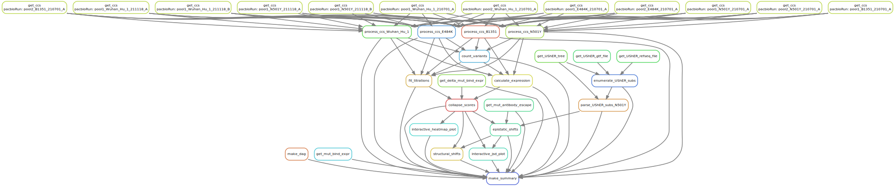

# Summary

Analysis run by [Snakefile](../../Snakefile)
using [this config file](../../config.yaml).
See the [README in the top directory](../../README.md)
for details.

Here is the DAG of the computational workflow:

Here is the Markdown output of each Jupyter notebook in the
workflow:

1. Get prior Wuhan-1 RBD DMS mutation-level [binding and expression data](../prior_DMS_data/mutant_ACE2binding_expression.csv). 

2. Process PacBio CCSs for each background: [Wuhan_Hu_1](process_ccs_Wuhan_Hu_1.md), [E484K](process_ccs_E484K.md), [N501Y](process_ccs_N501Y.md), [B.1.351](process_ccs_B1351.md). Creates barcode-variant lookup tables for each background: [Wuhan_Hu_1](../variants/codon_variant_table_Wuhan_Hu_1.csv), [E484K](../variants/codon_variant_table_E484K.csv), [N501Y](../variants/codon_variant_table_N501Y.csv), [B.1.351](../variants/codon_variant_table_B1351.csv).

3. [Count variants by barcode](count_variants.md).
   Creates a [variant counts file](../counts/variant_counts.csv)
   giving counts of each barcoded variant in each condition.

4. [Fit titration curves](compute_binding_Kd.md) to calculate per-barcode KD, recorded in [this file](../binding_Kd/bc_binding.csv).

5. [Analyze Sort-seq](compute_expression_meanF.md) to calculate per-barcode RBD expression, recorded in [this file](../expression_meanF/bc_expression.csv).